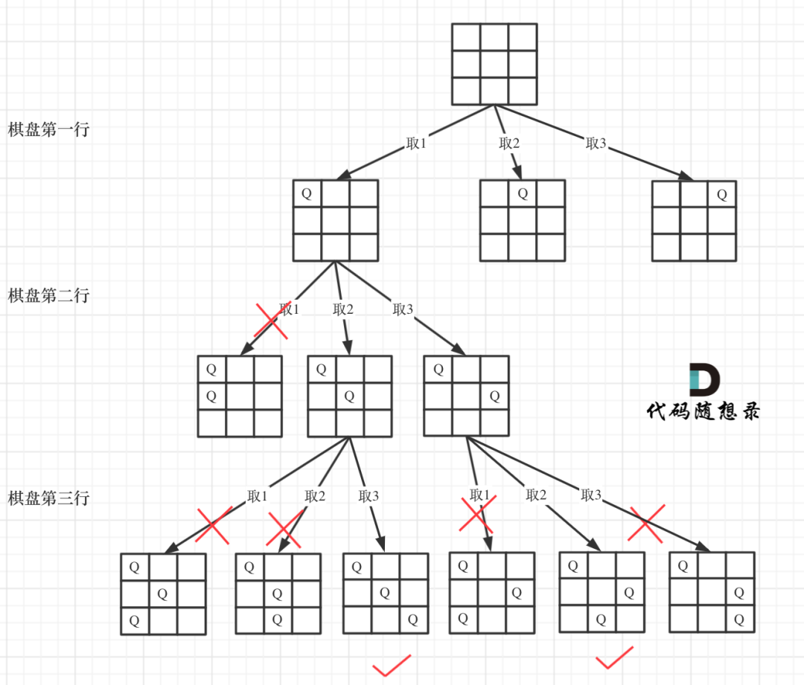

# NQueens

## Topic

- Backstracking

## Description

[https://leetcode.com/problems/n-queens/](https://leetcode.com/problems/n-queens/)

The **n-queens** puzzle is the problem of placing `n` queens on an `n x n` chessboard such that no two queens attack each other.

Given an integer `n`, return all distinct solutions to the **n-queens puzzle**.

Each solution contains a distinct board configuration of the n-queens' placement, where `'Q' `and `'.'` both indicate a queen and an empty space, respectively.

**Example 1:**


```
Input: n = 4
Output: [[".Q..","...Q","Q...","..Q."],["..Q.","Q...","...Q",".Q.."]]
Explanation: There exist two distinct solutions to the 4-queens puzzle as shown above
```

**Example 2:**

```
Input: n = 1
Output: [["Q"]]
```

**Constraints:**

- `1 <= n <= 9`

## Analysis
### 题目分析
n皇后问题是回溯算法解决的经典问题。

首先来看一下皇后们的约束条件：

1. 不能同行
2. 不能同列
3. 不能同斜线

确定完约束条件，来看看究竟要怎么去搜索皇后们的位置，其实搜索皇后的位置，可以抽象为一棵树。

下面用一个3 * 3 的棋牌，将搜索过程抽象为**一颗树**，如图：

**注意，为了方便理解，暂时屏蔽皇后们“不能同斜线”的约束条件**。



从图可看出，二维矩阵中矩阵的高就是这颗树的高度，矩阵的宽就是树型结构中每一个节点的宽度（有多少个子节点）。

那么我们用皇后们的约束条件，来回溯搜索这颗树，只要搜索到了树的叶子节点，说明就找到了皇后们的合理位置了。

### 回溯三弄
根据经典回溯模板编程：

```java
void backtracking(参数) {
    if (终止条件) {
        存放结果;
        return;
    }

    for (选择：本层集合中元素（树中节点孩子的数量就是集合的大小）) {
        处理节点;
        backtracking(路径，选择列表); // 递归
        回溯，撤销处理结果
    }
}
```

#### 函数签名
- `List<String> rows`：当前遍历行前的皇后摆法。
- `int lengthOfSide`：棋盘单边有多少格，也就是N皇后的N。
- `int depth`：目前递归深度，它的最大值是`lengthOfSide`。
- `List<List<String>> result`：存放符合要求N皇后摆法。

代码如下：
```java
private void backstracking(List<String> rows, int lengthOfSide, int depth, List<List<String>> result) {
}
```

#### 终止条件
回看[题目分析](#_34)的例图，当递归到棋盘最底层（也就是叶子节点）的时候，就可以收集结果并返回了。

代码如下：

```java
if (rows.size() == lengthOfSide) {
	result.add(new ArrayList<>(rows));
	return;
}
```

#### 遍历过程
首先，验证皇后摆法是否合法，皇后们不能同行，同列，同斜线，代码如下：

```java
private boolean isValid(List<String> rows, int row, int col, int lengthOfSide) {

	// 上方向
	for (int i = row - 1; i > -1; i--) {
		if (rows.get(i).charAt(col) == 'Q')
			return false;
	}

	// 左上斜线方向
	for (int i = row - 1, j = col - 1; i > -1 && j > -1; i--, j--) {
		if (rows.get(i).charAt(j) == 'Q')
			return false;
	}

	// 右上斜线方向
	for (int i = row - 1, j = col + 1; i > -1 && j < lengthOfSide; i--, j++) {
		if (rows.get(i).charAt(j) == 'Q')
			return false;
	}

	return true;
}
```

然后，生成含有一个皇后字符串行，代码如下：

```java
private String makeRow(int index, int lengthOfSide) {
	StringBuilder sb = new StringBuilder();
	for (int i = 0; i < lengthOfSide; i++) {
		sb.append(i == index ? 'Q' : '.');
	}
	return sb.toString();
}
```

最后，遍历过程：

```java
for (int i = 0; i < lengthOfSide; i++) {
	if (isValid(rows, depth, i, lengthOfSide)) {//检测皇后放置第depth行，第i列，是否合法
		rows.add(makeRow(i, lengthOfSide));//放置符合要求皇后所在字符串行
		backstracking(rows, lengthOfSide, depth + 1, result);
		rows.remove(rows.size() - 1);//回溯
	}
}
```

### 最终代码
请移步至[Submission](#Submission_155)。

### 参考资料
[回溯算法：N皇后问题](https://mp.weixin.qq.com/s?__biz=MzUxNjY5NTYxNA==&mid=2247485624&idx=1&sn=d560c3a277e1badedc0fa05b8effae87&scene=21#wechat_redirect)

## Code

[Source Code](../../src/main/java/com/lun/hard/NQueens.java)

[Test Code](../../src/test/java/com/lun/hard/NQueensTest.java)

