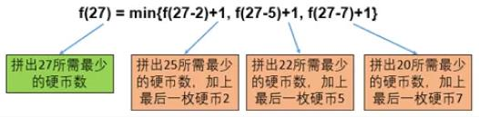
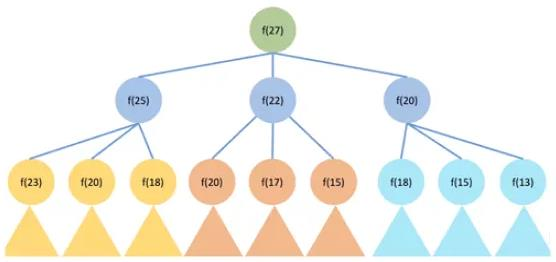
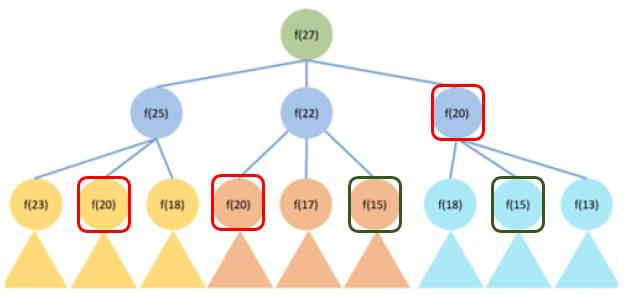

# CoinChange #

## Topic

- Dynamic Programming

## Description

[https://leetcode.com/problems/coin-change/](https://leetcode.com/problems/coin-change/)

You are given coins of different denominations and a total amount of money *amount*. Write a function to compute the fewest number of coins that you need to make up that amount. If that amount of money cannot be made up by any combination of the coins, return `-1`.

**Example 1**:

	Input: coins = [1, 2, 5], amount = 11
	Output: 3
	Explanation: 11 = 5 + 5 + 1

**Example 2**:

	Input: coins = [2], amount = 3
	Output: -1

**Note**:
You may assume that you have an infinite number of each kind of coin.

## Analysis

[解说来源](https://mp.weixin.qq.com/s/0wqHKHBKPNlLQhY20gVQGQ)

### 解决动态规划问题的4步骤

1. 确定问题状态
	- 提炼最后一步
	- 子问题转化
2. 转移方程，把问题方程化
3. 按照实际逻辑设置初始条件和边界情况
4. 确定计算顺序并求解

本文中的“Write a function to compute the fewest number of coins that you need to make up that amount.”一句中的关键词“the fewest number of coins”，最值问题自然联想到，“**求最值问题，动态规划**”。

---

假设 Input: coins = [2, 5, 7], amount = 27，用最少的硬币组合

**正常人第一反应思路**:

最少硬币组合?

优先使用大面值硬币——7+7+7+5=26 额？可求解目标是27啊……

改算法——7+7+7+2+2+2=27，总共用了6枚硬币正好27元.

实际正确答案：7+5+5+5+5=27，才用了5枚硬币。

所以**这里贪心算法是不正确的**。

---

开始使用动态规划4步骤解决本问题

#### 确定问题状态

动态规划问题求解需要先开一个数组，并确定数组的每个元素f[i]代表什么，就是确定这个问题的状态。类似于解数学题中，设定X，Y，Z代表什么。

##### 确定状态首先提取【最后一步】

最优策略必定是K枚硬币a1, a2,…, aK 面值加起来是27。

**找出不影响最优策略的最后一个独立角色**，这道问题中，那枚最后的硬币“aK”就是最后一步。

把aK提取出来，硬币aK之前的所有硬币面值加总是27- aK

因为总体求最硬币数量最小策略，所以拼出27- aK的硬币数也一定最少（**重要设定**）。


##### 转化子问题

最后一步aK提出来之后，我们只要求出“最少用多少枚硬币可以拼出27- aK”就可以了。

**这种与原问题内核一致，但是规模变小的问题，叫做子问题。**

为简化定义，我们设状态f(X)=最少用多少枚硬币拼出总面值X。

我们目前还不知道最后的硬币aK面额多少，但它的面额一定只可能是2、5、7之一。

1. 如果aK是2，f(27)应该是f(27-2) + 1 (加上最后这一枚面值2的硬币）
2. 如果aK是5，f(27)应该是f(27-5) + 1 (加上最后这一枚面值5的硬币）
3. 如果aK是7，f(27)应该是f(27-7) + 1 (加上最后这一枚面值7的硬币）

除此以外，没有其他的可能了。

**至此，通过找到原问题最后一步，并将其转化为子问题。
为求面值总额27的最小的硬币组合数的状态就形成了，用以下函数表示：**

	f(27) = min{f(27-2)+1, f(27-5)+1, f(27-7)+1}



#### 转移方程，把问题方程化

	//（动态规划都是要开数组，所以这里改用方括号表示）
	f[X] = min{f[X-2]+1, f[X-5]+1, f[X-7]+1}

**实际面试中求解动态规划类问题，正确列出转移方程正确基本上就解决一半了。**

**但是请问：这与递归有什么不同？？**

递归的解法如下:

```java
// f(X)返回最少用多少枚硬币拼出X
int f(int X) {
	// 0元钱只要0枚硬币
	if (X == 0) return 0;
	// 初始化用无穷大
	int res = MAX_VALUE;
	// 最后一枚硬币是2元
	if (X >= 2) {
		res = Math.min(f(X – 2) + 1, res);
	}
	// 最后一枚硬币是5元
	if (X >= 5) {
		res = Math.min(f(X – 5) + 1, res);
	}
	// 最后一枚硬币是7元
	if (X >= 7) {
		res = Math.min(f(X – 7) + 1, res);
	}
	return res;
}
```

执行图如下：



要算f(27)，就要递归f(25)、f(22)、f(20)，然后下边依次递归……（三角形表示）

问题明显——重复递归太多。



这是求f(27)，还可以勉强递归。如果求f(100)呢？简直是天文数字。**最终结果就是递归超时**。

所以，**求总体最值，一定优先考虑动态规划，谨慎使用递归**。

#### 按照实际逻辑设置边界情况和初始条件

`f[X] = min{f[X-2]+1, f[X-5]+1, f[X-7]+1} `的 边 界 情 况 是 [x-2]、[x-5]、[x-7] 不能小于0（硬币面值为正），也不能高于27。

**故对边界情况设定如下**：

**如果硬币面值不能组合出Y，就定义f[Y]=正无穷**

例如f[-1]=f[-2]=…=正无穷；f[1] =min{f[-1]+1, f[-4]+1,f[-6]+1}=正无穷,

**特殊情况**：本题的F[0]对应的情况为F[-2]、F[-5]、F[-7]，按照上文的边界情况设定结果是正无穷。

但是实际上F[0]的结果是存在的（即使用0个硬币的情况下），F[0]=0。

可是按照我们刚刚的设定，F[0] = F[0-2]+1 = F[-2]+1 = 正无穷。

**岂不是矛盾？**

这种用转移方程无法计算，但是又实际存在的情况，就必须通过**手动定义**。

这里手动强制定义初始条件为：F[0]=0。

而从0之后的数值是没矛盾的，比如F[1]= F[1-2]+1= F[-1]+1=正无穷（正无穷加任何数结果还是正无穷）；F[2] = F[2-2]+1= F[0]+1 = 1 ……


#### 确定计算顺序并计算求解

那么开始计算时，是从F[1]、F[2]开始呢？还是从F[27]、F[26]开始呢？
判断计算顺序正确与否的原则是：

当我们要计算F[X]（等式左边，如F[10]）的时候，等式右边（f[X-2], f[X-5], f[X-7]等）都是已经得到结果的状态，这个计算顺序就是OK的。

**实际就是从小到大的计算方式**（偶有例外的情况我们后边再讲）。

例如我们算到F[12]的时候，发现F[11]、F[10]、F[9]都已经算过了，这种算法就是对的；
而开始算F[27]的时候，发现F[26]还没有算，这样的顺序就是错的。

很显然这样的情况下写一个for循环就够了。

回到这道题，采用动态规划的算法，每一步只尝试三种硬币，一共进行了27步。算法时间复杂度（即需要进行的步数）为27 \* 3。(coins.;ength * amount)

**与递归相比，没有任何重复计算**。


## Code

[Source Code](../../src/main/java/com/lun/medium/CoinChange.java)

[Test Code](../../src/test/java/com/lun/medium/CoinChangeTest.java)
