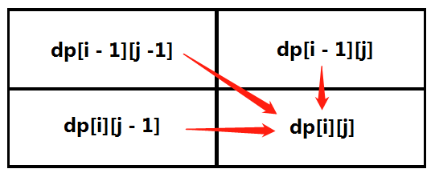
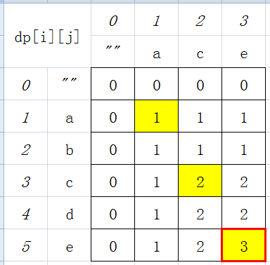

# LongestCommonSubsequence

## Topic

- Dynamic Programming

## Description

[https://leetcode.com/problems/longest-common-subsequence/](https://leetcode.com/problems/longest-common-subsequence/)

Given two strings `text1` and `text2`, return the length of their longest **common subsequence**. If there is no **common subsequence**, return `0`.

A **subsequence** of a string is a new string generated from the original string with some characters (can be none) deleted without changing the relative order of the remaining characters.

For example, `"ace"` is a subsequence of `"abcde"`.
A **common subsequence** of two strings is a subsequence that is common to both strings.

**Example 1**:

```
Input: text1 = "abcde", text2 = "ace" 
Output: 3  
Explanation: The longest common subsequence is "ace" and its length is 3.
```

**Example 2**:

```
Input: text1 = "abc", text2 = "abc"
Output: 3
Explanation: The longest common subsequence is "abc" and its length is 3.
```

**Example 3**:

```
Input: text1 = "abc", text2 = "def"
Output: 0
Explanation: There is no such common subsequence, so the result is 0.
```

Constraints:

- `1 <= text1.length, text2.length <= 1000`
- `text1` and `text2` consist of only lowercase English characters.

## Analysis

### 方法一：标准DP

动态规划五部曲:
1. 确定dp数组（dp table）以及下标的含义；
2. 确定递推公式；
3. dp数组如何初始化；
4. 确定遍历顺序；
5. 举例推导dp数组。

**DP数组意，归纳递推式，初始元素值，定序来遍历，最后举个例**。

用动规五部曲分析如下

1.确定dp数组（dp table）以及下标的含义

dp[i][j]表示 从text1的下标0开始截取长度为i的字符串 与 从text2的下标0开始截取长度为j的字符串 的最长公共子序列的长度。

也可以换句话说。

dp[i][j]表示 从text1的下标0开始截取到下标i-1截取的字符串（包含下标i-1处的字符） 与 从text2的下标0开始截取到下标j-1截取的字符串（包含下标j-1处的字符） 的最长公共子序列的长度。

2.确定递推公式

主要就是两大情况：text1[i - 1] 与 text2[j - 1]相同，text1[i - 1] 与 text2[j - 1]不相同

1. 如果text1[i - 1] 与 text2[j - 1]相同，那么找到了一个公共元素，所以`dp[i][j] = dp[i - 1][j - 1] + 1;`。
2. 如果text1[i - 1] 与 text2[j - 1]不相同，那就看看text1[0, i - 2]与text2[0, j - 1]的最长公共子序列 和 text1[0, i - 1]与text2[0, j - 2]的最长公共子序列，取最大的，即：`dp[i][j] = max(dp[i - 1][j], dp[i][j - 1]);`。

代码如下：

```java
if (text1[i - 1] == text2[j - 1]) {
    dp[i][j] = dp[i - 1][j - 1] + 1;
} else {
    dp[i][j] = max(dp[i - 1][j], dp[i][j - 1]);
}
```

3.dp数组如何初始化

先看看dp[i][0]应该是多少呢？

test1[0, i-1]和空字符串的最长公共子序列自然是0，所以dp[i][0] = 0;

同理dp[0][j]也是0。

其他下标都是随着递推公式逐步覆盖，初始值是默认的即可。

总之，全部都是0，即默认的。

```java
int[][] dp = new int[text1.length() + 1][text2.length() + 1];
```

4.确定遍历顺序

从递推公式，可以看出，有三个方向可以推出dp[i][j]，如图：



那么为了在递推的过程中，这三个方向都是经过计算的数值，所以要**从前向后，从上到下**来遍历这个矩阵。

5.举例推导dp数组

以输入：text1 = "abcde", text2 = "ace" 为例，dp状态如图：



最后红框dp[text1.length()][text2.length()]为最终结果。

**再次重申**，dp[i][j]表示 从text1的下标0开始截取长度为i的字符串 与 从text2的下标0开始截取长度为j的字符串 的最长公共子序列的长度。

### 方法二：方法一的空间优化

进一步地观察，方法一的代码遍历时只需前一行以及目前一行的信息即可。因此，dp数组初始化**两行的**。

注意，用k ^ 1、k ^= 1来切换 dp[0] (第一行) 与 dp[1] (第二行)。

注意，m % 2 与 m & 1 意同。

### 方法三：方法一的空间优化Plus

再进一步地观察，方法一的代码遍历时只需前一行以及目前一行的前一元素信息即可。因此，dp数组**初始化一行**的，另加3个变量进行辅助。

最后，优化后的时空杂度分别为：O(m * n)，O(min(m, n))。


### 参考资料

1. [动态规划：最长公共子序列](https://mp.weixin.qq.com/s/Qq0q4HaE4TyasCTj2WGFOg)
2. <a href="https://leetcode.com/problems/longest-common-subsequence/discuss/351689/JavaPython-3-Two-DP-codes-of-O(mn)-and-O(min(m-n))-spaces-w-picture-and-analysis">[Java/Python 3] Two DP codes of O(mn) & O(min(m, n)) spaces w/ picture and analysis</a>

## Code

[Source Code](../../src/main/java/com/lun/medium/LongestCommonSubsequence.java)

[Test Code](../../src/test/java/com/lun/medium/LongestCommonSubsequenceTest.java)

