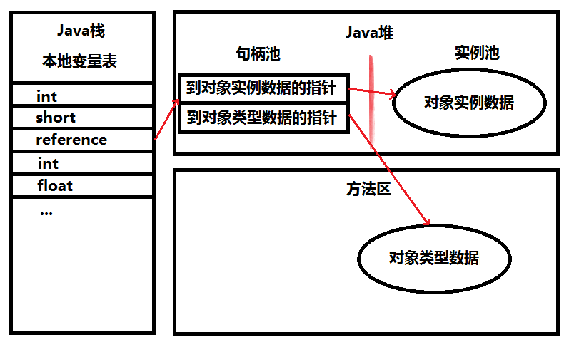
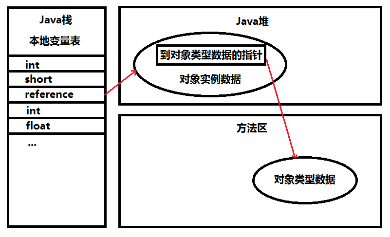

# Java内存区域与内存溢出异常 #

## 概述 ##

**内存泄露 Memory Leak**

**内存溢出 Out Of Memory**

有JVM存在，无需为每个new操作写配对的delete/free代码，不易出现 **Out Of Memory** 或 **Memory Leak**。但是，愿望是美好的，该出现的问题还是会出现，了解JVM如何使用内存有助于解决问题。

>A memory leak in Java is when objects you aren't using cannot be garbage collected because you still have a reference to them somewhere.

>An OutOfMemoryError is thrown when there is no memory left to allocate new objects. This is usually caused by a memory leak, but can also happen if you're just trying to hold too much data in memory at once.

>——[What is the difference between an OutOfMemoryError and a memory leak](https://stackoverflow.com/a/4943570)

## 运行时数据区域 ##

### 程序计数器 ###

**Program Counter Register PCR** 是一块较小的内存空间，可看作**当前线程所执行的字节码的行号指示器**。

在VM概念模型中，字节码解释器工作时就是通过改变PCR的值来选取下一条需要执行的字节码指令。

以下功能需要这个计数器来完成。

1. 分支
2. 循环
3. 跳转
4. 异常处理
5. 线程恢复
6. ...

---

由于JVM多线程是通过**线程轮流切换**并**分配处理器执行时间**的方式来实现的，在任何一个确定的时刻，一处理器（对于多核处理器来说是一个内核）都只会执行一条线程中的指令。（**一时刻一核一指令**）

因此，为了线程切换后能恢复到正确的执行位置，每条线程需要一个独立PCR，各条线程PCR互不影响，独立存储，这内存区域被称为“**线程私有**”。（**线程独立性**）

---

若线程正执行一个Java方法，这PCR记录**正在执行VM字节码指令的地址**；若正执行是Native方法，这PCR则为空Undefinded。

这内存区域是**唯一一个**在JVM规范没有规定任何**OutOfMemoryError OOME**情况的区域

## Java虚拟机栈 ##

**VM Stack**，线程私有，声明周期与线程相同。

VM Stack描述的Java方法执行的内存模型：每个方法在执行的同时会创建一个**栈帧Stack Frame**。

Stack Frame用于

1. 存储局部变量表
2. 操作数栈
3. 动态链接
4. 方法出口信息

**每一个方法从调用直至执行完成的过程，就对应着一个Stack Frame 在VM Stack中入栈到出栈的过程**。

---

粗糙说法，Java内存区分为

1. Heap 堆内存
2. Stack 栈内存 这里指 VMStack

Java内存区域划分实际上远比这复杂。

---

**局部变量表**存放

1. 编译期可知的各种**基本数据类型**（boolean/byte/char/short/int/float/double）
2. **对象引用** reference类型 它不等同于对象本身，可能是
	- 一个指向对象起始地址的**引用指针**
	- 一个代表对象的**句柄**或其他与此对象相关的位置
3. returnAddress类型（指向了一条字节码指令的地址）

---

64位的double/long类型数据会占用2个**局部变量空间Slot**，其余基本类型占1个。

局部变量表所需的内存空间**在编译期间完成分配**，当进入一个方法时，这方法需要在帧中分配多大的局部变量空间是**完全确定的**，在方法运行期间**不会**改变局部变量表的大小。

---

JVM规范中，这区域规定2种异常状况：
1. **StackOverflowError SOE**，当线程请求栈深度大于VM所允许深度时。
2. ** OutOfMemoryError OOME**，VM Stack可动态扩展（当前大部分JVM都可动态扩展，只不过JVM规范中允许固定程度的VM Stack），当扩展时无法申请到足够的内存。

---

### 本地方法栈 ###

**Native Method Stack NVS** 与 VM Stack作用相似，它们区别为
1. VM Stack为VM执行Java方法（也就是字节码）服务。
2. NVS则为VM使用到Native方法服务。

VM规范未强制规定

1. 对NVS中方法使用的**语言**
2. 使用方式与数据结构并没有强制规定。

不同VM各有发挥。

Sum HotSpot VM 直接把 VM Stack 和 NVS 合二为一。

会抛SOE和OOME异常。

### Java堆 ###

Java Heap ，线程共享

通常，Java堆是JVM所管理内存最大一块。

VM启动时创建。

**此内存区域的唯一目的就是存放对象实例，几乎所有对象实例在这里分配内存**。

JVM规范：所有对象实例以及数组都要在堆上分配。

但随着JIT编译器技术等发展，所有对象在堆上分配不是那么绝对。

---

Java堆是GC管理主要区域，因此也被称为GC堆（Garbage Collected Heap）

**从内存回收的角度看**，由于现在收集器基于**分代收集算法**，所以Java堆中可细分为：**新生代** 和 **老生代**；更细致的 Eden空间、From Survivor 空间、To Survivor空间等。

**从内存分配的角度来看**，线程共享的Java堆可划分多个线程私有的分配缓冲区（Thread Local Allocation Buffer，TLAB）

无论怎样划分，**目的始终是 更好回收内存，更快分配内存**。

---

通过-Xmx/-Xms控制扩展大小

若堆中没有内存完成实例分配，并且堆也无法再扩展时，将会抛出OOME

### 方法区 ###

Method Area 线程共享。

它用于存储已被VM加载的

1. 类型信息
2. 常量
3. 静态变量
4. 即时编译器编译后的代码等数据
5. 。。。

JVM规范 把 方法区描述为对的一个逻辑部分，但它别名叫做Non-Heap（非堆），目的与Java堆区分开。

---

大部分HotSpot VM开发者更愿意成**方法区**称为**永久代Permanent Generation**，

二者并不等价，只因HotSpot设计团队**选择把GC分代收集扩展至方法区**，或说使用**永久代**来实现方法区而已，这样HotSpot的GC可以像管理Java堆一样管理这部分内存，能够省去专门为方法区编写内存管理代码工作。

其他虚拟机BEA JRockit/IBM J9等不存在永久代的概念。

原则上，如何实现方法区属于VM实现细节，不受虚拟机规范结束，但使用永久代来实现方法区，现在看不是好主意，因为易于 **内存溢出** 问题（永久代有-XX:MaxPermSize的上限）

JDK1.7的HotSpot已把原在**永久代**的字符串常量池移出.

GC比较少在方法区内出现，但并非数据进入了方法区就如永久代的名字一样“永久”存在了，这区域的内存回收目标主要是**针对常量池的回收** 和 **对类型的卸载**。

---

当内存不满足，抛OOME

### 运行时常量池 ###

Runtime Constant Pool RCP是**方法区**的一部分

Class文件中除了有类的版本、字段、方法、接口等描述信息外，还有一项信息是**常量池Constant Pool Table**，用于存放编译期生成的各种**字面量**和**符号引用**，这部分内容将在类加载后进入方法区的RCP中存放。

---

JVM对Class文件每一部分的格式都有严格规定，每一字节用于存储那种数据都必须符合规范上的要求才会被VM认可、装载和执行。

但对于RCP，JVM规范没有做任何细节的要求，不同的提供商实现的虚拟机可以按照自己的需要实现区域。

通常，除了保存Class文件中描述的符号引用外，还会翻译出来的字节引用也存储在RCP中。

---

运行时常量池 相对于Class文件常量池 的另外一个重要特征是**具备动态性**。

Java语言并不要常量一定只有编译器才能产生，也就是并非预置如Class文件中常量池的内容才能进入方法区RCP，运行期间也可能将新的常量放入池中，如String类的intern()方法。

---

当内存不满足，抛OOME

### 直接内存 ###

Direct Memory 并不是虚拟机运行时数据区的一部分，也就是JVM规范中定义的内存区域。

这部分内存也频繁使用，而也可能导致OOME.

在JDK1.4中新加入了NIO类，引入一种基于**通道Channel**与**缓冲区Buffer**的IO方式，它可以使用Native函数库直接分配堆外内存，然后通过一个存储在Java堆中的DirectByteBuffer对象作为这块内存的引用进行操作。这样能在一些场景中显著提高性能，因为避免了在Java堆和Native堆中来回复制数据。

---

显然，Direct Memory分配不受Java 堆大小的限制，但是，既然是内存，肯定还是会受到本机总内存（包括RAM一级SWAP区或者分页文件）大小 以及 处理器寻址空间的限制。

服务器管理员在配置VM参数，会根据实际内存设置-Xms等参数信息，但经常忽略直接内存，使得各种内存区域总和大于**物理内存限制**，从而导致动态扩展时出现OOME.

## HotSpot虚拟机对象探秘 ##

对于细节问题，必须把讨论范围限定在具体的虚拟机和集中在某一个内存区域上才有意义。

### 对象的创建 ###

JVM创建一个普通对象（非数组或Class对象）过程大概可分4步。

#### 一 ####

VM遇到一条new指令时，首先将去检查这个指令的参数是否能在常量池中定位到一个类的符号引用，并且检查这个符号引用是否已被加载、解析和初始化过。

若没有，那必须先执行相应的类加载过程。

#### 二 ####

在类加载检查通过后，接下来VM将为新生对象分配内存。

对象所需内存的大小在类加载完成后完全确定为对象分配空间的任务等同于把一块确定大小的内存从Java堆中划分出来。

两种分配方式:

1. 指针碰撞 Bump the Pointer
2. 空闲列表Free List

**假设Java堆中内存是绝对的完整的**，所有用过的内存放在一边，空闲的内存放在另一边，中间放着一个指针作为分界点的指示器，那所分配内存就仅是那指针向空闲那边挪动一段与对象大小相等的距离，这种分配方式称为“**指针碰撞 Bump the Pointer**”

若Java堆中的内存并不是规整的，已使用的内存和空闲的内存相互交错，那就无法简单地进行**指针碰撞**，VM就必须维护**一个列表**，记录上哪些内存块是可用的，在分配的时候从列表中找到一块足够大的空间划分给对象实例，并更新列表上的激励，这种分配方式称为“**空闲列表Free List**”。

**采用GC是否带有压缩整理功能 --决定-->Java堆是否规整 --决定--> ? 指针碰撞 : 空闲列表**

因此，使用Serial、ParNew等带Compact过程的收集器时，系统采用的分配算法是**指针碰撞**

使用CMS这种基于Mark-Sweep算法的手机器时，通常采用**空闲列表**

---

除了如何划分可用空间之外，还有另外一个需要考虑的问题是**对象创建在虚拟机中是否非常频繁的行为，即使是仅仅修改一个指针所指向的位置**，在并发情况下也不是线程安全，可能出现正在给对象A分配内存，指针还没来得及修改，对象B又同时使用了原来的指针来分配内存的情况。（分配内存时的线程安全问题）

解决上述问题有两种方案：（好似synchronized和ThreadLocal ：）

1. **对分配内存空间的动作进行同步处理**——实际上虚拟机采用CAS配上失败重试的方式保证更新操作的原子性
2. **把内存分配的动作按照线程划分在不同的空间之中进行**，即每个线程在Java堆中预先分配一小块内存，称为本地线程分配缓存（Thread Local Allocation Buffer, TLAB）。哪个线程分配内存，就在哪个线程上的TLAB上分配，只有TLAB用完并分配新的TLAB是，才需要同步锁定。VM是否使用TLAB，可以通过-XX:+/-UseTLAB参数来设定。

#### 三 ####

内存分配完成后，**VM需要将分配到的内存空间都初始化为零值**（不包括对象头），如果使用TLAB，这一工作也可以提前至TLAB分配时进行。这一步操作保证了对象的实例字段在Java代码中可以不赋初始值就直接使用，程序能访问到这些字段的数据类型所对应的零值。

#### 四 ####

VM对对象进行必要的设置，例如：

1. 这个对象是哪个类的实例
2. 如何才能找到类的元数据信息
3. 对象的哈希码
4. 对象的GC分代年龄
5. 。。。

这些信息存放在对象的对象头（Object Header）之中。根据VM当前的运行状态的不同，如是否启用偏向锁等，对象头会有不同的设置方式。

#### 最后 ####

在上面工作都完成之后，从VM的视角来看，**一个新对象已经诞生**，**但**从Java程序的视角来看，对象创建才刚刚开始（前面那个顶多是个半成品）——<init&gt;方法还没有执行，所有字段都还为零。所以，一般来说（由字节码是否跟随invokespecial指令所决定），执行new指令之后会接着执行<init&gt;方法，把对象按照程序员的意愿进行初始化，这样**一个真正可用的对象才算完全产生出来**。

### 对象的内存布局 ###

在**HotSpot VM**中，对象在内存中存储的布局可以分为3块区域：对象头（Header）、实例数据（Instance）和对齐填充（Padding）

#### 对象头Header ####

对象头包含两部分信息

##### 一 #####

第一部分用于存储对象自身的运行时数据，如

1. 哈希码HashCode
2. GC分代年龄
3. 锁状态标志
4. 线程持有的锁
5. 偏向线程ID
6. 偏向时间戳
7. 。。。

这部分数据的长度在32/64位的VM（未开启压缩指针）中分别为32/64bit，官方称它为“**Mark Word**”

##### 二 #####

另一部分是类型指针，即**对象指向它的类元数据的指针**，VM通过这个指针来确定这个对象是哪个类的实例。

**并不是**所有VM实现都必须在对象数据上保留类型指针，换句话说，查找对象的元数据信息并不一定要经过对象本身。

**若对象是一个Java数组**，那在对象头还必须有一块用于记录数组长度的数据，因为VM可通过普通Java对象的元数据信息确定Java对象的大小，但是从数组的元数组中却无法确定数组的大小。

#### 实例数据Instance ####

对象真正存储的有效信息，也是程序代码中所定义的各种类型的字段内容。

无论是从父类继承下来的，还是在子类中定义的，都需要记录起来。这部分的存储顺序会受到**虚拟机分配策略参数**（FieldsAllocationStyle）和**字段在Java源码中定义顺序**的影响。

#### 对齐填充Padding ####

鸡肋，仅仅起着占位符的作用。HotSpot VM的自动内存管理系统要求对象起始地址必须是8字节的整数倍。也就是对象大小必须是8字节的整数倍。当对象实例数据部分没有对齐时，就需要通过对齐填充来补充。

### 对象的访问定位 ###

建立对象是为了使用对象，Java程序需要通过栈上的reference数据来操作堆上的具体对象。

由于reference类型在JVM规范中只规定了一个指向对象的引用，并没有定义这个引用通过何种方式去**定位**、**访问**堆中的对象的具体位置，所以对象访问方式也是取决于虚拟机实现而定的。

目前主流访问方式有使用**句柄**和**直接指针**两种

#### 句柄 ####

Java堆中将会划分出一块内存来作为**句柄池**，reference中存储的就是对象的句柄地址，而句柄中包含了**对象实例数据** 与 **对象类型数据**各自的具体地址信息。

#### 直接指针 ####

Java堆对象的布局中就必须考虑如何放置访问类型数据的相关信息，而reference中存储的直接就是**对象地址**

#### 小结 ####

这两种对象访问方式各有优势，使用**句柄**来访问的最大好处就是reference中存储的是**稳定**的句柄地址，在对象被移动（垃圾收集时移动对象是非常普遍的行为）时只会改变句柄中的实例数据指针，而reference本身不需要修改。

使用**直接指针**访问方式的最大好处就是速度**更快**，它节省了一次指针定位的时间开销，由于对象的访问在Java中非常频繁，因此这类开销积少成多也是一项非常可观的执行成本。

HotSpot使用**直接指针**进行对象访问的，但从整个软件开发的范围来看，各种语言和框架使用句柄来访问的情况也十分常见。

## 实战：OutOfMerroyError ##

