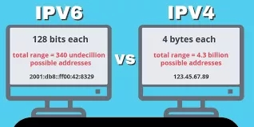
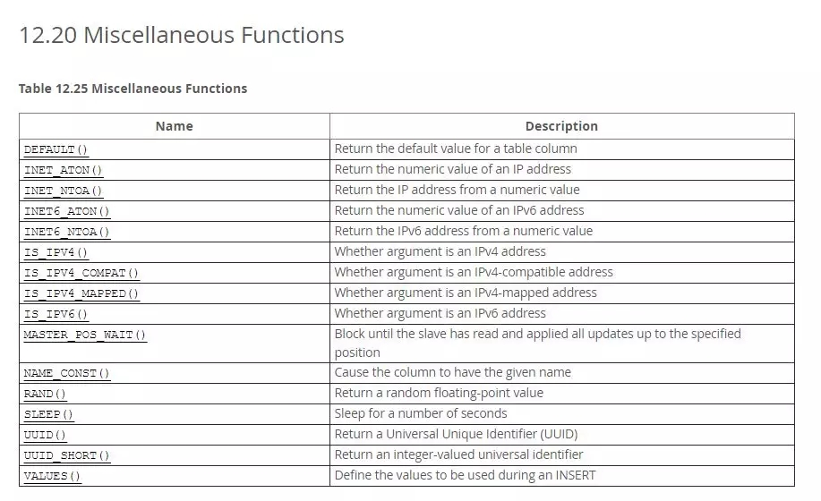

# 面试题：我有一批IPv6地址，你帮我想个办法来存储？ #

[https://mp.weixin.qq.com/s/h1F2KKaoa-1OweKuC-0cXA](https://mp.weixin.qq.com/s/h1F2KKaoa-1OweKuC-0cXA)

## 情景还原 ##

面试官：我有一批IPv6地址，你帮我想个办法来存储？

我：啊。。。

面试官：……嗯。好的。回去等通知吧。

## 什么是IPv6？ ##

IPv6是英文“Internet Protocol Version 6”（互联网协议第6版）的缩写，是互联网工程任务组（IETF）设计的用于替代IPv4的下一代IP协议，其地址数量号称可以为全世界的每一粒沙子编上一个地址。

IPv6的地址长度为128位，它有3种表示方法，分别是

1. 冒分十六进制表示法、
2. 0位压缩表示法、
3. 内嵌IPv4地址表示法。

## 思考 ##

首先，IPv6 的地址长度为 128 位，而 Java 中没有 128 位的原生数字，int 为 32 位，long 是 64 位，因此若要将 IPv6 地址直接转为 long, 则会丢掉一半的信息，这肯定是不能接受的。

因此，解决方式有两种思路。

1. 使用 BigInteger
2. 第二，将 IPv6 地址的 128 位拆分为两个 64 位的地址，即可存到两个 long 整数组成的数组中。

本文采用后者，即将 IPv6 地址转换为 long 数组。

## 实现篇 ##

另外，为简便起见，我们只考虑冒分十六进制表示法的情况，即完整的ip地址，如 0 : 0 : 0 : 0 : 0 : 0 : 0 : 0，0位压缩表示法和内嵌 IPv4 地址表示法暂不考虑。

[SaveIPv6](SaveIPv6.java)

好了，我在这里抛砖引玉了，实现了IPv6的转换，相信聪明的你一定知道接下来该怎么存储这个long数组了。

其实，现在很多数据库，都内置了专门的函数来转换IP地址。比如从mysql5.6开始，可以直接使用inet6_aton()函数来转换，见下图。

总之，直接保存字符串，虽然可读性最好，但浪费了不少的存储空间；转换后再存储，虽然节约了存储空间，但可读性较差。该如何取舍，还是根据具体的应用场景来决定。

