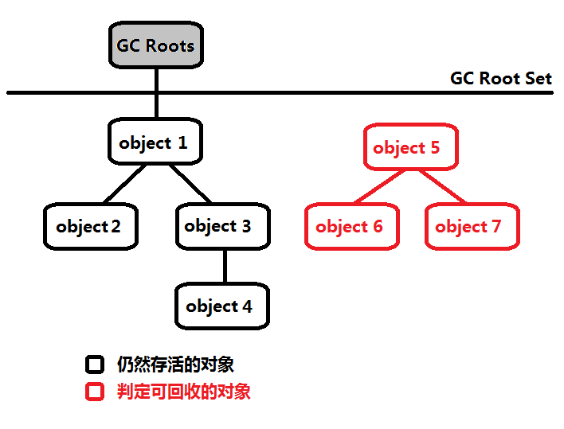
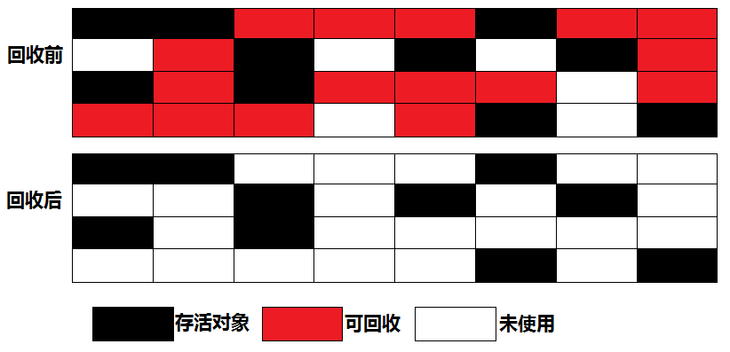
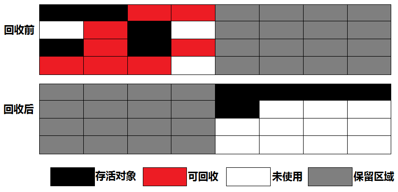
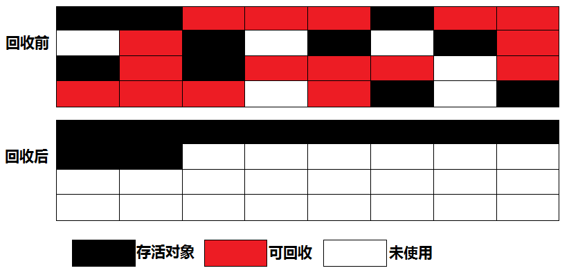
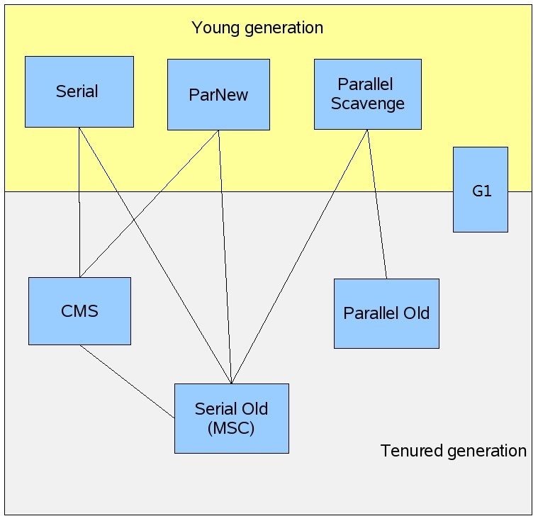

# 垃圾收集器与内存分配策略 #

## 概述 ##

1960年诞生于MIT的Lisp是**第一门**真正使用**内存动态分配**和**垃圾收集技术**的语言。

当Lisp还在胚胎期，人们就在思考GC需要完成3件事情：

1. 哪些内存需要回收？
2. 什么时候回收？
3. 如何回收？

经过多年发展，垃圾收集器与内存分配技术日臻完善，**为什么还有去了解GC和内存分配**？

因为当需要排查各种内存溢出、内存泄露问题时，当垃圾收集称为系统达到**更高并发量的瓶颈**时，就需要对这些“自动化”的技术实施必要的**监控**和**调节**。

---

在Java内存运行时区域中，**PCR、 VM Stack、 Native Method Stack 3个区域与线程同生共死**。

栈中的栈帧随着方法的进入和退出而有条不紊地执行者出栈和入栈的操作。每一栈帧中分配多少内存基本上是在类结构确定下俩就已知的。

因此这几个区域内存分配和回收都具备确定性，所以无需多虑，**内存随着方法结束或者线程结束而回收**。

Java堆 和 方法区与这3区域的不同。

一个接口中的多个实现类需要的内存可能不一样，一个方法中的多个分支需要的内存也可能不一样，这能在程序运行期间才能知道会创建哪些对象，这部分内存分配和回收都是动态。

GC所关注的是这部分内存。

## 对象已死吗 ##

GC在堆进行回收前，第一件事就是要哪些对象是“活”的，哪些是“死”的。

### 引用计数算法 ###

**引用计数算法 Reference Counting**思路：给对象中添加一个**引用计数器**，每当有一个地方引用它时，计数器+1；引用失效时，计数器-1；任何时刻计数器为0的对象就是不可能再被使用。

它的优点：简单高效

但是，主流JVM**未选用**该算法管理内存，其中最主要的原因是**它很难解决对象间相互循环引用的问题**。

两对象相互引用的例子

[ReferenceCountingGC](ReferenceCountingGC.java)

上例侧面说明VM并不是通过引用计数算法来判断对象是否存活的。

PS. 上例没有main方法，另外程序例子运行后如何生成GC日志暂未说明，GC日志内容也未说明。

### 可达性分析算法 ###

Reachability Analysis/əˈnælɪsɪs/

Java、C#、古老Lisp都是通过这种算法来判断对象是否存活。

算法思路：通过一系列称为“GC Roots”的对象作为起始点，从这些节点开始向下搜索，搜索所走过的路径称为**引用链Reference Chain**，当一对象到GC Roots没有任何引用链相连（用图论的话来说，就是从GC Root到这个对象不可达）时，则证明此对象是不可用的。

在Java语言中，可作为GC Roots的对象包括下面几种：

1. VM Stack(栈帧的本地变量表)中引用的对象
2. 方法区中类静态属性引用的对象
3. 方法区中常量引用的对象
4. 本地方法栈中JNI（即一般说的Native方法）引用的对象

### 再谈引用 ###

无论是通过**引用计数算法**判断对象的引用对象，还是**通过可达性分析算法**判断对象的引用链是否可达，判定对象是否存活都与“**引用**”有关。

JDK1.2以前，Java中的引用的定义很传统：若reference类型的数据中存储的数字代表的是另一块内存的起始地址，就称这块内存代表着一个引用。这定义纯粹，但狭隘，一个对象在这种顶一下只有被引用或者没有被引用两种状态。

愿景：有一类对象，当内存空间还足够时，则保留在内存中；若内存空间在进行垃圾收集后还是非常紧张，则可抛弃这些对象。很多系统的缓存功能都符合这样的应用场景。

在JDK1.2后，Java对引用的概念进行了扩充。

1. **强引用StrongReference**指在程序代码中普遍存在的，类似“Object obj = new Object()”这类的引用，只要强引用还存在，GC永不回收掉被引用的对象。
2. **软引用SoftReference**用来描述一些还有用但并非必需的对象。 对于软引用关联着的对象，在系统将要发生**OOME**之前，将会把这些对象列入回收范围之中进行第二次回收。若这次回收还没有足够内存，才会抛出OOME。在JDK1.2后，SoftReference类实现软引用
3. **弱引用WeakReference**用来描述非必需对象的，但是它的强度比软引用更弱一些，被弱引用关联的对象只能生存到下一次垃圾收集发生之前。当GC工作时，无论当前内存是否足够，都会回收掉只被弱引用关联的对象。在JDK1.2后，WeakReference类实现弱引用
4. **虚引用PhantomReference**最弱的引用。一个对象是否有虚引用的存在，完全不会对其生存时间构成影响，也无法通过虚引用用来取得一个对象实例。**为一个对象设置虚引用关联的唯一目的就是能在这个对象被GC回收时收到一个系统通知**。在JDK1.2后，PhantomReference类实现虚引用

这4种引用强度依次逐渐减弱。

### finalize()：生存还是死亡 ###

要真正宣告一个对象死亡，至少要经历两次标记过程：

若对象在进行可达性分析后发现没有与GC Roots相连接引用链，那它会被**第一次标记**。第一次标记后进行一次筛选，条件是**此对象是否有必要执行finalize()方法**。

VM将两种情况视为“没必要执行”
- 对象没有覆盖finalize()方法
- finalize()方法已经被VM调用过

---

若这对象被判定为有必要执行finalize()方法，这对象就将会防止在一个叫做F-Queue的队列之中，并在稍后由一个由VM自动建立的、低优先级的Finalizer线程去执行它。

这里所谓的“执行”是指VM会触碰这个方法，但**并不承诺会等待它运行结束**，这样做的原因是，若一个对象在finalize()方法中执行缓慢，或者发生了死循环（更极端的情况），将可能会导致F-ueue队列中其他对象永久处于等待，甚至导致整个内存回收系统崩溃。

finalize()方法是对象逃脱死亡命运的最后一次机会，稍后GC将对F-Queue中的对象进行**第二次小规模标记**，

自赎的方法：

若对象要在finalize()成功拯救自己——只要重新与引用链上的任何一个对象建立关联即可，譬如把自己（this关键字）赋值给某个类变量或者对象的成员变量，那在第二次标记时它将被移除出“即将回收”的集合：若对象这时候还没有逃脱，那基本上它就真的被回收了。如下例

[FinalizeEscapeGC](FinalizeEscapeGC.java)

上例子中，代码有两段完全一样的代码片段，执行结果却是一次逃脱成功，一次失败，这是因为任何一个对象的finalize()方法都只会被系统自动调用一次，若对象面临下一次回收，它的finalize()方法不会被再次执行，因此第二段代码自救行动失败了。

---

**建议finalize()不要被调用**。

它不是C/C++中的析构函数，而是Java诞生初期为使C/C++程序员更容易接受它所作出的一个妥协。

它的运行代价高昂，不确定性大，无法保证各个对象的调用顺序。

finalize()能做的所有工作，使用try-finally或者其他方式都可以做得更好、更及时。

所以，finalize()方法了解一下就行了。

### 回收方法区 ###

方法区（HotSpotVM的永生代）被认为没有垃圾收集，JVM规范确实说过可以不要求VM在方法区实现垃圾收集，而且在方法区中进行垃圾收集的“性价比”一般较低：在堆中，尤其是在新生代中，常规应用进行一次垃圾收集一般可以回收70%~95%的空间，而永久代的垃圾收集效率远低于此。

永久代的垃圾收集主要回收两部分内容

1. 废弃常量
2. 无用类

回收废弃常量与回收Java堆中的对象非常类似。

**以常量池中字面量的回收为例**，假如一个字符串“abc”已经进入常量池中，当前系统没有任何一个String对象叫做“abc”的，换句话说，就是没有任何String对象引用常量池中的“abc”常量，也没有其他地方引用了这个字面量，如果这时发生内存回收，而且必要的话，这“abc”常量就会被系统清理出常量池。常量池中的其他类（接口）、方法、字段的符号引用也与此类似。

---

判定一个常量是否是“废弃常量”比较简单，而要判定一个类是否是“无用的类”的条件则相对苛刻许多。

类需要同时满足下面3个条件才能算是“无用的类”：

1. 该类所有实例已被回收，也就是Java堆中不存在该类的任何实例。
2. 加载该类的ClassLoader已经被回收
3. 该类对应的java.lang.Class对象没有在任何地方被引用，无法在任何地方通过反射访问该类的方法。

VM可对满足上述3个条件的无用类进行回收，这里仅仅是“可以”，而并不是和对象一样，不使用了就必然会回收。

---

是否对类进行回收，HotSpot VM提供了-Xnoclassgc参数进行控制，还可以使用-verbose:class以及-XX:+TraceClassLoading、-XX:+TraceClassUnLoading查看类加载和卸载信息，

其中-verbose:class、-XX:+TraceClassLoading可在Product版的虚拟机中使用，-XX:+TraceClassUnLoading参数需要FastDebug版的虚拟机支持。

---

在大量使用反射、动态代理、CGLib等ByteCode框架、动态生JSP以及OSGi这类频繁自定义ClassLoader的场景都需要VM具备卸载的功能，以保证永久代不会溢出。

## 垃圾收集算法 ##

这里只介绍算法思想，各种VM有各种垃圾收集算法

### 标记-清除算法 ###

Mark-Sweep

算法分两阶段

1. 标记 标记出所有需要回收的对象（标记过程在上章介绍）
2. 清除 标记完成后统一回收所有被标记的对象

它的不足有两个

1. 效率问题，标记和清除两个过程效率不高；
2. 空间问题，标记清除走会产生大量不连续的内存碎片，空间碎片太多可能会导致一首在程序运行过程中需要分配较大对象时，无法找到足够的连续内存而不得不提前出发另一次垃圾回收动作。

### 复制算法 ###

Copying 为解决效率问题而出现的。

它将可用内存按容量划分为大小相等的两块，每次只使用其中一块。**当这一块内存用完了，就将还存活着的对象复制到另外一块上面，然后再把已使用过的内存空间一次清理掉**。

这样使得每次都是对整个半区进行内存回收；内存分配时也就不用考虑内存碎片等复杂情况，只是移动堆顶指针，按顺序分配内存即可，实现简单，运行高效。

只是这种算法的代价是将内存缩小为了原来的一般，未免太高了一点。

现在VM都采用这种收集算法来回收新生代。

IBM研究发现，新生代中的对象98%是“朝生夕死”（短命），所以不必按照1：1比例划分内存空间。

而是将内存分为一块较大的Eden（伊甸园）空间和两块较小的Survivor空间，每次使用Eden和其中一块Survivor。

**当回收时，将Eden和Survivor中还存活着的对象一次性地复制到另一块Survivor上，最后清理掉Eden和刚才用过的Survivor空间**。

HotSpot虚拟机默认Eden和Survivor大小比例是8：1，也就是每次新生代可用内存空间为整个新生代容量的90%（80%+10%），只有10%内存会被“浪费”。当然，98%的对象可回收只是一般场景下的数据，无法保证每次回收都只有不多于10%的对象存活，当Survivor空间不够用时，需要依赖其他内存（这里指老年代）进行分配担保**Handle Promotion**

---

**类比**

内存的**分配担保**就好比我么去**银行借款**，若信誉良好，在98%情况下都能按时偿还，于是银行可能会默认我们下一次也能按时按量地偿还贷款，只需要有一个担保人能保证如果我不能还款时，可以从他的账户扣钱，那银行就认为没有风险了

若另一块Survivor空间**没有足够空间**存放上一次新生代收集下来存活对象时，这些对象将直接通过分配担保机制进入**老年代**。

### 标记-整理算法 ###

复制收集算法在对象存活率较高时就要进行较多的复制操作，效率将会变低。

若不想浪费50%的空间，就需要有额外的空间进行分配担保，以应对被使用内存中所有对象都100%存活的极端情况，所以老年代一般不能直接选用这种算法。

根据老年代的特点，有人提出了另外一种“标记-整理”**Mark-Compact**算法，标记过程仍然与“标记-清除”算法一样，但后续步骤不是直接对可回收对象进行清理，而是让所有存活的对象都向一端移动，然后直接清理掉端边界以外的内存。

### 分代收集算法 ###

当代商业VM的垃圾收集都采用“分代收集”Generational Collection算法，根据对象存活周期的不同将内存划分为几块。

一般是把Java堆分为 **新生代** 和 **老生代**，然后根据各种年代特点采用最适当的收集算法。

在新生代中，每次垃圾收集时都发现有大批对象死掉，只有少量存活，那就选用**复制算法**，只需要付出少量存活对象的复制成本就可以完成收集。

而老年代中因为对象存活率高、没有额外空间对它进行分配担保，就必须使用“**标记——清理**”或者“**标记——整理**”算法来进行回收。

## HotSpot的算法实现 ##

### 枚举根结点 ###

从可达性分析中从GC Roots节点找引用链这个操作为例，可作为GC Roots的节点主要在全局性的引用（例如常量或静态属性）与执行上下文（例如栈帧中的本地变量表）中，**现在很多应用仅仅方法区就有数百兆，若要逐个检查这里面的引用，那必然会消耗很多时间**（局限）。

---

另外，可达性分析对执行时间的敏感还体现在**GC停顿**上，因为这项分析工作必须在一个能确保**一致性的快照**中进行

这里“**一致性**”的意思是指在整个分析期间整个执行系统看起来就像被冻结在某个时间点上，不可以出现分析过程中对象引用关系还在不断变化的情况，该点不满足的话分析结果准确性就无法得到保证。

这点是导致GC进行时必须停顿所有Java执行线程的其中一个重要原因，即使是在号称不会停顿CMS收集器中，枚举根结点时也是必须要停顿的。

---

由于目前的主流JVM使用的多事准确性GC，所以当执行系统停顿下来，**并不需一个不漏地检查完所有执行上下文和全局的引用位置**，VM应当是有办法直接得知哪些地方存放着对象引用。

在HotSpot的实现中，是使用一组称为**OopMap**的数据结构来达到这个目的的，在类加载完成的时候，HotSpot就把**对象内什么偏移量上是什么类型的数据计算出来**，在JIT编译过程中，也会在**特定的位置**记录下栈和寄存器中哪些位置是引用。这样，GC在扫描时就可以直接得知这些信息了。

---

总结：用OopMap记录对象存放地方，减少枚举根结点消耗时间（空间换时间）

### 安全点 ###

Safepoint

在OopMap的协助下，HotSpot可以快速且准确地完成GC Roots枚举。

但**一个很现实的问题**随之而来：可能导致引用关系变化，或者说OopMap内容变化指令非常多，如果为每一条指令都生成对应的OopMap，那将会需要大量的额外空间，这样GC的空间成本将会变得很高。

---

实际上，**HotSpot也的确没有为每条指令都生成OopMap**，只是在**特定的位置**记录这些信息，这些位置称为安全点（**Safepoint**），即**程序执行时并非在所有地方都能停顿下来开始GC**，只有在到达安全点时才能暂停。

**安全点的选定即不能太少以致于让GC等待时间太长，也不能过于频繁以致于过分增大运行时的负荷**。

所以，安全点的选定基本上是以程序“**是否具有让程序长时间执行的特征**”为标准进行选定的——因为每条指令执行的时间都非常短暂，程序不太可能因为指令流长度太长这个原因而过长时间运行。“长时间执行”的最明显特征就是指令序列复用，例如

1. 方法调用
2. 循环跳转
3. 异常跳转
4. ...

所以具有这些功能的指令才会产生**Safepoint**。

---

对于Safepoint，另一个需要考虑的问题是**如何在GC发生时让所有线程（这里不包括执行JNI调用的线程）都“跑”到最近的安全点上再停顿下来**。

这里两种方案可供选择：

1. 抢先式中断（Preemptive Suspension）不需要线程的执行代码主动去配合，在GC发生时，首先把所有线程全部中断，若发现有线程中断的地方不在安全点上，就恢复线程，让它“跑”到安全点上。**现在几乎没哟VM实现采用这方案来暂停从而响应GC事件**。
2. 主动式中断（Voluntary Suspension）不直接对线程操作，仅仅简单地设置一个标志，各个线程执行时主动去轮询这个标志，发现中断标志为真时就自己中断挂起。**轮询标志的地方和安全点是重合的**，另外再加上创建对象需要分配内存的地方。（类似**信号灯**）

---

小结：选择适合的Safepoint来而启动GC，避免过多或过少启动GC而影响性能。

### 安全区域 ###

Safepoint机制保证了程序执行时，在不太长的时间内就会遇到可进入GC的Safepoint。

但是，程序“不执行”的时候呢？所谓的程序不执行就是没有分配CPU时间，典型的例子就是线程处于**Sleep**状态或者**Blocked**状态，**这时候线程无法响应JVM的中断请求**，“走”到安全的地方去中断挂起，JVM也显然不太可能等待线程重新被分配CPU时间。对于这种情况，就需要**安全区域Safe Region**来解决。

**安全区是指在一段代码片段之中，引用关系不会发生变化。在这区域中的任意地方开始GC都是安全，我们也可以吧Safe Region看作是被扩展了的Safepoint**。

---

在线程执行到Safe Region中的代码时，首先标识自己已经进入Safe Region，那样，当在这段时间里JVM要发起GC时，就不用管标识自己为Safe Region状态的线程了。

在线程要离开Safe Region时，它要检查系统是否已经完成了根节点枚举（或者是整个GC过程），如果完成了，那线程就继续执行，否则它就必须等待直到收到可以安全离开Safe Region的信号为止。

---

小结：Safe Region看作是被扩展了的Safepoint

## 垃圾收集器 ##

**若说收集算法是内存回收的方法论，那么GC就是内存回收的具体实现**。

JVM规范对垃圾收集器应该如何实现并没有任何规定，因此不同的厂商、不同版本的VM所提供的GC可能大有差别，并且一般都会提供参数供用户根据自己的应用特点和要求组合出各个年代所使用的收集器。

接着讨论的GC基于JDK 1.7 Update14之后的HotSpot VM（这版本中正式提供了商用G1收集器，之前G1仍处于实验状态）

图中展示了7种作用于不同分代的收集器，若两个GC有联线，就说明他们可以搭配使用。GC所处的区域，则表示它是属于**新生代收集器**还是**老年代收集器**。

明确一点：**虽然是在对各个GC进行比较，但并非为了挑出了一个最好的GC。因为直到现在为止还没有最好的GC出现，更加没有万能的GC，所以我们选择的只是对具体应用最合适的GC**。这点不需要多加解释就能证明：如果有一种放之四海而皆准、任何场景都适用的完美的GC存在，那HotSpot VM就没必要实现那么多不同的GC了。

### Serial收集器 ###

