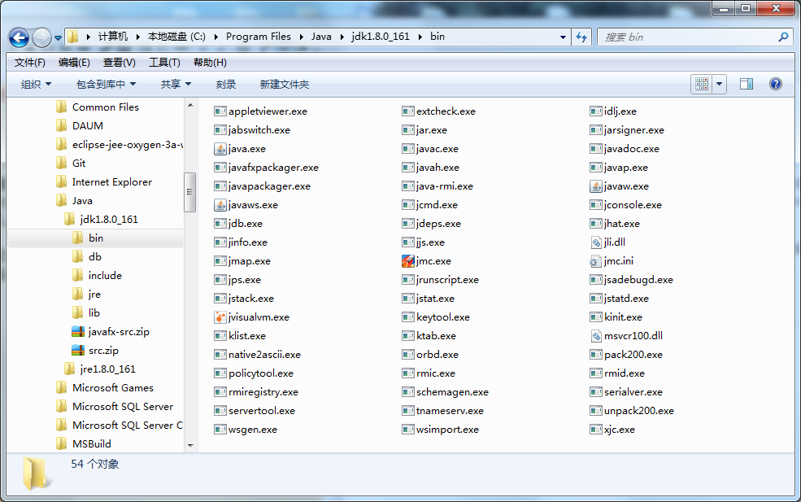
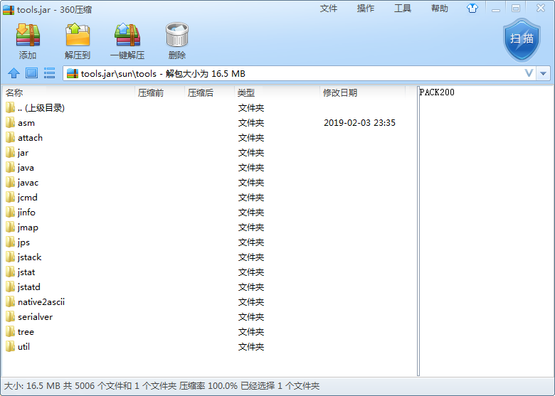
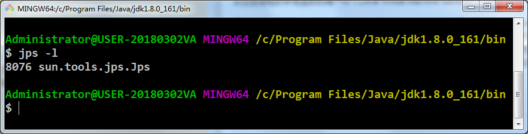

# 虚拟机性能监控与故障处理工具 #

## 概述 ##

给一个系统定位问题的时候，**知识、经验**是关键基础，**数据**是依据，**工具**是运用知识处理数据的手段。这里说的**数据**包括：运行日志、异常堆栈、GC日志、线程快照（threaddump/javacore文件）、堆转储快照（headdump/hprof文件）等。

经常使用适当的虚拟机监控和分析工具可以加快分析数据、定位解决问题的速度，但在学习工具前，也应当意识到**工具永远都是知识技能的一层包装**。

## JDK的命令行工具 ##

这些工具比较小巧，只因这些命令行工具大多数是JDK/lib/tools.jar类库的一层薄包装而已

**JDK开发团队选择采用Java代码来实现这些监控工具是有特别用意的**：当应用程序部署到生产环境后，无论是直接接触物理服务器还是远程Telnet到服务器上都可能会受到限制。借助tools.jar类库里面的接口，我们可以直接在应用程序中实现功能强大的监控分析功能。

---

**下表是Sun JDK监控和故障处理工具**

名称|主要作用
---|---
jps|JVM Process Status Tool，显示指定系统内所有的HotSpot虚拟机进程
jstat|JVM Statistics Monitoring Tool，用于收集HotSpot虚拟机各方面的运行数据
jinfo|Configuration Info for Java，显示虚拟机配置信息
jmap|Memory Map for Java，生成虚拟机的内存转储快照（Heapdump文件）
jhat|JVM Heap Dump Browser，用于分析heapdump文件，它会建立一个HTTP/HTML服务器，让用户可以在浏览器上查看分析结果
jstack|Stack Trace for Java，显示虚拟机的线程快照

### jps虚拟机进程状况工具 ###

JVM Process Status Tool，命名、功能都与Unix的ps类似

可列出正在运行的虚拟机进程，并显示虚拟机执行主类（Main Class，main()函数所在的类）名称以及这些进程的本地虚拟机唯一ID（Local Virtual Machine Identifier，LVMID）。

**虽然功能比较单一，但它是使用频率最高的JDK命令行工具**，因为其他的JDK命令行工具大多需要输入它查询到LVMID来确定要监控的是哪一个虚拟机进程。对于本地虚拟机进程来说，LVMID与操作系统的进程ID（Process Identifier，PID）是一致的，使用Windows的任务管理器或者unix的ps命令也可以查询到虚拟机进程的LVMID，但如果同时启动了多个虚拟机进程，无法根据进程名称定位时，那就只能依赖jps命令来显示主类的功能才能区分了

**jps命令格式**：

	jps [ option ] [ hostid ]

**jps工具主要选项**

选项|作用
---|---
-q|只输出LVMID，省略主类的名称
-m|输出虚拟机进程启动时传递给主类main（）函数的参数     
-l|输出主类的全名，如果进程执行的是Jar包，输出Jar路径
-v|输出虚拟机进程启动时JVM参数

## jstat：虚拟机统计信息监视工具 ##

