# 类文件结构 #

## 概述 ##

记得在第一节计算机程序课上我的老师就讲过：“计算机只认识0和1，所以我们写的程序需要经编译器翻译成由0和1构成的二进制格式才能由计算机执行”。

10多年时间过去了，今天的计算机仍然只能识别0和1，但由于最近10年内虚拟机以及大量建立在虚拟机之上的程序语言如雨后春笋般出现并蓬勃发展，将我们编写的程序编译成二进制本地机器码（Native Code）已不再是唯一的选择，**越来越多的程序语言选择了与操作系统和机器指令集无关的、平台中立的格式作为程序编译后的存储格式**。

## 无关性的基石 ##

如果计算机的CPU指令集只有x86一种，操作系统也只有Windows一种，**那也许Java语言就不会出现**。Java在刚刚诞生之时曾经提出过一个非常著名的宣传口号：“**一次编写，到处运行（Write Once,Run Anywhere）**”，这句话充分表达了软件开发人员对冲破平台界限的渴求。在无时无刻不充满竞争的IT领域，不可能只有Wintel存在，我们也不希望只有Wintel存在，各种不同的硬件体系结构和不同的操作系统肯定会长期并存发展。

**“与平台无关”的理想最终实现在操作系统的应用层上**：Sun公司以及其他虚拟机提供商发布了许多可以运行在各种不同平台上的虚拟机，这些虚拟机都可以载入和执行同一种平台无关的字节码，从而实现了程序的“一次编写，到处运行”。

---

各种不同平台的虚拟机与所有平台都统一使用的程序存储格式——**字节码（ByteCode）是构成平台无关性的基石**，但本节标题中刻意省略了“平台”二字，那是因为笔者注意到虚拟机的另外一种中立特性——**语言无关性正越来越被开发者所重视**。

到目前为止，**或许大部分程序员都还认为Java虚拟机执行Java程序是一件理所当然和天经地义的事情**。但在Java发展之初，设计者就曾经考虑过并实现了让其他语言运行在Java虚拟机之上的可能性，他们在发布规范文档的时候，也刻意把Java的规范拆分成了**Java语言**规范《The Java Language Specification》及**Java虚拟机**规范《The Java Virtual Machine Specification》。

并且在1997年发布的第一版Java虚拟机规范中就曾经承诺过：“In the future,we will consider bounded extensions to the Java virtual machine to provide better support for other languages”（在未来，我们会对Java虚拟机进行适当的扩展，以便更好地支持其他语言运行于JVM之上），当Java虚拟机发展到JDK 1.7～1.8的时候，JVM设计者通过JSR-292基本兑现了这个承诺。

---

时至今日，商业机构和开源机构已经在Java语言之外发展出一大批在Java虚拟机之上运行的语言，如Clojure、Groovy、JRuby、Jython、Scala等。使用过这些语言的开发者可能还不是非常多，但是听说过的人肯定已经不少，随着时间的推移，谁能保证日后Java虚拟机在语言无关性上的优势不会赶上甚至超越它在平台无关性上的优势呢？

---

**实现语言无关性的基础仍然是虚拟机和字节码存储格式**。**Java虚拟机不和包括Java在内的任何语言绑定，它只与“Class文件”这种特定的二进制文件格式所关联，Class文件中包含了Java虚拟机指令集和符号表以及若干其他辅助信息**。基于安全方面的考虑，Java虚拟机规范要求在Class文件中使用许多强制性的语法和结构化约束，但任一门功能性语言都可以表示为一个能被Java虚拟机所接受的有效的Class文件。

**作为一个通用的、机器无关的执行平台，任何其他语言的实现者都可以将Java虚拟机作为语言的产品交付媒介**。例如，使用Java编译器可以把Java代码编译为存储字节码的Class文件，使用JRuby等其他语言的编译器一样可以把程序代码编译成Class文件，虚拟机并不关心Class的来源是何种语言，如下图所示。

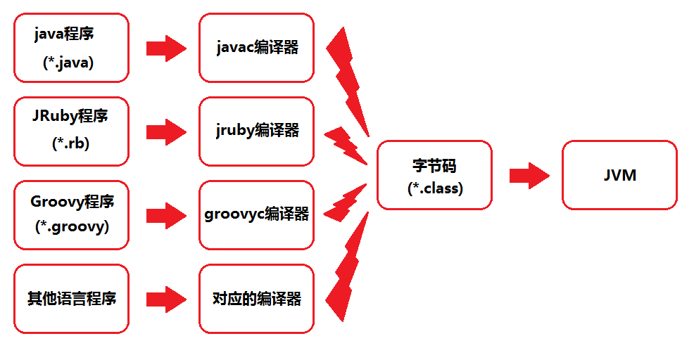

Java语言中的各种变量、关键字和运算符号的语义最终都是由多条字节码命令组合而成的，因此**字节码命令所能提供的语义描述能力肯定会比Java语言本身更加强大**。因此，有一些Java语言本身无法有效支持的语言特性不代表字节码本身无法有效支持，这也为其他语言实现一些有别于Java的语言特性提供了基础。

## Class类文件的结构 ##

数据结构方面的讲解不可避免地会比较枯燥，而这部分内容又是了解虚拟机的重要基础之一。如果想比较深入地了解虚拟机，那么这部分是不能不接触的。

关于Class文件结构的讲解中，将以《Java虚拟机规范（第2版）》（1999年发布，对应于JDK 1.4时代的Java虚拟机）中的定义为**主线**，这部分内容虽然古老，但它所包含的指令、属性是Class文件中**最重要和最基础的**。同时，我们也会以后续JDK 1.5～JDK 1.7中添加的内容为**支线**进行较为简略的、介绍性的讲解

>**注意**　任何一个Class文件都对应着唯一一个类或接口的定义信息，但反过来说，类或接口并不一定都得定义在文件里（譬如类或接口也可以通过类加载器直接生成）。
>
>本章中，只是通俗地将任意一个有效的类或接口所应当满足的格式称为“Class文件格式”，实际上**它并不一定以磁盘文件的形式存在**。

---

Class文件是一组以8位字节为基础单位的二进制流，各个数据项目严格按照顺序紧凑地排列在Class文件之中，**中间没有添加任何分隔符**，这使得整个Class文件中存储的内容几乎全部是程序运行的必要数据，没有空隙存在。当遇到需要占用8位字节以上空间的数据项时，则会按照高位在前的方式分割成若干个8位字节进行存储。

根据Java虚拟机规范的规定，Class文件格式采用一种类似于C语言结构体的伪结构来存储数据，这种伪结构中只有两种数据类型：**无符号数**和**表**。

- **无符号数**属于**基本**的数据类型，以u1、u2、u4、u8来分别代表1个字节、2个字节、4个字节和8个字节的无符号数，无符号数可以用来描述
	- 数字
	- 索引引用
	- 数量值
	- 按照UTF-8编码构成字符串值。

- **表**是由多个无符号数或者其他表作为数据项构成的**复合数据类型**，所有表都习惯性地以“_info”结尾。表用于描述有层次关系的复合结构的数据，整个Class文件本质上就是一张表，它由下表的数据项构成。 

### Class文件格式 ###

类型|名称|数量|链接
---|---|---|---
u4|magic|1|<a href='#魔数与class文件的版本'>Link</a>
u2|minor_version|1|<a href='#魔数与class文件的版本'>Link</a>
u2|major_version|1|<a href='#魔数与class文件的版本'>Link</a>
u2|constant_pool_count|1|<a href='#常量池'>Link</a>
cp_info|constant_pool|constant_pool_count-1|<a href='#常量池'>Link</a>
u2|access_flags|1|<a href='#访问标志'>Link</a>
u2|this_class|1|<a href='#类索引父类索引与接口索引集合'>Link</a>
u2|super_class|1|<a href='#类索引父类索引与接口索引集合'>Link</a>
u2|interfaces_count|1|<a href='#类索引父类索引与接口索引集合'>Link</a>
u2|interfaces|interfaces_count|<a href='#类索引父类索引与接口索引集合'>Link</a>
u2|fields_count|1|<a href='#字段表集合'>Link</a>
field_info|fields|fields_count|<a href='#字段表集合'>Link</a>
u2|methods_count|1|<a href='#方法表集合'>Link</a>
method_info|methods|methods_count|<a href='#方法表集合'>Link</a>
u2|attributes_count|1|<a href='#属性表集合'>Link</a>
attribute_info|attributes|attributes_count|<a href='#属性表集合'>Link</a>

无论是无符号数还是表，当需要描述同一类型但数量不定的多个数据时，经常会使用一个**前置的容量计数器**加**若干个连续的数据项**的形式，这时称这一系列连续的某一类型的数据为**某一类型的集合**。

再次重申，Class的结构不像XML等描述语言，由于它没有任何分隔符号，所以在上表的数据项，无论是顺序还是数量，甚至于数据存储的字节序（Byte Ordering,Class文件中字节序为**Big-Endian**）这样的细节，**都是被严格限定的**，哪个字节代表什么含义，长度是多少，先后顺序如何，都不允许改变。

>Big-Endian，具体是指最高位字节在地址最低位、最低位字节在地址最高位的顺序来存储数据。

接下来一起看看这个表中各个数据项的**具体含义**。

### 魔数与Class文件的版本 ###

每个Class文件的头4个字节称为魔数（Magic Number），**它的唯一作用是确定这个文件是否为一个能被虚拟机接受的Class文件**。很多文件存储标准中都使用魔数来进行身份识别，譬如图片格式，如gif或者jpeg等在文件头中都存有魔数。使用魔数而不是扩展名来进行识别主要是基于安全方面的考虑，因为文件扩展名可以随意地改动。文件格式的制定者可以自由地选择魔数值，只要这个魔数值还没有被广泛采用过同时又不会引起混淆即可。

Class文件的魔数的获得很有“**浪漫气息**”，值为：**0xCAFEBABE**（咖啡宝贝？），这个魔数值在Java还称做“Oak”语言的时候（大约是1991年前后）就已经确定下了。它还有一段很有趣的历史，据Java开发小组最初的关键成员Patrick Naughton所说：“我们一直在寻找一些好玩的、容易记忆的东西，选择0xCAFEBABE是因为它象征着著名咖啡品牌Peet’s Coffee中深受欢迎的Baristas咖啡”，这个魔数似乎也预示着日后“Java”这个商标名称的出现。

---

紧接着魔数的4个字节存储的是Class文件的版本号：**第5和第6个字节是次版本号（Minor Version），第7和第8个字节是主版本号（Major Version）**。Java的版本号是从45开始的，JDK 1.1之后的每个JDK大版本发布主版本号向上加1（JDK 1.0～1.1使用了45.0～45.3的版本号），高版本的JDK能向下兼容以前版本的Class文件，但不能运行以后版本的Class文件，即使文件格式并未发生任何变化，虚拟机也必须拒绝执行超过其版本号的Class文件。

例如，JDK 1.1能支持版本号为45.0～45.65535的Class文件，无法执行版本号为46.0以上的Class文件，而JDK 1.2则能支持45.0～46.65535的Class文件。现在，最新的JDK版本为1.7，可生成的Class文件主版本号最大值为51.0。

---

这里使用JDK 1.8（书上的是使用JDK 1.6）编译下面[源码](TestClass.java)输出Class文件为基础来进行讲解

	package com.lun.other.jvm.c06;
	
	public class TestClass {
		
		private int m;
	
		public int inc() {
			return m + 1;
		}
	
	}

---

使用十六进制编辑器WinHex打开这个Class文件的结果，可以清楚地看见开头4个字节的十六进制表示是0xCAFEBABE，代表次版本号的第5个和第6个字节值为0x0000，而主版本号的值为0x0034，也即是十进制的52，该版本号说明这个文件是可以被JDK 1.8或以上版本虚拟机执行的Class文件。

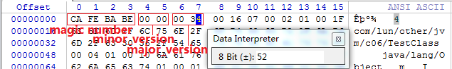

---

下表列出了从JDK 1.1到JDK 1.7，主流JDK版本编译器输出的默认和可支持的Class文件版本号。

**Class 文件版本号**

JDK 编译器版本|target 参数|十六进制 minor.major|十进制 minor.major
---|---|---|---
JDK1.1.8|不能带 target 参数|00 03 00 2D|45.3
JDK1.2.2|不带(默认为 -target 1.1)|00 03 00 2D|45.3
JDK1.2.2|-target 1.2|00 00 00 2E|46.0
JDK1.3.1_19|不带(默认为 -target 1.1)|00 03 00 2D|45.3
JDK1.3.1_19|-target 1.3|00 00 00 2F|47.0
JDK1.4.2_10|不带(默认为 -target 1.2)|00 00 00 2E|46.0
JDK1.4.2_10|-target 1.4|00 00 00 30|48.0
JDK1.5.0_11|不带(默认为 -target 1.5)|00 00 00 31|49.0
JDK1.5.0_11|-target 1.4 -source 1.4|00 00 00 30|48.0
JDK1.6.0_01|不带(默认为 -target 1.6)|00 00 00 32|50.0
JDK1.6.0_01|-target 1.5|00 00 00 31|49.0
JDK1.6.0_01|-target 1.4 -source 1.4|00 00 00 30|48.0
JDK1.7.0|不带(默认为 -target 1.6)|00 00 00 32|50.0
JDK1.7.0|-target 1.7|00 00 00 33|51.0
JDK1.7.0|-target 1.4 -source 1.4|00 00 00 30|48.0

### 常量池 ###

紧接着主次版本号之后的是常量池入口，**常量池可以理解为Class文件之中的资源仓库**，它是Class文件结构中与其他项目关联最多的数据类型，也是占用Class文件空间最大的数据项目之一，同时它还是在Class文件中第一个出现的**表类型**数据项目。

由于常量池中常量的数量是不固定的，所以在常量池的入口需要放置一项u2类型的数据，代表常量池容量计数值（constant_pool_count）。**与Java中语言习惯不一样的是，这个容量计数是从1而不是0开始的**，如下图所示，常量池容量（偏移地址：0x00000008）为十六进制数0x0016，即十进制的22，这就代表常量池中有21项常量，索引值范围为1～21。

在Class文件格式规范制定之时，设计者将第0项常量空出来是有特殊考虑的，这样做的**目的**在于**满足后面某些指向常量池的索引值的数据在特定情况下需要表达“不引用任何一个常量池项目”的含义**，这种情况就可以把索引值置为0来表示。Class文件结构中**只有常量池的容量计数是从1开始**，对于其他集合类型，包括接口索引集合、字段表集合、方法表集合等的容量计数都与一般习惯相同，是从0开始的。 

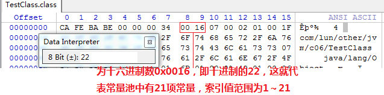

常量池中主要存放两大类常量：

1. **字面量**（Literal）比较接近于Java语言层面的常量概念，如文本字符串、声明为final的常量值等。

2. **符号引用**（Symbolic References）则属于编译原理方面的概念，包括了下面三类常量：

	1. 类和接口的全限定名（Fully Qualified Name）
	2. 字段的名称和描述符（Descriptor）
	3. 方法的名称和描述符

Java代码在进行Javac编译的时候，并不像C和C++那样有“连接”这一步骤，而是在**虚拟机加载Class文件的时候进行动态连接**。也就是说，在Class文件中不会保存各个方法、字段的最终内存布局信息，因此这些字段、方法的符号引用不经过运行期转换的话**无法得到真正的内存入口地址**，**也就无法直接被虚拟机使用**。当虚拟机运行时，需要从常量池获得对应的符号引用，再在类创建时或运行时解析、翻译到具体的内存地址之中。

---

常量池中每一项常量都是一个表，在JDK 1.7之前共有11种结构各不相同的表结构数据，在JDK 1.7中为了更好地支持动态语言调用，又额外增加了3种（CONSTANT_MethodHandle_info、CONSTANT_MethodType_info和CONSTANT_InvokeDynamic_info）。

这14种表都有一个共同的特点，就是表开始的第一位是一个u1类型的标志位（tag，取值见下表中标志列），代表当前这个常量属于哪种常量类型。这14种常量类型所代表的具体含义见下表

**常量池的项目类型**

类型|标志|描述　
---|---|---
CONSTANT_Utf8_info|1|UTF-8编码的字符串
CONSTANT_Integer_info|3|整形字面量
CONSTANT_Float_info|4|浮点型字面量
CONSTANT_Long_info|5|长整型字面量
CONSTANT_Double_info|6|双精度浮点型字面量
CONSTANT_Class_info|7|类或接口的符号引用
CONSTANT_String_info|8|字符串类型字面量
CONSTANT_Fieldref_info|9|字段的符号引用
CONSTANT_Methodref_info|10|类中方法的符号引用
CONSTANT_InterfaceMethodref_info|11|接口中方法的符号引用
CONSTANT_NameAndType_info|12|字段或方法的符号引用
CONSTANT_MethodHandle_info|15|表示方法句柄
CONSTANT_MothodType_info|16|标志方法类型
CONSTANT_InvokeDynamic_info|18|表示一个动态方法调用点

---

之所以说常量池是最烦琐的数据，是因为这14种常量类型各自均有自己的结构。看下图中常量池的第一项常量，它的标志位（偏移地址：0x0000000A）是0x07，查上表的标志列发现这个常量属于CONSTANT_Class_info类型，此类型的常量代表一个类或者接口的符号引用。CONSTANT_Class_info的结构比较简单，见下表。

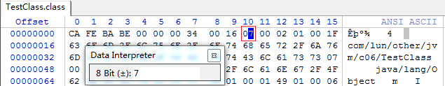

**CONSTANT_Class_info类型常量的结构**

类型|名称|数量
---|---|---
u1|tag|1
u2|name_index|1

tag是标志位，上面已经讲过了，它用于区分常量类型；**name_index**是一个索引值，它指向常量池中一个CONSTANT_Utf8_info类型常量，此常量代表了这个类（或者接口）的全限定名，这里**name_index**值（偏移地址：0x0000000B）为0x0002，也即是指向了常量池中的**第二项**常量。

从上图中查找第二项常量，它的标志位（地址：0x0000000D）是0x01，查**常量池的项目类型**可知确实是一个CONSTANT_Utf8_info类型的常量。

**CONSTANT_Utf8_info类型常量的结构**

类型|名称|数量
---|---|---
u1|tag|1
u2|length|1
u1|bytes|length

---

length值说明了这个UTF-8编码的字符串长度是多少字节，它后面紧跟着的长度为length字节的连续数据是一个使用UTF-8缩略编码表示的字符串。UTF-8缩略编码与普通UTF-8编码的区别是：
- 从’\u0001’到’\u007f’之间的字符（相当于1～127的ASCII码）的缩略编码使用一个字节表示；
- 从’\u0080’到’\u07ff’之间的所有字符的缩略编码用两个字节表示；
- 从’\u0800’到’\uffff’之间的所有字符的缩略编码就按照普通UTF-8编码规则使用三个字节表示。

>由于Class文件中方法、字段等都需要引用CONSTANT_Utf8_info型常量来描述名称，所以CONSTANT_Utf8_info型常量的最大长度也就是Java中方法、字段名的最大长度。而这里的最大长度就是length的最大值，既u2类型能表达的最大值65535(2^16 - 1)。所以Java程序中如果定义了超过64KB英文字符的变量或方法名，将会无法编译。

本例中这个字符串的length值（偏移地址：0x0000000E）为0x001F，也就是长31字节，往后31字节正好都在1～127的ASCII码范围以内，内容为“com/lun/other/jvm/c06/TestClass”，换算结果如下图选中的部分所示。

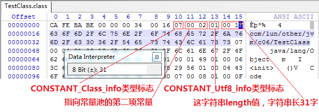

---

到此为止，我们分析了TestClass.class常量池中21个常量中的两个，其余的19个常量都可以通过类似的方法计算出来。为了避免计算过程占用过多的版面，后续的19个常量的计算过程可**以借助计算机**来帮我们完成。

在JDK的bin目录中，Oracle公司已经为我们准备好一个专门用于分析Class文件字节码的工具：**javap**，下面代码中列出了使用javap工具的-verbose参数输出的TestClass.class文件字节码内容（此清单中省略了常量池以外的信息）。

**使用javap命令输出常量表**

	Administrator@USER-20180302VA MINGW64 /c/eclipse-workspace/LeetCode/target/classes/com/lun/other/jvm/c06 (master)
	$ javap -verbose TestClass
	警告: 二进制文件TestClass包含com.lun.other.jvm.c06.TestClass
	Classfile /C:/eclipse-workspace/LeetCode/target/classes/com/lun/other/jvm/c06/TestClass.class
	  Last modified 2019-2-10; size 397 bytes
	  MD5 checksum 2ce812c9022b7d780e1b35ed456e1f97
	  Compiled from "TestClass.java"
	public class com.lun.other.jvm.c06.TestClass
	  minor version: 0
	  major version: 52
	  flags: ACC_PUBLIC, ACC_SUPER
	Constant pool:
	   #1 = Class              #2             // com/lun/other/jvm/c06/TestClass
	   #2 = Utf8               com/lun/other/jvm/c06/TestClass
	   #3 = Class              #4             // java/lang/Object
	   #4 = Utf8               java/lang/Object
	   #5 = Utf8               m
	   #6 = Utf8               I
	   #7 = Utf8               <init>
	   #8 = Utf8               ()V
	   #9 = Utf8               Code
	  #10 = Methodref          #3.#11         // java/lang/Object."<init>":()V
	  #11 = NameAndType        #7:#8          // "<init>":()V
	  #12 = Utf8               LineNumberTable
	  #13 = Utf8               LocalVariableTable
	  #14 = Utf8               this
	  #15 = Utf8               Lcom/lun/other/jvm/c06/TestClass;
	  #16 = Utf8               inc
	  #17 = Utf8               ()I
	  #18 = Fieldref           #1.#19         // com/lun/other/jvm/c06/TestClass.m:I
	  #19 = NameAndType        #5:#6          // m:I
	  #20 = Utf8               SourceFile
	  #21 = Utf8               TestClass.java
	...

从上述代码中可看出，计算机已把整个常量池的21项常量都计算了出来，并且第1、2项常量的计算结果与我们手工计算的结果一致。

仔细看一下会发现，其中有一些常量似乎从来没有在代码中出现过，如“I”、“V”、“<init&gt;”、“LineNumberTable”、“LocalVariableTable”等，**这些看起来在代码任何一处都没有出现过的常量是哪里来的呢**？

这部分自动生成的常量的确没有在Java代码里面直接出现过，但它们会被后面即将讲到的字段表（field_info）、方法表（method_info）、属性表（attribute_info）引用到，它们会用来描述一些不方便使用“**固定字节**”进行表达的内容。

譬如描述方法的返回值是什么？有几个参数？每个参数的类型是什么？因为Java中的“类”是无穷无尽的，无法通过简单的无符号字节来描述一个方法用到了什么类，因此**在描述方法的这些信息时，需要引用 常量表 中的符号引用进行表达**。

#### 常量池中的14种常量项的结构总表 ####

<table>

<thead>
<tr>
<th>常量</th>
<th>项目</th>
<th>类型</th>
<th>描述</th>
</tr>
</thead>

<tbody>
<tr>
<td rowspan=3>CONSTANT_Utf8_info</td>
<td>tag</td>
<td>u1</td>
<td>值为1</td>
</tr>

<tr>
<td>length</td>
<td>u2</td>
<td>UTF-8编码字符串占用的字节数</td>
</tr>

<tr>
<td>bytes</td>
<td>u1</td>
<td>长度为length的UTF-8编码的字符串</td>
</tr>

<tr>
<td rowspan=2>CONSTANT_Integer_info</td>
<td>tag</td>
<td>u1</td>
<td>值为3</td>
</tr>

<tr>
<td>bytes</td>
<td>u4</td>
<td>按照高位在前存储的int值</td>
</tr>

<tr>
<td rowspan=2>CONSTANT_Float_info</td>
<td>tag</td>
<td>u1</td>
<td>值为4</td>
</tr>

<tr>
<td>bytes</td>
<td>u4</td>
<td>按照高位在前存储的float值</td>
</tr>

<tr>
<td rowspan=2>CONSTANT_Long_info</td>
<td>tag</td>
<td>u1</td>
<td>值为5</td>
</tr>

<tr>
<td>bytes</td>
<td>u8</td>
<td>按照高位在前存储的long值</td>
</tr>

<tr>
<td rowspan=2>CONSTANT_Double_info</td>
<td>tag</td>
<td>u1</td>
<td>值为6</td>
</tr>

<tr>
<td>bytes</td>
<td>u8</td>
<td>按照高位在前存储的double值</td>
</tr>

<tr>
<td rowspan=2>CONSTANT_Class_info</td>
<td>tag</td>
<td>u1</td>
<td>值为7</td>
</tr>

<tr>
<td>index</td>
<td>u2</td>
<td>指向全限定名常量项的索引</td>
</tr>

<tr>
<td rowspan=2>CONSTANT_String_info</td>
<td>tag</td>
<td>u1</td>
<td>值为8</td>
</tr>

<tr>
<td>index</td>
<td>u2</td>
<td>指向字符串字面量的索引</td>
</tr>

<tr>
<td rowspan=3>CONSTANT_Fieldref_info</td>
<td>tag</td>
<td>u1</td>
<td>值为9</td>
</tr>

<tr>
<td>index</td>
<td>u2</td>
<td>指向声明字段的类或者接口描述符CONSTANT_Class_info的索引项</td>
</tr>

<tr>
<td>index</td>
<td>u2</td>
<td>指向字段描述符CONSTANT_NameAndType的索引项</td>
</tr>

<tr>
<td rowspan=3>CONSTANT_Methodref_info</td>
<td>tag</td>
<td>u1</td>
<td>值为10</td>
</tr>

<tr>
<td>index</td>
<td>u2</td>
<td>指向声明方法的类描述符CONSTANT_Class_info的索引项</td>
</tr>

<tr>
<td>index</td>
<td>u2</td>
<td>指向名称及类型描述符CONSTANT_NameAndType的索引项</td>
</tr>

<tr>
<td rowspan=3>CONSTANT_Interface_Methodref_info</td>
<td>tag</td>
<td>u1</td>
<td>值为11</td>
</tr>

<tr>
<td>index</td>
<td>u2</td>
<td>指向声明方法的接口描述符CONSTANT_Class_info的索引项</td>
</tr>

<tr>
<td>index</td>
<td>u2</td>
<td>指向名称及类描述符CONSTANT_NameAndType的索引项</td>
</tr>

<tr>
<td rowspan=3>CONSTANT_NameAndType_info</td>
<td>tag</td>
<td>u1</td>
<td>值为12</td>
</tr>

<tr>
<td>index</td>
<td>u2</td>
<td>指向该字段或方法名称常量的索引</td>
</tr>

<tr>
<td>index</td>
<td>u2</td>
<td>指向该字段或方法描述符常量项的索引</td>
</tr>

<tr>
<td rowspan=3>CONSTANT_MethodHandle_info</td>
<td>tag</td>
<td>u1</td>
<td>值为15</td>
</tr>

<tr>
<td>reference_kind</td>
<td>u1</td>
<td>值必须在1-9之间（包括1和9），它决定了方法句柄的类型。方法句柄类型的值表示方法句柄的字节码行为</td>
</tr>

<tr>
<td>reference_index</td>
<td>u2</td>
<td>值必须是对常量池的有效索引</td>
</tr>

<tr>
<td rowspan=2>CONSTANT_MethodType_info</td>
<td>tag</td>
<td>u1</td>
<td>值为16</td>
</tr>

<tr>
<td>descriptor_index</td>
<td>u2</td>
<td>值必须是对常量池的有效索引，常量池在该索引处的项必须是CONSTANT_Utf8_info结构，表示方法的描述符</td>
</tr>

<tr>
<td rowspan=3>CONSTANT_InvokeDynamic_info</td>
<td>tag</td>
<td>u1</td>
<td>值为18</td>
</tr>

<tr>
<td>bootstrap_method_attr_index</td>
<td>u2</td>
<td>值必须是对当前Class文件中引导方法表的bootstrap_methods[]数组的有效索引</td>
</tr>

<tr>
<td>name_and_type_index</td>
<td>u2</td>
<td>值必须是对当前常量池的有效索引，常量池在该索引出的项必须是CONSTANT_NameAndType_info结构，表示方法名和方法描述符</td>
</tr>

</tbody>
</table>

### 访问标志 ###

在常量池结束之后，紧接着的两个字节代表访问标志（**access_flags**），这个标志用于识别一些类或者接口层次的访问信息，包括：

1. **这个Class是类还是接口**；
2. 是否定义为public类型；
3. 是否定义为abstract类型；
4. 如果是类的话，是否被声明为final；
5. 。。。

---

**访问标志**

标志名称|标志值|含义
---|---|---
ACC_PUBLIC|0x0001|是否为public类型
ACC_FINAL|0x0010|是否被声明为final，只有类可以设置
ACC_SUPER|0x0020|是否允许使用invokespecial字节码指令的新语义，invokespecial指令的语意在JDK1.0.2发生过改变，为了区别这条指令使用哪种语意，JDK1.0.2之后编译出来的类的这个标志默认为真
ACC_INTERFACE|0x0200|标志这是一个接口
ACC_ABSTRACT|0x0400|是否为abstract类型，对于接口或者抽象类来说，次标志值为真，其他类型为假
ACC_SYNTHETIC|0x1000|标志这个类并非由用户代码产生
ACC_ANNOTATION|0x2000|标志这是一个注解
ACC_ENUM|0x4000|标志这是一个枚举

---

access_flags中一共有16个标志位可以使用，当前只定义了其中8个，没有使用到的标志位要求一律为0。

以[TestClass](TestClass.java)的代码为例，TestClass是一个普通Java类，不是接口、枚举或者注解，被public关键字修饰但没有被声明为final和abstract，并且它使用了JDK 1.2之后的编译器进行编译，

因此它的ACC_PUBLIC、ACC_SUPER标志应当为真，而ACC_FINAL、ACC_INTERFACE、ACC_ABSTRACT、ACC_SYNTHETIC、ACC_ANNOTATION、ACC_ENUM这6个标志应当为假，因此它的access_flags的值应为：0x0001|0x0020=0x0021。

从下图中可以看出，access_flags标志（偏移地址：0x000000F3）的确为0x0021。

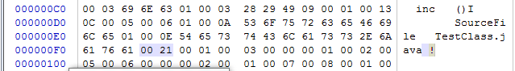

### 类索引、父类索引与接口索引集合 ###

**类索引**（this_class）和**父类索引**（super_class）都是一个u2类型的数据，而**接口索引集合**（interfaces）是一组u2类型的数据的集合，**Class文件中由这三项数据来确定这个类的继承关系**。

**类索引**用于确定这个类的全限定名，**父类索**引用于确定这个类的父类的全限定名。由于Java语言不允许多重继承，所以父类索引只有一个，除了java.lang.Object之外，所有的Java类都有父类，因此除了java.lang.Object外，所有Java类的父类索引都不为0。

**接口索引集合**就用来描述这个类实现了哪些接口，这些被实现的接口将按implements语句（如果这个类本身是一个接口，则应当是extends语句）后的接口顺序从左到右排列在接口索引集合中。

类索引、父类索引和接口索引集合都按顺序排列在访问标志之后，类索引和父类索引用两个u2类型的索引值表示，它们各自指向一个类型为CONSTANT_Class_info的类描述符常量，通过CONSTANT_Class_info类型的常量中的索引值可以找到定义在CONSTANT_Utf8_info类型的常量中的全限定名字符串。下图演示了代码的代码的类**索引查找过程**。

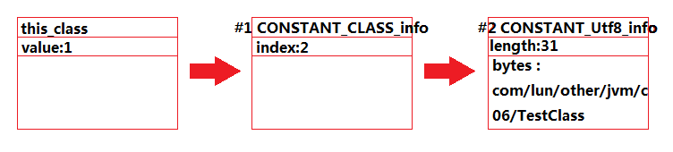

---

对于接口索引集合，入口的第一项——u2类型的数据为接口计数器（interfaces_count），表示索引表的容量。如果该类没有实现任何接口，则该计数器值为0，后面接口的索引表不再占用任何字节。代码中的访问标志、类索引、父类索引与接口表索引的内容如下图所示。 

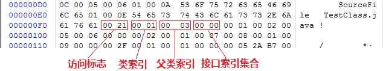

从偏移地址0x000000F5开始的3个u2类型的值分别为0x0001、0x0003、0x0000，也就是类索引为1，父类索引为3，接口索引集合大小为0。

查询前面javap命令计算出来的常量池，找出对应的类和父类的常量，结果如下面代码所示。

	...
	Constant pool:
	   #1 = Class              #2             // com/lun/other/jvm/c06/TestClass
	   #2 = Utf8               com/lun/other/jvm/c06/TestClass
	   #3 = Class              #4             // java/lang/Object
	   #4 = Utf8               java/lang/Object
	...

### 字段表集合 ###

字段表（field_info）用于描述接口或者类中声明的变量。字段（field）包括**类级变量**以及**实例级变量**，但**不包括**在方法内部声明的局部变量。

在Java中描述一个字段可以包括的信息有：

1. 字段的作用域（public、private、protected修饰符）
2. 是实例变量还是类变量（static修饰符）
3. 可变性（final）
4. 并发可见性（volatile修饰符，是否强制从主内存读写）
5. 可否被序列化（transient修饰符）
6. 字段数据类型（基本类型、对象、数组）
7. 字段名称。

上述这些信息中，各个修饰符都是布尔值，要么有某个修饰符，要么没有，很适合使用标志位来表示。而字段叫什么名字、字段被定义为什么数据类型，这些都是无法固定的，**只能引用常量池中的常量来描述**

---

**字段表结构**

类型|名称|数量
---|---|---
u2|access_flags|1
u2|name_index|1
u2|descriptor_index|1
u2|attributes_count|1
attribute_info|attributes|attributes_count

字段修饰符放在access_flags项目中，他与类中的access_flags项目是非常类似的，都是一个u2的数据类型，其中可以设置的标志位和含义见下表。

**字段访问标志 access_flags**

标志名称|标志值|含义
---|---|---
ACC_PUBLIC|0x0001|字段是否public
ACC_PRIVATE|0x0002|字段是否private
ACC_PROTECTED|0x0004|字段是否protected
ACC_STATIC|0x0008|字段是否static
ACC_FINAL|0x0010|字段是否final
ACC_VOLATILE|0x0040|字段是否volatile
ACC_TRANSIENT|0x0080|字段是否transient
ACC_SYNTHETIC|0x1000|字段是否由编译器自动产生的
ACC_ENUM|0x4000|字段是否enum

很明显，在实际情况中，ACC_PUBLIC、ACC_PRIVATE、ACC_PROTECTED三个标志最多只能选择其一，ACC_FINAL、ACC_VOLATILE不能同时选择。接口之中的字段必须有ACC_PUBLIC、ACC_STATIC、ACC_FINAL标志，**这些都是由Java本身的语言规则所决定的**。

根据access_flags标志的是两项索引值：name_index和descriptor_index。他们都是对常量池的引用，分别代表着字段的简单名称以及字段和方法的描述符。

---

现在需要解释一下“**简单名称**”、“**描述符**”以及“**全限定名**”这三种特殊字符串的概念。

**全限定名**和**简单名称**很好理解，以下面代码为例，“com/lun/other/jvm/c06/TestClass”是这个类的**全限定名**，仅仅是把类全名中的“.”替换成了“/”而已，为了使连续的多个全限定名之间不产生混淆，在使用时最后一般会加入一个“;”表示全限定名结束。

**简单名称**是指没有类型和参数修饰的方法或者字段名称，这个类中的inc()方法和m字段的简单名称分别是“inc”和“m”。

	public class TestClass {
	
	    private int m;
	
	    public int inc() {
	        return m + 1;
	    }
	}

**描述符**的作用是用来描述字段的数据类型、方法的参数列表（包括数量、类型以及顺序）和返回值。根据描述符规则，基本数据类型（byte、char、double、float、int、long、short、boolean）以及代表无返回值的void类型都用一个大写字符来表示，而对象类型则用字符L加对象的全限定名来表示，详见下表。

标识字符|含义
---|---
B|基本类型byte
C|基本类型char
D|基本类型double
F|基本类型float
I|基本类型int
J|基本类型long
S|基本类型short
Z|基本类型boolean
V|特殊类型void
L|对象类型，如Ljava/lang/Object

对于**数组类型**，每一维度将使用一个前置的“[”字符来描述，如一个定义为“java.lang.String[][]”类型的二维数组，将被记录为：“[[Ljava/lang/String;”，，一个整型数组“int[]”被记录为“[I”。

用**描述符**来描述方法时，按照先参数列表，后返回值的顺序描述，参数列表按照参数的严格顺序放在一组小括号“( )”之内。

如:
1. 方法void inc()的描述符为“( ) V”，
2. 方法java.lang.String toString()的描述符为“( ) LJava/lang/String;”，
3. 方法int indexOf(char[] source, int sourceOffset, int sourceCount, char[] target, int targetOffset, int targetCount, int fromIndex)的描述符为“([CII[CIII) I”

---

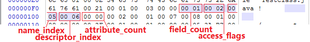

对于TestClass.class文件来说，字段表集合从地址0x000000FB开始，

- 第一个u2类型的数据为容量计数器**fields_count**，如上图所示，其值为0x0001，说明这个类只有一个字段表数据。
- 接下来紧跟着容量计数器的是**access_flags**标志，值为0x0002，代表private修饰符的ACC_PRIVATE标志位为真（ACC_PRIVATE标志的值为0x0002），其他修饰符为假。
- 代表字段名称的**name_index**的值为0x0005，从javap得出常量表中可查得第5项常量是一个CONSTANT_Utf8_info类型的字符串，其值为“m”，
- 代表字段描述符的**descriptor_index**的值为0x0006，指向常量池的字符串“I”，

根据这些信息，我们可以推断出原代码定义的字段为：“private int m；”。

字段表都包含的固定数据项目到descriptor_index为止就结束了，不过在descriptor_index之后跟随着一个属性表集合用于存储一些额外的信息，字段都可以在属性表中描述零至多项的额外信息。对于本例中的字段m，它的**attributes_count**属性表计数器为0，也就是没有需要额外描述的信息，

**但是**，如果将字段m的声明改为“final static int m=123；”，那就可能会存在一项名称为ConstantValue的属性，其值指向常量123。

---

**字段表集合中不会列出从超类或者父接口中继承而来的字段**，**但**有可能列出原本Java代码之中不存在的字段，**譬如**在内部类中为了保持对外部类的访问性，会自动添加指向外部类实例的字段。

另外，**在Java语言中字段是无法重载的**，两个字段的数据类型、修饰符不管是否相同，都必须使用不一样的名称，但是对于字节码来讲，如果两个字段的描述符不一致，那字段重名就是合法的。

### 方法表集合 ###

Class文件存储格式中对方法的描述与对字段的描述几乎采用了完全一致的方式，方法表的结构如同字段表一样，依次包括了访问标志（access_flags）、名称索引（name_index）、描述符索引（descriptor_index）、属性表集合（attributes）几项，见下表。

类型|名称|数量
---|---|---
u2|access_flags|1
u2|name_index|1
u2|descriptor_index|1
u2|attributes_count|1
attribute_info|attributes|attributes_count

这些数据项目的含义也非常类似，仅在访问标志和属性表集合的可选项中有所区别。 

因为volatile关键字和transient关键字不能修饰方法，所以方法表的访问标志中没有了ACC_VOLATILE标志和ACC_TRANSIENT标志。

与之相对的，synchronized、native、strictfp和abstract关键字可以修饰方法，所以方法表的访问标志中增加了ACC_SYNCHRONIZED、ACC_NATIVE、ACC_STRICTFP和ACC_ABSTRACT标志。对于方法表，所有标志位及其取值可参见下表

标识名称|标志值|含义
---|---|---
ACC_PUBLIC|0x0001|方法是否是public
ACC_PRIVATE|0x0002|方法是否是private
ACC_PUBLICPROTECTED|0x0004|方法是否是protected
ACC_STATIC|0x0008|方法是否是static
ACC_FINAL|0x0010|方法是否是final
ACC_SYNCHRONIZED|0x0020|方法是否是synchronized
ACC_BRIDGE|0x0040|方法是否是由编译器产生的桥接方法
ACC_VARARGS|0x0080|方法是否接受不定参数
ACC_NATIVE|0x0100|方法是否是native
ACC_ABSTRACT|0x0400|方法是否是abstract
ACC_STRICTFP|0x0800|方法是否是strictfp
ACC_SYNTHETIC|0x1000|方法是否是由编译器自动产生的

行文至此，也许会产生疑问，方法的定义可以通过访问标志、名称索引、描述符索引表达清楚，但**方法里面的代码去哪里了**？

方法里的Java代码，经过编译器编译成字节码指令后，存放在方法属性表集合中一个名为“**Code**”的属性里面，属性表作为Class文件格式中最具扩展性的一种数据项目。

---

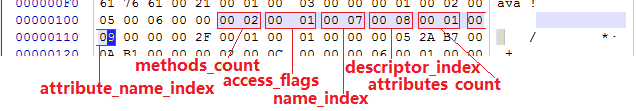

继续以TestClass文件为例对方法表集合进行分析，如上图所示，方法表集合的入口地址为：0x00000105，

- 第一个u2类型的数据（即是计数器容量**methods_count**）的值为0x0002，代表集合中有两个方法（这两个方法为编译器添加的实例构造器<init&gt;和源码中的方法inc()）。
- 第一个方法的访问标志值**access_flags**为0x001，也就是只有ACC_PUBLIC标志为真，
- 名称索引值**name_index**为0x0007，查javap代码的常量池得方法名为“<init&gt;”，
- 描述符索引**descriptor_index**值为0x0008，对应常量为“()V”，
- 属性表计数器**attributes_count**的值为0x0001就表示此方法的属性表集合有一项属性，
- 属性名称索引**attribute_name_index**为0x0009，对应常量为“**Code**”，说明此属性是方法的字节码描述。 

---

与字段表集合相对应的，如果父类方法在子类中没有被重写（Override），**方法表集合中就不会出现来自父类的方法信息**。**但**同样的，有可能会出现由编译器自动添加的方法，最典型的便是类构造器“<clinit&gt;”方法和实例构造器“<init&gt;”方法。

在Java语言中，要重载（Overload）一个方法，除了要与原方法具有相同的简单名称之外，还要求必须拥有一个与原方法不同的**特征签名Signature**，特征签名**就是一个方法中各个参数在常量池中的字段符号引用的集合**，也就是因为返回值不会包含在特征签名中，因此**Java语言里面是无法仅仅依靠返回值的不同来对一个已有方法进行重载的**。(**Java代码的方法特征签名**只包括了方法名称、参数顺序及参数类型，而**字节码的特征签名**还包括方法返回值以及受查异常表)

**但是**在Class文件格式中，特征签名的范围更大一些，只要描述符不是完全一致的两个方法也可以共存。也就是说，如果两个方法有相同的名称和特征签名，但返回值不同，那么也是可以合法共存于同一个Class文件中的。

### 属性表集合 ###

在Class文件、字段表、方法表都可以携带自己的属性表集合，以用于描述某些场景专有的信息。

与Class文件中其他的数据项目要求严格的顺序、长度和内容不同，属性表集合的限制**稍微宽松**了一些，不再要求各个属性表具有严格顺序，并且只要不与已有属性名重复，**任何人**实现的编译器都可以向属性表中写入自己定义的属性信息，Java虚拟机运行时会忽略掉它不认识的属性。

为了能正确解析Class文件，《Java虚拟机规范（第2版）》中预定义了9项虚拟机实现应当能识别的属性，而在最新的《Java虚拟机规范（Java SE 7）》版中，预定义属性已经增加到**21**项，具体内容见下表。

**虚拟机规范定义的属性**

属性名称|使用位置|含义
---|---|---
<a href='#code属性'>Code</a>|方法表|Java代码编译成的字节码指令
<a href='#constantvalue属性'>ConstantValue</a>|字段表|final关键字定义的常量值
<a href='#deprecated及synthetic属性'>Deprecated</a>|类、方法表、字段表|被声明为deprecated的方法和字段
<a href='#exceptions属性'>Exceptions</a>|方法表|方法抛出的异常
EnclosingMethod|类文件|仅当一个类为局部类或者匿名类时才能拥有这个属性，这个属性用于标识这个类所在的外围方法
<a href='#innerclasses属性'>InnerClasses</a>|类文件|内部类列表
<a href='#linenumbertable属性'>LineNumberTable</a>|Code属性|Java源码的行号与字节码指令的对用关系
<a href='#localvariabletable属性'>LocalVariableTable</a>|Code属性|方法的局部变量描述
<a href='#stackmaptable属性'>StackMapTable</a>|Code属性|JDK1.6中新增的属性，供新的类型检查验证器（Type Checker）检查和处理目标方法的局部变量和操作数栈所需要的类型是否匹配
<a href='#signature属性'>Signature</a>|类、方法表、字段表|JDK1.5中新增的属性，这个属性用于支持泛型情况下的方法签名，在Java语言中，任何类、接口、初始化方法或成员的泛型签名如果包含了类型变量（Type Variables）或参数化类型（Parameterized Types），则Signature属性会为他记录泛型签名信息。由于Java的泛型采用擦除法实现，在为了避免类型信息被擦出后导致签名混乱，需要这个属性记录泛型中的相关信息
<a href='#sourcefile属性'>SourceFile</a>|类文件|记录源文件名称
SourceDebugExtension|类文件|JDK 1.6中新增的属性，SourceDebugExtension属性用于存储额外的调试信息，譬如在进行JSP文件调试时，无法同构Java堆栈来定位到JSP文件的行号，JSR-45规范为这些非Java语言编写，却需要编译成字节码并运行在Java虚拟机中的程序提供了一个进行调试的标准机制，使用SourceDebugExtension属性就可以用于存储这个标准所新加入的调试信息
<a href='#deprecated及synthetic属性'>Synthetic</a>|类、方法表、字段表|标识方法或字段为编译器自动生成的
LocalVariableTypeTable|类|JDK 1.5中新增的属性，他使用特征签名代替描述符，是为了引入泛型语法之后能描述泛型参数化类型而添加
RuntimeVisibleAnnotations|类、方法表、字段表|JDK 1.5中新增的属性，为动态注解提供支持。RuntimeVisibleAnnotations属性用于指明哪些注解是运行时（实际上运行时就是进行反射调用）可见的
RuntimeInVisibleAnnotations|类、方法表、字段表|JDK 1.5新增的属性，与RuntimeVisibleAnnotations属性作用刚好相反，用于指明哪些注解是运行时不可见的
RuntimeVisibleParameter
Annotations|方法表|JDK 1.5新增的属性，作用与RuntimeVisibleAnnotations属性类似，只不过作用对象为方法参数
RuntimeInVisibleAnnotations
Annotations|方法表|JDK 1.5中新增的属性，作用与RuntimeInVisibleAnnotations属性类似，只不过作用对象为方法参数
AnnotationDefault|方法表|JDK 1.5中新增的属性，用于记录注解类元素的默认值
<a href='#signature属性'>BootstrapMethods</a>|类文件|JDK 1.7中新增的属性，用于保存invokedynamic指令引用的引导方法限定符

对于每个属性，它的名称需要从**常量池中引用**一个CONSTANT_Utf8_info类型的常量来表示，而属性值的结构则是完全自定义的，只需要通过一个u4的长度属性去说明属性值所占用的位数即可。一个符合规则的属性表应该满足下表中所定义的结构

类型|名称|数量
---|---|---
u2|attribute_name_index|1
u4|attribute_length|1
u1|info|attribute_length

#### Code属性 ####

Java程序方法体中的代码经过javac编译器处理后，最终变为**字节码指令**存储在Code属性内。

Code属性出现在方法表的属性集合之中，但**并非**所有的方法表都必须存在这个属性，譬如接口或者抽象类中的方法就不存在Code属性，如果方法表有Code属性存在，那么他的结构将如下表所示。

**Code属性表的结构**

类型|名称|数量
---|---|---
u2|attribute_name_index|1
u4|attribute_length|1
u2|max_stack|1
u2|max_locals|1
u4|code_length|1
u1|code|code_length
u2|exception_table_length|1
exception_info|exception_table|exception_table_length
u2|attributes_count|1
attribute_info|attributes|attributes_count

**attribute_name_index**是一项指向CONSTANT_Utf8_info型常量的索引，常量值固定为“Code”，他代表了该属性的属性名称，**attribute_length**指示了属性值的长度，由于属性名称索引与属性长度一共为6个字节，所以属性值的长度固定为整个属性表长度减少6个字节。

**max_stack**代表了操作数栈（Operand Stacks）深度的最大值。在方法执行的任意时刻，操作数栈都不会超过这个深度。虚拟机运行的时候需要根据这个值分配栈帧（Stack Frame）中的操作帧深度。

**max_locals**代表了局部变量表所需的存储空间。在这里，max_locals的单位是Slot，Slot是虚拟机为局部变量分配内存所使用的最小单位。对于byte、char、float、int、short、boolean和returnAddress等长度不超过32位的数据类型，每个局部变量占用1个Slot，而double和long这两种64位的数据类型则需要两个Slot来存放。

方法参数（包括实例方法中的隐藏参数“this”）、显式异常处理器的参数（Exception Handler Parameter，就是try-catch语句中catch块所定义的异常）、方法体中定义的局部变量都需要使用局部变量表来存放。

另外，并不是在方法中用到了多少个局部变量，就把这些局部变量所占Slot之和作为max_locals的值，原因是局部变量表中的Slot可以**重用**，当代码执行超出一个局部变量的作用域时，这个局部变量所占的Slot可以被其他局部变量所使用，Javac编译器会根据变量的作用域来分配Slot给各个变量使用，然后计算出max_locals的大小。

**code_length**和**code**用来存储java源程序编译后生成的字节码指令。code_length代表字节码长度，code是用于存储字节码指令的一系列字节流。既然叫字节码指令，那么每个指令就是一个u1类型的单字节，当虚拟机读取到code中的一个字节码时，就可以对应找出这个字节码代表的是什么指令，并且可以知道这条指令后面是否需要跟随参数，以及参数应当如何理解。我们知道一个u1数据类型的取值范围为0x00~0xFF，对应十进制的0~255，也就是一共可以表达256条指令，目前，Java虚拟机规范已经定义了其中约200条编码值对应的指令含义[Link](../appendix/B)。

关于**code_length**，有一件值得注意的事情，虽然他是一个u4类型的长度值，理论上最大值可以达到2的32次方减1，**但是虚拟机规范中明确限制了一个方法不允许超过65535条字节码指令**，即他实际只使用了u2的长度，如果超过这个限制，Javac编译器也会拒绝编译。一般来讲，编写Java代码时只要不是刻意去编写一个超长的方法来为难编译器，是不太可能超过这个最大值的限制。但是，某些特殊情况，例如在编译一个很复杂的JSP文件时，某些JSP编译器会把JSP内容和页面输出的信息归并于一个方法之中，就可能因为方法生成字节码超长的原因而导致编译失败。

Code属性是Class文件中最重要的一个属性，如果把一个Java程序中的信息分为代码（Code，方法体里面的Java代码）和元数据（Metadata，包括类、字段、方法定义及其他信息）两部分，那么在整个Class文件中，**Code属性用于描述代码，所有的其他数据项目都用于描述元数据**。

了解Code属性是学习后面关于字节码执行引擎内容的必要基础，能直接阅读字节码也是工作中分析Java代码语义问题的必要工具和基本技能，因此准备了一个比较详细的实例来讲解虚拟机是如何使用这个属性的。

##### Code属性中的code详解 #####

[TestClass](TestClass.java)

继续以TestClass.class文件为例，如下图所示，这是上一节分析过的实例构造器“<init&gt;”方法的Code属性。它的操作数栈的最大深度和本地变量表的容量都为0x0001，字节码区域所占空间的长度为0x0005。虚拟机读取到字节码区域的长度后，按照顺序依次读入紧随的5个字节，并根据字节码指令表翻译出所对应的字节码指令。翻译“2A B7 00 0A B1”的过程为： 

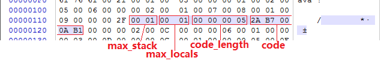

1. 读入2A，查表得0x2A对应的指令为aload_0，这个指令的含义是将第0个Slot中为reference类型的本地变量推送到操作数栈顶。

2. 读入B7，查表得0xB7对应的指令为invokespecial，这条指令的作用是以栈顶的reference类型的数据所指向的对象作为方法接收者，**调用此对象的实例构造器方法、private方法或者他的父类的方法**。这个方法有一个u2类型的参数说明具体调用哪一个方法，他指向常量池中的一个CONSTANT_Methodref_info类型常量，即此方法的方法符号引用。

3. 读入000A，这时invokespecial的参数，查常量吃得0x000A对应的常量为实例构造器“<init&gt;”方法的符号引用。

4. 读入B1，查表得0xB1对应的指令为return，含义是返回此方法，并且返回值为void。这条指令执行后，当前方法结束。

这段字节码虽然很短，但是至少可以看出他的执行过程中的数据交换、方法调用等操作都是基于栈（操作栈）的。我们可以初步猜测：Java虚拟机执行字节码是基于栈的体系结构。但是与一般基于堆栈的零字节指令又不太一样，某些指令（如invokespecial）后面还会带有参数。

再次使用javap命令把此Class文件中另外一个方法的字节码指令也计算出来，结果如下面所示。

	Administrator@USER-20180302VA MINGW64 /c/eclipse-workspace/LeetCode/target/classes/com/lun/other/jvm/c06 (master)
	$ javap -verbose TestClass
	...
	{
	  public com.lun.other.jvm.c06.TestClass();
		descriptor: ()V
		flags: ACC_PUBLIC
		Code:
		  stack=1, locals=1, args_size=1
			 0: aload_0
			 1: invokespecial #10                 // Method java/lang/Object."<init>":()V
			 4: return
		  LineNumberTable:
			line 3: 0
		  LocalVariableTable:
			Start  Length  Slot  Name   Signature
				0       5     0  this   Lcom/lun/other/jvm/c06/TestClass;

	  public int inc();
		descriptor: ()I
		flags: ACC_PUBLIC
		Code:
		  stack=2, locals=1, args_size=1
			 0: aload_0
			 1: getfield      #18                 // Field m:I
			 4: iconst_1
			 5: iadd
			 6: ireturn
		  LineNumberTable:
			line 8: 0
		  LocalVariableTable:
			Start  Length  Slot  Name   Signature
				0       7     0  this   Lcom/lun/other/jvm/c06/TestClass;
	}
	SourceFile: "TestClass.java"

如果大家注意到javap中输出的“**Args_size**”的值，可能会有**疑问**：

- 这个类有两个方法——实例构造器<init&gt;()和inc()，这两个方法很明显都是没有参数的，为什么Args_size会为1？
- 而且无论是在参数列表里还是方法体内，都没有定义任何局部变量，那Locals又为什么会等于1？

如果有这样的疑问，大家可能是忽略了一点：在任何实例方法里面，都可以通过“this”关键字访问到此方法所属的对象。这个访问机制对Java程序的编写很重要，而他的实现却非常简单，仅仅是通过javac编译器编译的时候把对this关键字的访问转变为对一个普通方法参数的访问，然后在虚拟机调用实例方法时自动传入此参数而已。

因此在实例方法的局部变量表中至少会存在一个指向当前对象实例的局部变量，局部变量表中也会预留出第一个Slot位来存放对象实例的引用，方法参数值从1开始计算。**这个处理只对实例方法有效**，如果上面代码中的inc()方法声明为static，那Args_size就不会等于1而是等于0了。

##### exception_table异常表 #####

在字节码指令之后的是这个方法的显示异常处理表（下文简称异常表）集合，异常表对于Code属性来说并不是必须存在的，如上面就没有异常表生成。

**异常表的格式如下表所示**，他包含4个字段，这些字段的含义为：如果当字节码在第**start_pc**行到**end_pc**行之间（不含第end_pc行）出现了类型为**catch_type**或者其子类的异常（catch_type为指向一个CONSTANT_Class_info型常量的索引），则转到第**handler_pc**行继续处理。当catch_type的值为0时，代表任意异常情况都需要转向到handler_pc处进行处理。

类型|名称|数量
---|---|---
u2|start_pc|1
u2|end_pc|1
u2|handler_pc|1
u2|catch_type|1

异常表实际上是Java代码的一部分，编译器使用异常表而**不是简单地跳转命令来实现**Java异常及finally处理机制。

下面代码是一段演示异常表如何运作的例子，这段代码主要演示了在字节码层面中try-catch-finally是如何实现的。

	//Java源码
	public int inc(){
		int x；
		try{
			x=1；
			return x；
		}catch(Exception e){
			x=2；
			return x；
		}finally{
			x=3；
		}
	}

	//编译后的ByteCode字节码及异常表
	public int inc()；
		Code：
			Stack=1，Locals=5，Args_size=1
			0：iconst_1//try块中的x=1
			1：istore_1
			2：iload_1//保存x到returnValue中，此时x=1
			3：istore 4
			5：iconst_3//finaly块中的x=3
			6：istore_1
			7：iload 4//将returnValue中的值放到栈顶，准备给ireturn返回
			9：ireturn
			10：astore_2//给catch中定义的Exception e赋值，存储在Slot 2中
			11：iconst_2//catch块中的x=2
			12：istore_1
			13：iload_1//保存x到returnValue中，此时x=2
			14：istore 4
			16：iconst_3//finaly块中的x=3
			17：istore_1
			18：iload 4//将returnValue中的值放到栈顶，准备给ireturn返回
			20：ireturn
			21：astore_3//如果出现了不属于java.lang.Exception及其子类的异常才会走到这里
			22：iconst_3//finaly块中的x=3
			23：istore_1
			24：aload_3//将异常放置到栈顶，并抛出
			25：athrow
		Exception table：
			from	to	target	type
				0	5 	10		Class java/lang/Exception
				0	5	21		any
				10	16	21		any

编译器为这段Java源码生成了3条异常表记录，对应3条可能出现的代码执行路径。从Java代码的语义上讲，这3条执行路径分别为：

- 如果try语句块中出现属于Exception或其子类的异常，则转到catch语句块的处理。
- 如果try语句块中出现不属于Exception或其子类的异常，则转到finally语句块处理。
- 如果catch语句块中出现任何异常，则转到finally语句块处理。

返回到我们上面提到的问题，这段代码的返回值应该是多少？对Java语言熟悉的应该很容易说出答案：如果没有出现异常，返回值是1；如果出现了Exception异常，返回值是2；如果出现了Exception以外的异常，方法非正常退出，没有返回值。

**分析一下字节码的执行过程**

- 字节码中第0~4行所做的操作就是将整数1赋值给变量x，并且将此时x的值复制一份副本到最后一个本地变量表的Slot中（这个Slot里面的值在ireturn指令执行前将会重新读到操作栈顶，作为方法返回值使用。这里给slot起了个名字：returnValue）。

- 如果这时没有出现异常，则会继续走到第5~9行，将变量x赋值为3，然后将之保存在returnValue中的整数1读入到操作栈顶，最后ireturn指令会以int形式返回操作栈顶中的值，方法结束。

- 如果出现了异常，PC寄存器指针转到第10行，第10~20行所做的事情是将2赋值给变量x，然后将变量x此时的值赋给returnValue，最后再将变量x的值改为3.方法返回前同样将returnValue中停留的整数2都到了操作栈顶。

- 从第21行开始的代码，作用是变量x的值赋为3，并将栈顶的异常抛出，方法结束。

尽管大家都知道这段代码出现异常的概率非常小，但并不影响它为我们演示异常表的作用。如果大家到这里仍然对字节码的运作过程比较模糊，其实也不要紧，关于虚拟机执行字节码的过程，稍后有更详细的讲解。

//TODO:文件格式加入索引

#### Exceptions属性 ####

这里的Exceptions属性是在方法表中与Code属性平级的一项属性，**不要与前面刚刚讲解完的异常表产生混淆**。Exceptions属性的作用是列举出方法中可能抛出的**受查异常**（Checked Excepitons），也就是方法描述时在throws关键字后面列举的异常。

类型|名称|数量
---|---|---
u2|attribute_name_index|1
u4|attribute_length|1
u2|number_of_exceptions|1
u2|exception_index_table|number_of_exceptions

Exceptions属性中的number_of_exceptions项表示方法可能抛出number_of_exceptions种受查异常，每一种受查异常使用一个exception_index_table项表示，exception_index_table是一个指向常量池中CONSTANT_Class_info型常量的索引，代表了该受查异常的类型。

#### LineNumberTable属性 ####

**LineNumberTable属性用于描述Java源码行号与字节码行号（字节码的偏移量）之间的对应关系**。他并不是运行时必须的属性，但默认生成到Class文件之中，可以在Javac中分别使用-g:none或-g:lines选项来取消或要求生成这项信息。如果选择不生成LineNumberTable属性，对程序运行产生的最主要的影响就是当抛出异常时，堆栈中将不会显示出错的行号，并且在调试程序的时候，也无法按照源码行来设置断点。LineNumberTable属性的结构见下表。

类型|名称|数量
---|---|---
u2|attribute_name_index|1
u4|attribute_length|1
u2|line_number_table_length|1
line_number_info|line_number_table|line_number_table_length

line_number_table是一个数量为line_number_table_length、类型为line_number_info的集合，line_number_info表包括了start_pc和line_number两个u2类型的数据项，前者是字节码行号，后者是Java源码行号。

#### LocalVariableTable属性 ####

**LocalVariableTable属性用于描述栈帧中局部变量表中的变量与Java源码中定义的变量之间的关系**，它也不是运行时必须的属性，但默认会生成到Class文件之中，可以在Javac中分别使用-g : none或-g :vars选项来取消或要求生成这项信息。如果没有生成这项属性，最大的影响就是当前其他人引用这个方法时，所有的参数名称都将会丢失，IDE将会使用诸如arg0、arg1之类的占位符代替原有的参数名，这对程序运行没有影响，但是会对代码编写带来较大不便，而且在调试期间无法根据参数名称从上下文中获得参数值。LocalVariableTable属性的结构见下表。

类型|名称|数量
---|---|---
u2|attribute_name_index|1
u4|attribute_length|1
u2|local_variable_table_length|1
local_variable_info|local_variable_table|local_variable_table_length

其中，local_variable_info项目代表了一个栈帧与源码中的局部变量的关联，结构见下表。

类型|名称|数量
---|---|---
u2|start_pc|1
u2|length|1
u2|name_index|1
u2|descriptor_index|1
u2|index|1

**start_pc**和**length**属性分别代表了这个局部变量的生命周期开始地字节码偏移量及其作用范围覆盖的长度，两者结合起来就是这个局部变量在字节码之中的作用域范围。

**name_index**和**descriptor_index**都是指向常量池中CONSTANT_Utf8_info型常量的索引，分别代表了局部变量的名称以及这个局部变量的描述符。

**index**是这个局部变量在栈帧局部变量表中Slot的位置。当这个变量数据类型是64位类型时（double和long），他占用的Slot为index和index+1两个。

>顺便提一下，在JDK1.5引入泛型之后，LocalVariableTable属性增加了一个“姐妹属性”：LocalVariableTypeTable，这个新增的属性结构与LocalVariableTable非常相似，仅仅是吧记录的字段描述符的descriptor_index替换成了字段的特征签名（Signature），对于非泛型类型来说，描述符和特征签名能描述的信息是基本一致的，但是泛型引入后，由于描述符中反省的参数化类型被擦除掉，描述符就不能准确的描述泛型类型了，因此出现了LocalVariableTypeTable。

#### SourceFile属性 ####

**SourceFile属性用于记录生成这个Class文件的源码文件名称**。这个属性也是可选的，可以分别使用Javac的-g :none或=g : source选项来关闭或要求生成这项信息。在Java中，对于大多数的类来说，类名和文件名是一致的，但是有一些特殊情况（如内部类）例外。如果不生成这项属性，当抛出异常时，堆栈中将不会显示出错代码所属的文件名。这个属性是一个定长的属性，其结构见下表。

类型|名称|数量
---|---|---
u2|attribute_name_index|1
u4|attribute_length|1
u2|sourcefile_index|1

sourcefile_index数据项是指向常量池中CONSTANT_Utf8_info型常量的索引，常量值是源码文件的文件名。

#### ConstantValue属性 ####

**ConstantValue属性的作用是通知虚拟机自动为静态变量赋值**。**只有被static关键字**修饰的变量（类变量）才可以使用这项属性。类似“int x = 123”和“static int x=123”这样的变量定义在Java程序中是非常常见的事情，但虚拟机对这两种变量赋值的方法和时刻都有所不同。对于非static类型的变量（也就是实例变量）的赋值是在实例构造器<init&gt;方法中进行的；而对于类变量，则有两种方式可以选择：在类构造器<clinit&gt;方法中或者使用ConstantValue属性。

目前Sun Javac编译器的选择是：如果同时使用final和static来修饰一个变量（按照习惯，这里称“常量”更贴切），并且这个变量的数据类型是基本类型或者java.lang.String的话，就生成ConstantValue属性来进行初始化，如果这个变量没有被final修饰，或者并非基本类型及字符串，则将会选择在<clinit>方法中进行初始化。

虽然有final关键字才更符合“ConstantValue”的语义，但虚拟机规范中并没有强制要求字段必须设置了ACC_FINAL标志，只要求了有ConstantValue属性的字段必须设置ACC_STATIC标志而已，对final关键字的要求是javac编译器自己加入的限制。

而对ConstantValue属性值只能限于基本类型和String，不过不认为这是什么限制，因为此属性的属性值只是一个常量池的索引号，由于Class文件格式的常量类型中只有与基本属性和字符串相对应的字面量，所以就算ConstantValue属性在想支持别的类型也无能为力。ConstantValue属性的结构见下表。

类型|名称|数量
---|---|---
u2|attribute_name_index|1
u4|attribute_length|1
u2|constantvalue_index|1

从数据结构中可以看出，ConstantValue属性是一个定长属性，他的attribute_length数据项值必须固定为2。constantvalue_index数据项代表了常量池中一个字面量常量的引用，根据字段类型的不同，字面量可以是CONSTANT_Long_info、CONSTANT_Float_info、CONSTANT_Double_info、CONSTANT_Integer_info、CONSTANT_String_info常量中的一种。

#### InnerClasses属性 ####

**InnerClasses属性用于记录内部类与宿主类之间的关联**。如果一个类中定义了内部类，那编译器将会为他以及他所包含的内部类生成InnerClasses属性。该属性的结构见下表。

类型|名称|数量
---|---|---
u2|attribute_name_index|1
u4|attribute_length|1
u2|number_of_class|1
inner_classes_info|inner_class|number_of_classes

数据项number_of_classes代表需要记录多少个内部类信息，每一个内部类的信息都由一个inner_classes_info表进行描述。inner_classes_info的结构见下表。

类型|名称|数量
---|---|---
u2|inner_class_info_index|1
u2|outer_class_info_index|1
u2|inner_name_index|1
u2|inner_class_access_info|1

**inner_class_info_index**和**outer_class_info_index**都是指向常量池中CONSTANT_Class_info型常量的索引，分别代表了内部类和宿主类的符号引用。

**inner_name_index**是指向常量池中CONSTANT_Utf8_info型常量的索引，代表这个内部类的名称，如果是匿名内部类，那么这项值为0。

**inner_class_access_flags**是内部类的访问标志，类似于类的access_flags，它的取值范围如下表。

标志名称|标志值|含义
---|---|---
ACC_PUBLIC|0x0001|内部类是否为public
ACC_PRIVATE|0x0002|内部类是否为private
ACC_PROTECTED|0x0004|内部类是否为protected
ACC_STATIC|0x0008|内部类是否为static
ACC_FINAL|0x0010|内部类是否为final
ACC_INTERFACE|0x0020|内部类是否为synchronized
ACC_ABSTRACT|0x0400|内部类是否为abstract
ACC_SYNTHETIC|0x1000|内部类是否并非由用户代码产生的
ACC_ANNOTATION|0x2000|内部类是否是一个注解
ACC_ENUM|0x4000|内部类是否是一个枚举

#### Deprecated及Synthetic属性 ####

Deprecated和Synthetic两个属性都属于标志类型的布尔属性，只存在有和没有的区别，没有属性值的概念。

Deprecated属性用于表示每个类、字段或者方法，已经被程序作者定位不在推荐使用，他可以通过在代码中使用@deprecated注释进行设置。

Synthetic属性代表此字段或者方法并不是由Java源码直接产生的，而是由编译器自行添加的，在JDK 1.5之后，标识一个类、字段或者方法是编译器自动产生的，也可以设置他们访问标志中的ACC_SYNTHETIC标志位，其中最典型的例子就是Bridge Method。所有由非用户代码产生的类、方法及字段都应当至少设置Synthetic属性和ACC_SYNTHETIC标志位中的一项，唯一的例外是实例构造器“<init&gt;”方法和类构造器“<clinit&gt;”方法。

Deprecated和Synthetic属性的结构非常简单，见下表。

类型|名称|数量
---|---|---
u2|attribute_name_index|1
u4|attribute_length|1

其中attribute_length数据项的值必须为0x00000000，因为没有任何属性值需要设置。

>synthetic
>英 [sɪnˈθetɪk]   美 [sɪnˈθɛtɪk]  
>adj.
>合成的;人造的;摹拟的，虚构的;[语]综合的
>n.
>合成物;合成纤维;合成剂

#### StackMapTable属性 ####

StackMapTable属性在JDK 1.6发布周增加到了Class文件规范中，它是一个复杂的变长属性，位于Code属性的属性表，这个属性会在虚拟机类加载的字节码验证阶段被**新类型检查验证器**（Type Checker）使用，目的在于**代替**以前比较消耗性能的基于数据流分析的类型推导验证器。

这个类型检查验证器最初来源于Sheng Liang（听名字似乎是虚拟机团队中的华裔成员）为Java ME CLDC实现的字节码验证器。新的验证器在同样能保证Class文件合法性的前提下，省略了在运行期通过数据流分析确认字节码的行为逻辑合法性的步骤，而是在编译阶段将一系列的验证类型（Verification Types）直接记录在Class文件之中，通过检查这些验证类型代替了类型推导过程，从而大幅提升了字节码验证的性能。这个验证器在JDK 1.6中首次提供，并在JDK 1.7中强制代替原本基于类型推断的字节码验证器。

关于这个验证器的工作原理，《Java虚拟机规范（Java SE 7版）》花费了整整120页的篇幅来讲解描述，并且分析证明新验证方法的严谨性，在此不再赘述。

StackMapTable属性中包含零至多个栈映射帧（Stack Map Frames），每个栈映射帧都显式或隐式地代表了一个字节码偏移量，用于表示该执行到该字节码时局部变量表和操作数栈的验证类型。类型检查验证器会通过检查目标方法的局部变量和操作数栈所需要的类型来确定一段字节码指令是否符合逻辑约束。StackMapTable属性的结构见下表。

类型|名称|数量
---|---|---
u2|attribute_name_index|1
u4|attribute_length|1
u2|number_of_entries|1
stack_map_frame|stack_map_frame_entries|number_of_entries

《Java虚拟机规范（Java SE 7版）》明确规定：在版本号大于或等于50.0的Class文件中，如果方法的Code属性中没有附带StackMapTable属性，那就意味着他带有一个隐式的StackMap属性。这个StackMap属性的作用等同于number_of_entries值为0的StackMapTable属性。一个方法的Code属性最多只能有一个StackMapTable属性，否则将抛出ClassFormatError异常。

#### Signature属性 ###

Signature属性在JDK 1.5发布后增加到了Class文件规范之中，他是一个可选的定长属性，可以出现于类、属性表和方法表结构的属性表中。在JDK 1.5大幅增强了Java语言的语法，在此之后，任何类、接口、初始化方法或成员的泛型签名如果包含了类型变量（Type Variables）或参数化类型（Parameterized Types），则Signature属性会为他记录泛型签名信息。之所以要专门使用这样一个属性去记录泛型类型，是因为Java语言的泛型采用的是擦除法实现的伪泛型，在字节码（Code属性）中，泛型信息编译（类型变量、参数化类型）之后都统统被擦除掉。

使用擦除法的**好处**是实现简单（主要修改Javac编译器，虚拟机内部只做了很少的改动）、非常容易实现Backport，运行期也能够节省一些类型所占的内存空间。但**坏处**是运行期就无法像C#等有真泛型支持的语言那样，将泛型类型与用户定义的普通类型同等对待，例如运行期做反射时无法获得到泛型信息。Signature属性就是为了弥补这个缺陷而增设的，现在Java的反射API能够获取泛型类型，最终的数据来源也就是这个属性。Signature属性的结构见下表。

类型|名称|数量
---|---|---
u2|attribute_name_index|1
u4|attribute_length|1
u2|signature_index|1

其中signature_index项的值必须是一个对常量池的有效索引。常量池在该索引处的项必须是CONSTANT_Utf8_info结构，表示类签名、方法类型签名或字段类型签名。如果当前的Signature属性是类文件的属性，则这个结构表示类签名，如果当前的Signature属性是方法表的属性，则这个结构表示方法类型签名，如果当前Signature属性是字段表的属性，则这个结构表示字段类型签名。

#### BootstrapMethods属性 ####

BootstrapMethods属性在JDK 1.7发布后增加到了Class文件规范之中，他是一个复杂的变长属性，位于类文件的属性表中。这个属性用于保存invokedynamic指令引用的引导方法限定符。《Java虚拟机规范（Java SE 7版）》规定，如果某个类文件结构的常量池中曾经出现过CONSTANT_InvokeDynamic_info类型的常量，那么这个类文件的属性表中必须存在一个明确地BootstrapMethods属性，另外，即使CONSTANT_InvokeDynamic_info类型的常量在常量池中出现过多次，类文件的属性表中最多也只能一个BootstrapMethods属性。BootstrapMethods属性与JSR-292中的InvokeDynamic指令和java.lang.Invoke包关系非常密切。**要介绍这个属性的作用，必须先弄清楚InovkeDynamic指令的运作原理**，稍后有介绍

目前的Javac暂时无法生成InvokeDynamic指令和BootstrapMethods属性，必须通过一些非常规的手段才能使用到它们，也许在不久的将来，等JSR-292更加成熟一些，这种状况就会改变。BootstrapMethods属性的结构见下表。

类型|名称|数量
---|---|---
u2|attribute_name_index|1
u4|attribute_length|1
u2|num_bootstrap_methods|1
bootstrap_method|bootstrap_methods|num_bootstrap_methods

其中引用到的bootstrap_method结构见下表

类型|名称|数量
---|---|---
u2|bootstrap_method_ref|1
u2|num_bootstrap_arguments|1
u2|bootstrap_arguments|num_bootstrap_arguments

BootstrapMethods属性中，num_bootstrap_methods项的值给出了bootstrap_methods[]数组中的引导方法限定符的数量。而bootstrap_methods[]数组的每个成员包含了一个指向常量池CONSTANT_MethodHandle结构的索引值，他代表了一个引导方法，还包含了这个引导方法静态参数的序列（可能为空）。bootstrap_methods[]数组中的每个成员必须包含以下3项内容。

- bootstrap_method_ref：bootstrap_method_ref项的值必须是一个对常量池的有效索引。常量池在该索引处的值必须是一个CONSTANT_MethodHandle_info结构。
- num_bootstrap_arguments：num_bootstrap_arguments项的值给出了bootstrap_arguments[]数组成员的数量。
- bootstrap_arguments[]：bootstrap_arguments[]数组的每个成员必须是一个对常量池的有效索引。常量池在该索引处必须是下列结构之一：CONSTANT_String_info、CONSTANT_Class_info、CONSTANT_Integer_info、CONSTANT_Long_info、CONSTANT_Float_info、CONSTANT_Double_info、CONSTANT_MethodHandle_info或CONSTANT_MethodType_info。

## 字节码指令简介 ##

### 字节码与数据类型 ###

