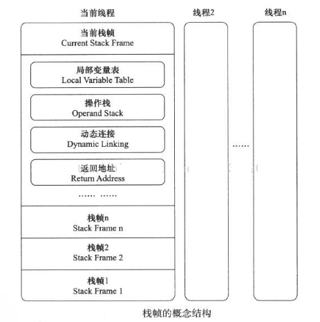
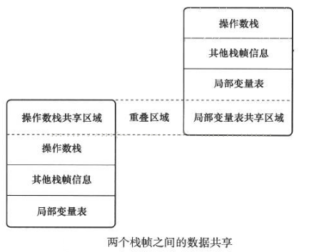

# 虚拟机字节码执行引擎 #

## 概述 ##

执行引擎是Java虚拟机最核心的组成部分之一。“虚拟机”是一个相对于“物理机”的概念，这两种机器都有代码执行能力，其**区别**是

- 物理机的执行引擎是直接建立在处理器、硬件、指令集和操作系统的层面上的，
- 虚拟机的执行引擎则是由自己实现的，因此可以自行制定指令集与执行引擎的结构体系，并且能够执行那些不被硬件直接支持的指令集格式。

在Java虚拟机规范中制定了虚拟机字节码执行引擎的概念模型，这个概念模型称为各种虚拟机执行引擎的**统一外观Facade**。

在不同的虚拟机实现里面，执行引擎在执行Java代码的时候可能会有解释执行（通过解释器执行）和编译执行（通过即时编译器产生本地代码执行）两种选择，也可能两者兼备，甚至是还可能会包含几个不同级别的编译器执行引擎。

但从外观上看起来，所有的Java虚拟机的执行引擎都是一致的：输入的是字节码文件，处理过程是字节码解析的等效过程，输出的是执行结果，本章将主要从概念模型的角度来讲解虚拟机的方法调用和字节码执行。

## 运行时栈帧结构 ##

栈帧Stack Frame是用于支持虚拟机进行方法调用和方法执行的数据结构，它是虚拟机运行时数据区中的虚拟机栈的栈元素。栈帧存储了方法的

1. 局部变量表、
2. 操作数栈、
3. 动态连接
4. 方法返回地址
5. ...

**每一个方法从调用开始至执行完成的过程，都对应着一个栈帧在虚拟机栈里面从入栈到出栈的过程**。

每一个栈帧都包括了局部变量表、操作数栈、动态连接、方法返回地址和一些额外的附加信息。在编译程序代码的时候，栈帧中需要多大的局部变量表，多深的操作数栈都是完全确定的，并且写入到方法表的Code属性之中，因此**一个栈帧需要分配多少内存，不会受到程序运行期变量数据的影响，而仅仅取决于具体的虚拟机实现**。

一个线程中方法的调用链可能会很长，很多方法都同时处于执行状态。对于执行引擎来说，在活动线程中，只有位于**栈顶**的栈帧才是有效的，称为**当前栈帧Current Stack Frame**，与这个栈帧相关联的方法，称为**当前方法Current Method**。

执行引擎运行的所有字节码指令都只针对当前栈帧进行操作，在概念模型上，典型的栈帧结构如下图所示：

### 局部变量表 ###

局部变量表Local Variable Table是一组值的存储空间，用于存放方法参数和方法内部定义的局部变量表。在Java程序编译为Class文件时，就在方法的Code属性的max_locals数据项中确定了该方法所需要分配的局部变量表的最大容量。

局部变量表的容量以(变量槽Variable Slot，下称**Slot**)为最小单位，虚拟机范围中**并没有明确指明一个Slot应占用的内存空间大小**，只是很有导向性地说到每个Slot都应该能存放一个boolean、byte、char、short、int、float、reference或returnAddress类型的数据，这8种数据类型，都可以使用32位或更小的物理内存来存放，但这种描述与明确指出“每个Slot占用32位长度的内存空间”是有一些差别的，它允许Slot的长度可以随着处理器、操作系统或虚拟机的不同而发生变化。

只要保证即使在64位虚拟机中使用了64位的物理内存空间取实现一个Slot，**虚拟机仍要使用对齐和补白的手段让Slot在外观上看起来与32位虚拟机中的一致**。

>PS.这显得很浪费

---

Java虚拟机的数据类型：一个Slot可以存放一个32位以内的数据类型，Java中占用32位以内的数据类型有boolean、byte、char、short、int、float、reference和returnAddress 8种类型。

**前面6种**boolean、byte、char、short、int、float我们可以按照Java语言中对应的数据类型的概念去理解它们（注意：仅是这样理解而已，Java语言与Java虚拟机中的基本数据类型是存在本质差别的）。

而**第7种**reference（32位和64位都有可能）类型表示对一个对象实例的引用，虚拟机规范既没有说明它的长度，也没有明确指出这种引用应有怎样的结构。但一般来说，虚拟机实现至少都应当能通过这个引用做到两点：

1. 是从此引用中直接或间接地查找到对象在**Java堆**中的数据存放的起始地址的索引
2. 是此引用中直接或间接地查找到对象所属数据类型在**方法区**中的存储的类型信息，否则无法实现Java语言规范中定义的语法约束。

**第8种**即returnAddress类型目前已经**很少见**了，它是为字节码指令jsr、jsr_w和ret服务的，指向了一条字节码指令的地址，很古老的JVM曾经使用这几条指令来实现异常处理，现在已经由**异常表**代替。

对于64位的数据类型，**虚拟机会以高位对齐的方式为其分配两个连续的Slot空间**。Java语言中明确的64位类型只有long和double两种，把long和double数据类型分割存储的做法与“long和double的非原子性协定”中把一次long和double数据类型读写分割为两次32位读写的做法有些类似，可以与Java内存模型做一个对比。

不过，由于**局部变量表建立在线程的堆栈**上，是线程私有的数据，无论读写两个连续的Slot是否为原子操作，都**不会**引起数据安全问题。

---

虚拟机通过索引定位的方式使用**局部变量表**，索引值的范围是从0开始至局部变量表最大的Slot数量。如果访问的是32位数据类型的变量，索引n就代表了使用第n个Slot，如果是64位数据类型的变量，则说明会同时使用n和n+1两个Slot。对于两个相邻的共同存放一个**64位数据的两个Slot**，**不允许采用任何方式单独访问其中的某一个**，Java虚拟机规范中明确要求了如果遇到进行这种操作的字节码序列，虚拟机应该在类加载的校验阶段抛出异常。

>PS. 64位数据的两个Slot是**命运共同体**

在方法执行时，虚拟机是使用局部变量表完成参数值到参数变量列表的传递过程的，如果执行的是实例方法（非static的方法），那局部变量表中的**第0位索引的Slot默认是用于传递方法所属对象实例的引用，在方法中可以通过关键字“this”来访问到这个隐含的参数**。其余参数则按照参数表顺序排列，占用从1开始的局部变量Slot，参数表分配完毕后，再根据方法体内部定义的变量顺序和作用域分配其余的Slot。

#### 重用栈帧节省空间伴随的副作用 ####

为了尽可能节省栈帧空间，**局部变量表中的Slot是可以重用的**，方法体中定义的变量，其作用域不一定会覆盖整个方法体，如果当前字节码PC计数器的值已经超出了某个变量的作用域，那这个变量对应的Slot就可以交给其他变量使用。不过，这样的设计出了节省栈帧空间以外，还会**伴随一些额外的副作用**，例如，在某些情况下，Slot的复用会直接影响到系统的垃圾收集行为，请看下面3个Demo

	public static void main(String []args){
		byte[] placeholder = new byte[64 * 1024 * 1024];
		System.gc();
	}

如上代码清单中的代码很简单，向内存填充了64MB的数据，然后通知虚拟机进行垃圾收集。我们在虚拟机运行参数中加上“-verbose:gc”来看看垃圾收集的过程，发现在System.gc()运行后并没有回收掉这64MB的内存，下面是运行的结果： 

	[GC 66846K->65824K（125632K），0.0032678 secs]
	[Full GC 65824K->65746K（125632K），0.0064131 secs]

---

没有回收placeholder所占的内存能说得过去，因为在执行System.gc（）时，变量placeholder还处于作用域之内，虚拟机自然不敢回收placeholder的内存。那我们把代码修改一下，变成下面代码。

	public static void main(String []args){
	{
			byte[] placeholder = new byte[64 * 1024 * 1024];
		}
		System.gc();
	}

加入了花括号之后，placeholder的作用域被限制在花括号之内，从代码逻辑上讲，在执行System.gc()的时候，placeholder已经不可能再被访问了，但执行一下这段程序，会发现运行结果如下，还是有64MB的内存**没有被回收掉**，这又是为什么呢？ 

	[GC 66846K->65888K（125632K），0.0009397 secs]
	[Full GC 65888K->65746K（125632K），0.0051574 secs]

---

在解释为什么之前，我们先对这段代码进行第二次修改，在调用System.gc()之前加入一行代码“int a = 0;”，变成如下代码清单的样子：

	public static void main（String[] args）{
		{
			byte[] placeholder = new byte[64*1024*1024];
		}
		
		int a=0;
		System.gc();
	}

这个修改看起来很莫名其妙，但运行一下程序，却发现**这次内存真的被正确回收了**。

	[GC 66401K->65778K（125632K），0.0035471 secs]
	[Full GC 65778K->218K（125632K），0.0140596 secs]

在上面的3个代码清单中，placeholder能否被回收的根本原因是：**局部变量表中的Slot是否还存有关于placeholder数组对象的引用**。在第一次修改中，代码虽然已经离开了placeholder的作用域，但在此后，没有任何对局部变量表的读写操作，placeholder原本所占用的Slot还没有被其他变量所复用，所以作为GC Roots一部分的局部变量表仍然保持着对它的关联。**这种关联没有被及时打断，在绝大部分情况下影响都是很轻微的**。

但如果遇到一个方法，其后面的代码有一些耗时很长的操作，而前面又定义了占用了大量内存、实际上已经不会在使用的变量，手动将其设置为null值（用来代替那句int a = 0，把变量对应的局部变量表Slot清空）便不见得是一个绝对无意义的操作，这种操作可以作为一种在极特殊情形（对象占用内存大、此方法的栈帧长时间不能被回收、方法调用次数达不到JIT的编译条件）下的“奇技”来使用。

Java语言的一本非常著名的书籍《Practical Java》中把“**不使用的对象手动赋值为null**”作为一条推荐的编码规则，但是并没有解释具体原因，很长时间之内都有读者对这条规则感到疑惑。

---

虽然上面的3个代码示例说明了赋null值的操作在某些情况下确实是有用的，但JVM作者观点是不应当对赋null值的操作有过多的依赖，**更没有必要把它当做一个普遍的编码规则来推广**。

原因有两点：

1. 从编码的角度讲，以恰当的变量作用域来控制变量回收时间才是最优雅的解决方法（代码3的场景并不多见且不优雅）。

2. 更关键的是，从执行角度来讲，使用赋null值的操作来优化内存回收是建立在对字节码执行引擎概念模型的理解之上的。在虚拟机使用解释器执行时，通常与概念模型还比较接近，但经过JIT编译器后，才是虚拟机执行代码的主要方式，**赋null值的操作在经过JIT编译优化后就会被消除掉**，这时候将变量设置为null就是没有意义的。
 
**字节码被编译为本地代码后**，对GC Roots的枚举也与解释执行时期有巨大的差别，以前面的例子来看，代码2在经过JIT编译后，System.gc()执行时就可以正确地回收掉内存，无须写成代码清单3的样子。

#### 局部变量必须亲手初始化 ####

关于局部变量表，还有一点可能会对实际开发产生影响，就是局部变量不像前面介绍的类变量那样存在“准备阶段”。已经知道类变量有两次赋初始值的过程，

- 一次在准备阶段，赋予系统初始值；
- 另一次在初始化阶段，赋予程序员定义的初始值。
 
因此，即使在初始化阶段程序员没有为类变量赋值也无关，类变量仍然具有一个确定的初始值。**但局部变量就不一样**，如果一个局部变量定义了但没有赋予初始值是不能使用的，不要认为Java中任何情况下都存在诸如整形变量默认为0，布尔变量默认为false等这样类似的默认值初始化。

在下面代码中，程序其实并不能运行，还好编译器能在编译期间就检查到并提示这一点，即便编译能通过或者手动生成字节码的方式制造出下面代码的效果，字节码检验的时候也会被虚拟机发现而导致类加载失败。

	public static void main(String []args){
		int a;//未赋值的局部变量
		System.out.println(a);
	}

### 操作数栈 ###

操作数栈也常称为操作栈，它是一个后入先出（Last In First Out，LIFO）栈。同局部变量表一样，操作数栈的最大深度也在编译的时候写入到Code属性的max_stacks数据项中。操作数栈的每一个元素可以是任意的Java数据类型，包括long和double。32位数据类型所占的栈容量为1，64位数据类型所占的栈容量为2。在方法执行的任何时候，操作数栈的深度都不会超过在max_stacks数据项中设定的最大值。

**当一个方法刚刚开始执行的时候，这个方法的操作数栈是空的**，在方法的执行过程中，会有各种字节码指令往操作数栈中写入和提取内容，**也就是出栈/入栈操作**。例如，在做算术运算的时候是通过操作数栈来进行的，又或者在调用其他方法的时候是通过操作数栈来进行参数传递的。

**举个例子**，整数加法的字节码指令iadd在运行的时候操作数栈中最接近栈顶的两个元素已经存入了两个int型的数值，当执行这个指令时，会将这两个int值出栈并相加，然后将相加的结构入栈。

---

**操作数栈中元素的数据类型必须与字节码指令的序列严格匹配**，在编译程序代码的时候，编译器要严格保证这一点，在类校验阶段的数据流分析中还要再次验证这一点。再以上面的iadd指令为例，这个指令用于整型数加法，它在执行时，最接近栈顶的两个元素的数据类型必须为int型，不能出现一个long和一个float使用iadd命令相加的情况。

另外，在概念模型中，两个栈帧作为虚拟机栈的元素，是完全相互独立的。但在大多虚拟机的实现里都会做一些优化处理，令两个栈帧出现一部分重叠。让下面栈帧的部分操作数栈与上面栈帧的部分局部变量表重叠在一起，这样在进行方法调用时就可以共用一部分数据，无须进行额外的参数复制传递，重叠过程如下图所示：

Java虚拟机的解释执行引擎称为“基于栈的执行引擎”，其中所指的“栈”就是操作数栈。

### 动态链接 ###

每个栈帧都包含一个指向运行时**常量池**中该栈帧所属方法的引用，持有这个引用是为了支持方法调用过程中的动态连接（Dynamic Linking）。Class文件的常量池中存放有大量的符号引用，字节码中的方法调用指令就以常量池中指向方法的符号引用作为参数。

这些符号引用一部分会在类加载阶段或者第一次使用的时候就转化为直接引用，这种转化称为**静态解析**。

另外一部分将在每一次运行期间转化为直接引用，这部分称为**动态连接**。

### 方法返回地址 ###

当一个方法开始执行后，只有两种方式可以退出这个方法。

1. 第一种方式是执行引擎遇到任意一个方法返回的字节码指令，这时候可能会有返回值传递给上层的方法调用者（调用当前方法的方法称为调用者），是否有返回值和返回值的类型将根据遇到何种方法返回指令来决定，这种退出的方式成为**正常完成出口**（Normal Method Invocation Completion）。

2. 另外一种退出方式是：在方法执行过程中遇到了异常，并且这个异常没有在方法体内得到处理，无论是Java虚拟机内部产生的异常，还是代码中使用athrow字节码指令产生的异常，只要在本方法的异常表中没有搜索到匹配的异常处理器，就会导致方法退出，这种退出方法的方式称为**异常完成出口**（Abrupt Method Invocation Completion）。一个方法使用异常完成出口的方式退出，是不会给它的上层调用者产生任何返回值的。

无论采用何种退出方式，在方法退出之后，**都需要返回到方法被调用的位置**，程序才能继续执行，方法返回时可能需要在栈帧中保存一些信息，用来帮助恢复它的上层方法的执行状态。一般来说，方法正常退出时，调用者的PC计数器的值可以做诶返回地址，栈帧中很可能会保存这个计数器值。而方法异常退出时，返回地址是要通过异常处理器表来确定的，栈帧中一般不会保存这部分信息。

方法退出的过程实际上就等同于把当前**栈帧出栈**，因此退出时可能执行的操作有：恢复上层方法的局部变量表和操作数栈，把返回值（如果有的话）压入调用者栈帧的操作数栈中，调整PC计数器的值以指向方法调用指令后面的一条指令等。

### 附加信息 ###

虚拟机规范允许具体的虚拟机实现增加一些规范里没有描述的信息到栈帧之中，例如与调试相关的信息，这部分信息完全取决于具体的虚拟机实现，这里不再详述。在实际开发中，一般会把动态连接、方法返回地址与其他附加信息完全归为一类，称为栈帧信息。

## 方法调用 ##

**方法调用并不等同于方法执行，方法调用阶段唯一的任务就是确定被调用方法的版本（即调用哪一个方法），暂时还不涉及方法内部的具体运行过程**。在程序运行时，进行方法调用是最普遍、最频繁的操作，但前面已经说过，Class文件的编译过程中不包含传统编译中的连接步骤，一切方法调用在Class文件里面存储的都**只是符号引用**，而不是方法在实际运行时内存布局中的入口地址（相当于之前说的直接引用）。这个特性给Java带来了更强大的动态扩展能力，但也使得Java方法调用过程变得相对复杂起来，需要在类加载期间，甚至到运行期间才能确定目标方法的直接引用。

### 解析 ###

### 分派 ###

### 动态类型语言支持 ###

## 基于栈的字节码解释执行引擎 ##

### 解释执行 ###

### 基于栈的指令集与寄存器的指令集 ###

### 基于栈的解释器执行过程 ###

