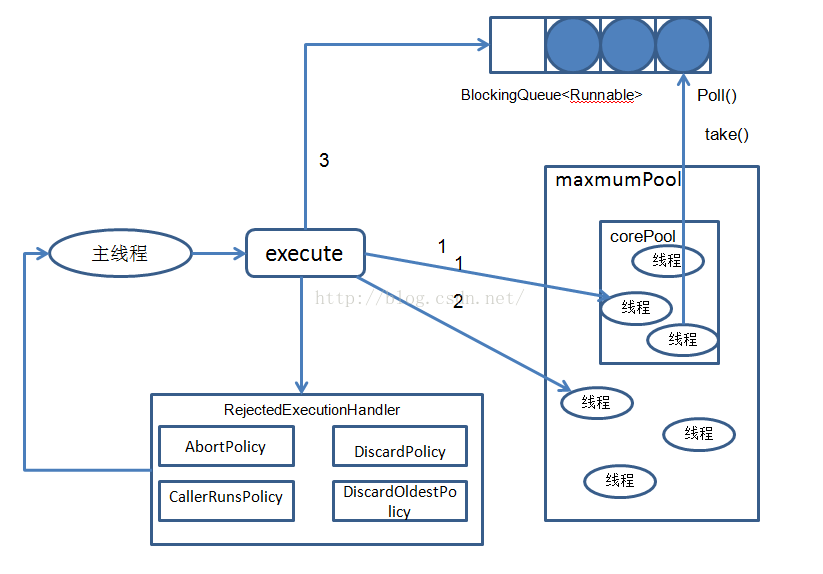
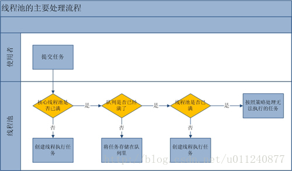

# Java的Executor框架和线程池实现原理 #

[https://blog.csdn.net/tuke_tuke/article/details/51353925](https://blog.csdn.net/tuke_tuke/article/details/51353925)

[Java的Executor框架](#java的Executor框架)

[线程池实现原理详解](#线程池实现原理详解)

## Java的Executor框架 ##

### Executor接口 ###

Executor接口是Executor框架中最基础的部分，定义了一个用于执行Runnable的execute方法，它没有实现类只有另一个重要的子接口ExecutorService。

	public interface Executor {
	    void execute(Runnable command);
	}

### ExecutorService接口 ###

	// 继承自Executor接口
	public interface ExecutorService extends Executor {
		/**
		 * 关闭方法，调用后执行之前提交的任务，不再接受新的任务
		 */
		void shutdown();

		/**
		 * 从语义上可以看出是立即停止的意思，将暂停所有等待处理的任务并返回这些任务的列表
		 */
		List<Runnable> shutdownNow();

		/**
		 * 判断执行器是否已经关闭
		 */
		boolean isShutdown();

		/**
		 * 关闭后所有任务是否都已完成
		 */
		boolean isTerminated();

		/**
		 * 中断
		 */
		boolean awaitTermination(long timeout, TimeUnit unit) throws InterruptedException;

		/**
		 * 提交一个Callable任务
		 */
		<T> Future<T> submit(Callable<T> task);

		/**
		 * 提交一个Runable任务，result要返回的结果
		 */
		<T> Future<T> submit(Runnable task, T result);

		/**
		 * 提交一个任务
		 */
		Future<?> submit(Runnable task);

		/**
		 * 执行所有给定的任务，当所有任务完成，返回保持任务状态和结果的Future列表
		 */
		<T> List<Future<T>> invokeAll(Collection<? extends Callable<T>> tasks) throws InterruptedException;

		/**
		 * 执行给定的任务，当所有任务完成或超时期满时（无论哪个首先发生），返回保持任务状态和结果的 Future 列表。
		 */
		<T> List<Future<T>> invokeAll(Collection<? extends Callable<T>> tasks, long timeout, TimeUnit unit)
				throws InterruptedException;

		/**
		 * 执行给定的任务，如果某个任务已成功完成（也就是未抛出异常），则返回其结果。
		 */
		<T> T invokeAny(Collection<? extends Callable<T>> tasks) throws InterruptedException, ExecutionException;

		/**
		 * 执行给定的任务，如果在给定的超时期满前某个任务已成功完成（也就是未抛出异常），则返回其结果。
		 */
		<T> T invokeAny(Collection<? extends Callable<T>> tasks, long timeout, TimeUnit unit)
				throws InterruptedException, ExecutionException, TimeoutException;
	}

ExecutorService接口继承自Executor接口，定义了终止、提交、执行任务、跟踪任务返回结果等方法
1. execute(Runnable command)：履行Ruannable类型的任务,

2. submit(task)：可用来提交Callable或Runnable任务，并返回代表此任务的Future对象
3. shutdown()：在完成已提交的任务后封闭办事，不再接管新任务,

4. shutdownNow()：停止所有正在履行的任务并封闭办事。
5. isTerminated()：测试是否所有任务都履行完毕了。,

6. isShutdown()：测试是否该ExecutorService已被关闭

### Executors ###

**Factory and utility methods** for Executor, ExecutorService, ScheduledExecutorService, ThreadFactory, and Callable classes defined in this package. 

- newFixedThreadPool(numberOfThreads:int):（固定线程池）ExecutorService 创建一个固定线程数量的线程池，并行执行的线程数量不变，线程当前任务完成后，可以被重用执行另一个任务
- newCachedThreadPool():（可缓存线程池）ExecutorService 创建一个线程池，按需创建新线程，就是有任务时才创建，空闲线程保存60s，当前面创建的线程可用时，则重用它们
- newSingleThreadExecutor()：（单线程执行器）线程池中只有一个线程，依次执行任务
- newScheduledThreadPool()：线程池按时间计划来执行任务，允许用户设定执行任务的时间
- newSingleThreadScheduledExcutor();线程池中只有一个线程，它按规定时间来执行任务

### Runnable、Callable、Future ###

#### Runnable接口 ####

实现Runnable接口的类将被Thread执行，表示一个基本的任务

	public interface Runnable {
	    // run方法就是它所有的内容，就是实际执行的任务
	    public abstract void run();
	}

#### Callable接口 ####

与Runnable接口的区别在于**它接收泛型**，同时它执行任务后带有**返回内容**

	public interface Callable<V> {
	    // 相对于run方法的带有返回值的call方法
	    V call() throws Exception;
	}

**Runnable**接口和**Callable**接口的实现类，都可以被ThreadPoolExecutor和ScheduledThreadPoolExecutor执行，他们之间的区别是Runnable不会返回结果，而Callable可以返回结果。

Executors可以把一个Runnable对象转换成Callable对象：

	public static Callable<Object> callable(Runnbale task);

Executors把一个Runnable和一个待返回的结果包装成一个Callable的API：

	public static<T> Callable<T> callable(Runnbale task,T result);

当把一个Callable对象提交给**ThreadPoolExecutor**和**ScheduledThreadPoolExecutor**执行时，submit(...)会向我们返回一个FutureTask对象(实现Future接口)。我们执行FutureTask.get()来等待任务执行完成，当任务完成后，FutureTask.get()将返回任务的结果。

#### Future接口 ####

Future就是对于具体的Runnable或者Callable任务的执行结果进行取消、查询是否完成、获取结果。必要时可以通过get方法获取执行结果，该方法会阻塞直到任务返回结果。

	// Future代表异步任务的执行结果
	public interface Future<V> {

		/**
		 * 尝试取消一个任务，如果这个任务不能被取消（通常是因为已经执行完了）
		 * ，返回false，否则返回true。
		 */
		boolean cancel(boolean mayInterruptIfRunning);

		/**
		 * 返回代表的任务是否在完成之前被取消了
		 */
		boolean isCancelled();

		/**
		 * 如果任务已经完成，返回true
		 */
		boolean isDone();

		/**
		 * 获取异步任务的执行结果（如果任务没执行完将等待）
		 */
		V get() throws InterruptedException, ExecutionException;

		/**
		 * 获取异步任务的执行结果（有最常等待时间的限制）
		 *
		 * timeout表示等待的时间，unit是它时间单位
		 */
		V get(long timeout, TimeUnit unit) throws InterruptedException, ExecutionException, TimeoutException;
	}

在Future接口中声明了5个方法，下面依次解释每个方法的作用：
- cancel()方法用来取消任务，如果取消任务成功则返回true，如果取消任务失败则返回false。参数mayInterruptIfRunning表示是否允许取消正在执行却没有执行完毕的任务，如果设置true，则表示可以取消正在执行过程中的任务。如果任务已经完成，则无论mayInterruptIfRunning为true还是false，此方法肯定返回false，即如果取消已经完成的任务会返回false；如果任务正在执行，若mayInterruptIfRunning设置为true，则返回true，若mayInterruptIfRunning设置为false，则返回false；如果任务还没有执行，则无论mayInterruptIfRunning为true还是false，肯定返回true。
- isCancelled()方法表示任务是否被取消成功，如果在任务正常完成前被取消成功，则返回 true。
- isDone()方法表示任务是否已经完成，若任务完成，则返回true；
- get()方法用来获取执行结果，这个方法会产生阻塞，会一直等到任务执行完毕才返回；
- get(long timeout, TimeUnit unit)用来获取执行结果，如果在指定时间内，还没获取到结果，就直接返回null。

也就是说Future提供了三种功能：
1. 判断任务是否完成；
2. 能够中断任务；
3. 能够获取任务执行结果。

#### FutureTask ####

通常使用FutureTask来处理我们的任务。FutureTask类同时又实现了Runnable接口，所以可以直接提交给Executor执行。

FutureTask提供了2个构造器：

	public FutureTask(Callable<V> callable) {
	}
	
	public FutureTask(Runnable runnable, V result) {
	}

[TryFutureTask](TryFutureTask.java)

不直接构造Future对象，也可以使用ExecutorService.submit方法来获得Future对象，submit方法即支持以 Callable接口类型，也支持Runnable接口作为参数，具有很大的灵活性。

## 线程池实现原理详解 ##

线程池执行者

    public ThreadPoolExecutor(int corePoolSize,
                              int maximumPoolSize,
                              long keepAliveTime,
                              TimeUnit unit,
                              BlockingQueue<Runnable> workQueue,
                              ThreadFactory threadFactory,
                              RejectedExecutionHandler handler) {

1. corePoolSize（线程池的基本大小）：the number of threads to keep in the pool, even if they are idle, unless allowCoreThreadTimeOut is set.当提交一个任务到线程池时，线程会创建一个线程来执行任务，即使其他空闲的基本线程能创建线程也会创建线程，等到到需要执行的任务数大于线程池基本大小corePoolSize时就不再创建。
2. maximumPoolSize（线程池最大大小）：the maximum number of threads to allow in the pool.线程池允许最大线程数。如果阻塞队列满了，并且已经创建的线程数小于最大线程数，则线程池会再创建新的线程执行。因为线程池执行任务时是线程池基本大小满了，后续任务进入阻塞队列，阻塞队列满了，在创建线程。
3. keepAliveTime（线程活动保持时间）：when the number of threads is greater than the core, this is the maximum time that excess idle多余空闲的 threads will wait for new tasks before terminating.空闲线程的保持存活时间。
4. TimeUnit（线程活动保持时间的单位）：
	- TimeUnit.DAYS; //天
	- TimeUnit.HOURS; //小时
	- TimeUnit.MINUTES; //分钟
	- TimeUnit.SECONDS; //秒
	- TimeUnit.MILLISECONDS; //毫秒
	- TimeUnit.MICROSECONDS; //微妙
	- TimeUnit.NANOSECONDS; //纳秒
5. workQueue（任务队列）：用于保存等待执行的任务的阻塞队列。一个阻塞队列，用来存储等待执行的任务：数组，链表，不存元素的阻塞队列
      - ArrayBlockingQueue;数组结构的有界阻塞队列，先进先出FIFO

      - LinkedBlockingQueue;链表结构的无界阻塞队列。先进先出FIFO排序元素，静态方法Executors.newFixedThreadPool和Executors.newSingleThreadExecutor使用这个方法

      - SynchronousQueue;不存储元素的阻塞队列，就是每次插入操作必须等到另一个线程调用移除操作，可以认为SynchronousQueue是一个缓存值为1的阻塞队列，但是 isEmpty()方法永远返回是true，remainingCapacity() 方法永远返回是0，remove()和removeAll() 方法永远返回是false，iterator()方法永远返回空，peek()方法永远返回null。静态方法Executors.newCachedThreadPool使用这个方法

6. threadFactory：用于设置创建线程的工厂，可以通过线程工厂给每个创建出来的线程设置更有意义的名字

7. handler（饱和策略）：表示当拒绝处理任务时的策略。当队列和线程池都满了，说明线程池处于饱和状态，那么必须采取一种策略处理提交的新任务。这个策略默认情况下是AbortPolicy，表示无法处理新任务时抛出异常。

- ThreadPoolExecutor.AbortPolicy:丢弃任务并抛出RejectedExecutionException异常。
- ThreadPoolExecutor.DiscardPolicy：也是丢弃任务，但是不抛出异常。

- ThreadPoolExecutor.DiscardOldestPolicy：丢弃队列最前面的任务，然后重新尝试执行任务（重复此过程）

- ThreadPoolExecutor.CallerRunsPolicy：由调用线程处理该任务

### Executors提供的静态方法 ###

new~ThreadPool

1. Fixed 
2. Cached
3. Single

我们尽量优先使用Executors提供的静态方法来创建线程池，如果Executors提供的方法无法满足要求，再自己通过ThreadPoolExecutor类来创建线程池:

- Executors.newFixedThreadPool(int); //创建固定容量大小的缓冲池       
- Executors.newCachedThreadPool(); //创建一个缓冲池，缓冲池容量大小为Integer.MAX_VALUE
- Executors.newSingleThreadExecutor(); //创建容量为1的缓冲池

下面是这三个静态方法的具体实现;

#### newFixedThreadPool固定线程池 ####

	public static ExecutorService newFixedThreadPool(int nThreads) {
	    return new ThreadPoolExecutor(nThreads, nThreads,
	                                  0L, TimeUnit.MILLISECONDS,
	                                  new LinkedBlockingQueue<Runnable>());
	}

newFixedThreadPool创建的线程池corePoolSize和maximumPoolSize值是相等的(n,n)，它使用的LinkedBlockingQueue

线程池corePoolSize和maximumPoolSize值是相等的(n,n),把keepAliveTime设置0L，意味着多余的空闲线程会被立即终止。
newFixedThreadPool的execute方法执行过程：

1. 如果当前运行线程数少于corePoolSize，则创建新线程来执行任务（优先满足核心池）
2. 当前运行线程数等于corePoolSize时，将任务加入LinkedBlockingQueue链式阻塞队列（核心池满了在进入队列）
3. 当线程池的任务完成之后，循环反复从LinkedBlockingQueue队列中获取任务来执行

#### newSingleThreadExecutor ####

	public static ExecutorService newSingleThreadExecutor() {
	    return new FinalizableDelegatedExecutorService
	        (new ThreadPoolExecutor(1, 1,
	                                0L, TimeUnit.MILLISECONDS,
	                                new LinkedBlockingQueue<Runnable>()));
	}

newSingleThreadExecutor将corePoolSize和maximumPoolSize都设置为(1,1)，也使用的LinkedBlockingQueue

newSingleThreadExecutor的execute方法执行过程如下：

1. 当前运行的线程数少于corePoolSize（即当前线程池中运行的线程），则创建一个新的线程来执行任务
2. 当线程池中有一个运行的线程时，将任务加入阻塞队列
3. 当线程完成任务时，会无限反复从链式阻塞队列中获取任务来执行

#### newCachedThreadPool ####

	public static ExecutorService newCachedThreadPool() {
	    return new ThreadPoolExecutor(0, Integer.MAX_VALUE,
	                                  60L, TimeUnit.SECONDS,
	                                  new SynchronousQueue<Runnable>());
	}

newCachedThreadPool将corePoolSize设置为0，将maximumPoolSize设置为Integer.MAX_VALUE，使用的SynchronousQueue，也就是说来了任务就创建线程运行，当线程空闲超过60秒，就销毁线程。

### 三个线程池的特点 ###

1. newFixedThreadPool创建一个**指定工作线程数量**的线程池。每当提交一个任务就创建一个工作线程，如果工作线程数量达到线程池初始的最大数corePoolSize，则将提交的任务存入到池队列中。

2. newCachedThreadPool创建一个可缓存的线程池。这种类型的线程池特点是：
	1. **工作线程的创建数量几乎没有限制**(其实也有限制的,数目为Interger. MAX_VALUE), 这样可灵活的往线程池中添加线程。
	2. **如果长时间没有往线程池中提交任务，即如果工作线程空闲了指定的时间(默认为1分钟)，则该工作线程将自动终止**。终止后，如果你又提交了新的任务，则线程池重新创建一个工作线程。

3. newSingleThreadExecutor创建一个**单线程化的Executor**，即只创建唯一的工作者线程来执行任务，如果这个线程异常结束，会有另一个取代它，保证顺序执行(我觉得这点是它的特色)。单工作线程最大的特点是**可保证顺序地执行各个任务**，并且在任意给定的时间不会有多个线程是活动的 

### 线程池的处理流程 ###

1. 首先线程池判断基本线程池是否已满（< corePoolSize ？）？
	- 没满，创建一个工作线程来执行任务。
	- 满了，则进入下个流程。

2. 其次线程池判断工作队列是否已满？
	- 没满，则将新提交的任务存储在工作队列里。
	- 满了，则进入下个流程。

3. 最后线程池判断整个线程池是否已满（< maximumPoolSize ？）？
	- 没满，则创建一个新的工作线程来执行任务。
	- 满了，则交给饱和策略来处理这个任务。

总结：线程池优先要创建出基本线程池大小（corePoolSize）的线程数量，没有达到这个数量时，每次提交新任务都会直接创建一个新线程，当达到了基本线程数量后，又有新任务到达，优先放入等待队列，如果队列满了，才去创建新的线程（不能超过线程池的最大数maxmumPoolSize）

### 向线程池提交任务的两种方式 ###

#### 通过execute()方法 ####

	ExecutorService threadpool= Executors.newFixedThreadPool(10);  
	threadpool.execute(new Runnable(){...});

这种方式提交**没有返回值，也就不能判断任务是否被线程池执行成功**。

#### 通过submit()方法 ####

	Future<?> future = threadpool.submit(new Runnable(){...});  
    try {  
        Object res = future.get();//获取任务执行结果  
    } catch (InterruptedException e) {  
        // 处理中断异常  
        e.printStackTrace();  
    } catch (ExecutionException e) {  
        // 处理无法执行任务异常  
        e.printStackTrace();  
    }finally{  
        // 关闭线程池  
        executor.shutdown();  
    }  

使用submit 方法来提交任务，**它会返回一个Future对象，通过future的get方法来获取返回值，get方法会阻塞住直到任务完成**，而使用get(long timeout, TimeUnit unit)方法则会阻塞一段时间后立即返回，这时有可能任务没有执行完。

### 线程池的关闭 ###

- shutdown()：不会立即终止线程池，而是再也不会接受新的任务，要等所有任务缓存队列中的任务都执行完后才终止

- shutdownNow()：立即终止线程池，再也不会接受新的任务，并尝试打断正在执行的任务，并且清空任务缓存队列，返回尚未执行的任务

### 线程池本身的状态 ###

- RUNNING:  Accept new tasks and process queued tasks
- SHUTDOWN: Don't accept new tasks, but process queued tasks
- STOP:     Don't accept new tasks, don't process queued tasks,and interrupt in-progress tasks
- TIDYING:  All tasks have terminated, workerCount is zero, the thread transitioning to state TIDYING will run the terminated() hook method
- TERMINATED: terminated() has completed
