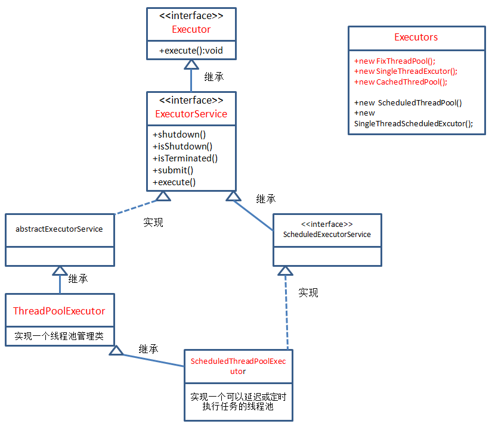

# Java的Executor框架和线程池实现原理 #

[https://blog.csdn.net/tuke_tuke/article/details/51353925](https://blog.csdn.net/tuke_tuke/article/details/51353925)

[Java的Executor框架](#java的Executor框架)

[线程池实现原理详解](#线程池实现原理详解)

## Java的Executor框架 ##

### Executor接口 ###

Executor接口是Executor框架中最基础的部分，定义了一个用于执行Runnable的execute方法，它没有实现类只有另一个重要的子接口ExecutorService。

	public interface Executor {
	    void execute(Runnable command);
	}

### ExecutorService接口 ###

	// 继承自Executor接口
	public interface ExecutorService extends Executor {
		/**
		 * 关闭方法，调用后执行之前提交的任务，不再接受新的任务
		 */
		void shutdown();

		/**
		 * 从语义上可以看出是立即停止的意思，将暂停所有等待处理的任务并返回这些任务的列表
		 */
		List<Runnable> shutdownNow();

		/**
		 * 判断执行器是否已经关闭
		 */
		boolean isShutdown();

		/**
		 * 关闭后所有任务是否都已完成
		 */
		boolean isTerminated();

		/**
		 * 中断
		 */
		boolean awaitTermination(long timeout, TimeUnit unit) throws InterruptedException;

		/**
		 * 提交一个Callable任务
		 */
		<T> Future<T> submit(Callable<T> task);

		/**
		 * 提交一个Runable任务，result要返回的结果
		 */
		<T> Future<T> submit(Runnable task, T result);

		/**
		 * 提交一个任务
		 */
		Future<?> submit(Runnable task);

		/**
		 * 执行所有给定的任务，当所有任务完成，返回保持任务状态和结果的Future列表
		 */
		<T> List<Future<T>> invokeAll(Collection<? extends Callable<T>> tasks) throws InterruptedException;

		/**
		 * 执行给定的任务，当所有任务完成或超时期满时（无论哪个首先发生），返回保持任务状态和结果的 Future 列表。
		 */
		<T> List<Future<T>> invokeAll(Collection<? extends Callable<T>> tasks, long timeout, TimeUnit unit)
				throws InterruptedException;

		/**
		 * 执行给定的任务，如果某个任务已成功完成（也就是未抛出异常），则返回其结果。
		 */
		<T> T invokeAny(Collection<? extends Callable<T>> tasks) throws InterruptedException, ExecutionException;

		/**
		 * 执行给定的任务，如果在给定的超时期满前某个任务已成功完成（也就是未抛出异常），则返回其结果。
		 */
		<T> T invokeAny(Collection<? extends Callable<T>> tasks, long timeout, TimeUnit unit)
				throws InterruptedException, ExecutionException, TimeoutException;
	}

ExecutorService接口继承自Executor接口，定义了终止、提交、执行任务、跟踪任务返回结果等方法
1. execute(Runnable command)：履行Ruannable类型的任务,

2. submit(task)：可用来提交Callable或Runnable任务，并返回代表此任务的Future对象
3. shutdown()：在完成已提交的任务后封闭办事，不再接管新任务,

4. shutdownNow()：停止所有正在履行的任务并封闭办事。
5. isTerminated()：测试是否所有任务都履行完毕了。,

6. isShutdown()：测试是否该ExecutorService已被关闭

### Executors ###

**Factory and utility methods** for Executor, ExecutorService, ScheduledExecutorService, ThreadFactory, and Callable classes defined in this package. 

- newFixedThreadPool(numberOfThreads:int):（固定线程池）ExecutorService 创建一个固定线程数量的线程池，并行执行的线程数量不变，线程当前任务完成后，可以被重用执行另一个任务
- newCachedThreadPool():（可缓存线程池）ExecutorService 创建一个线程池，按需创建新线程，就是有任务时才创建，空闲线程保存60s，当前面创建的线程可用时，则重用它们
- newSingleThreadExecutor()：（单线程执行器）线程池中只有一个线程，依次执行任务
- newScheduledThreadPool()：线程池按时间计划来执行任务，允许用户设定执行任务的时间
- newSingleThreadScheduledExcutor();线程池中只有一个线程，它按规定时间来执行任务

### Runnable、Callable、Future ###

#### Runnable接口 ####

实现Runnable接口的类将被Thread执行，表示一个基本的任务

	public interface Runnable {
	    // run方法就是它所有的内容，就是实际执行的任务
	    public abstract void run();
	}

#### Callable接口 ####

与Runnable接口的区别在于**它接收泛型**，同时它执行任务后带有**返回内容**

	public interface Callable<V> {
	    // 相对于run方法的带有返回值的call方法
	    V call() throws Exception;
	}

**Runnable**接口和**Callable**接口的实现类，都可以被ThreadPoolExecutor和ScheduledThreadPoolExecutor执行，他们之间的区别是Runnable不会返回结果，而Callable可以返回结果。

Executors可以把一个Runnable对象转换成Callable对象：

	public static Callable<Object> callable(Runnbale task);

Executors把一个Runnable和一个待返回的结果包装成一个Callable的API：

	public static<T> Callable<T> callable(Runnbale task,T result);

当把一个Callable对象提交给**ThreadPoolExecutor**和**ScheduledThreadPoolExecutor**执行时，submit(...)会向我们返回一个FutureTask对象(实现Future接口)。我们执行FutureTask.get()来等待任务执行完成，当任务完成后，FutureTask.get()将返回任务的结果。

#### Future接口 ####

Future就是对于具体的Runnable或者Callable任务的执行结果进行取消、查询是否完成、获取结果。必要时可以通过get方法获取执行结果，该方法会阻塞直到任务返回结果。

	// Future代表异步任务的执行结果
	public interface Future<V> {

		/**
		 * 尝试取消一个任务，如果这个任务不能被取消（通常是因为已经执行完了）
		 * ，返回false，否则返回true。
		 */
		boolean cancel(boolean mayInterruptIfRunning);

		/**
		 * 返回代表的任务是否在完成之前被取消了
		 */
		boolean isCancelled();

		/**
		 * 如果任务已经完成，返回true
		 */
		boolean isDone();

		/**
		 * 获取异步任务的执行结果（如果任务没执行完将等待）
		 */
		V get() throws InterruptedException, ExecutionException;

		/**
		 * 获取异步任务的执行结果（有最常等待时间的限制）
		 *
		 * timeout表示等待的时间，unit是它时间单位
		 */
		V get(long timeout, TimeUnit unit) throws InterruptedException, ExecutionException, TimeoutException;
	}

在Future接口中声明了5个方法，下面依次解释每个方法的作用：
- cancel()方法用来取消任务，如果取消任务成功则返回true，如果取消任务失败则返回false。参数mayInterruptIfRunning表示是否允许取消正在执行却没有执行完毕的任务，如果设置true，则表示可以取消正在执行过程中的任务。如果任务已经完成，则无论mayInterruptIfRunning为true还是false，此方法肯定返回false，即如果取消已经完成的任务会返回false；如果任务正在执行，若mayInterruptIfRunning设置为true，则返回true，若mayInterruptIfRunning设置为false，则返回false；如果任务还没有执行，则无论mayInterruptIfRunning为true还是false，肯定返回true。
- isCancelled()方法表示任务是否被取消成功，如果在任务正常完成前被取消成功，则返回 true。
- isDone()方法表示任务是否已经完成，若任务完成，则返回true；
- get()方法用来获取执行结果，这个方法会产生阻塞，会一直等到任务执行完毕才返回；
- get(long timeout, TimeUnit unit)用来获取执行结果，如果在指定时间内，还没获取到结果，就直接返回null。

也就是说Future提供了三种功能：
1. 判断任务是否完成；
2. 能够中断任务；
3. 能够获取任务执行结果。

#### FutureTask ####

通常使用FutureTask来处理我们的任务。FutureTask类同时又实现了Runnable接口，所以可以直接提交给Executor执行。

FutureTask提供了2个构造器：

	public FutureTask(Callable<V> callable) {
	}
	
	public FutureTask(Runnable runnable, V result) {
	}

[TryFutureTask](TryFutureTask.java)

不直接构造Future对象，也可以使用ExecutorService.submit方法来获得Future对象，submit方法即支持以 Callable接口类型，也支持Runnable接口作为参数，具有很大的灵活性。

## 线程池实现原理详解 ##

