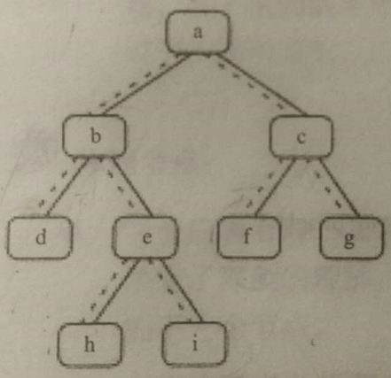

# 《剑指Offer》编程题 #

## 1. 赋值运算符函数 ##

//涉及C++，暂缓

## 2. 实现Singleton模式 ##

设计一个类，只能生成该类的一个实例。

[Singleton](Singleton.java)

## 4. 二维数组中的查找 ##

tag:查找

	在一个二维数组中，每一行都按照从左到右递增的顺序排序，每一列都按照从上到下递增的顺序排序。
	请完成一个函数，输入这样的一个二维数组和一个整数，判断数组中是否含有该整数，若果有，返回其坐标。

[FindNumberInTwoDimensionalIntegerArray](FindNumberInTwoDimensionalIntegerArray.java)

## 5. 替换空格 ##

tag:字符串

	请实现一个函数，把字符串中的每个空格替换成"%20"。
	例如，输入"We are happy."，则输出“We%20are%20happy.”

PS.字符数，预留好位置，从后到前处理

[ReplaceBlank](ReplaceBlank.java)

## 6. 从尾到头打印链表 ##

tag:单向链表

	输入一个链表的头节点，从尾到头反过来打印出每个节点的值。

PS:运用栈或递归方式实现。

[PrintListRecursively](PrintListRecursively.java)

## 7. 重建二叉树 ##

tag:二叉树

	输入某二叉树的前序遍历和中序遍历的结果，请重建该二叉树。
	假设输入的前序遍历和中序遍历的结果都不含重复的数字。
	例如，输入前序遍历序列{1,2,4,7,3,5,6,8}和中序遍历{4,7,2,1,5,3,8,6}，
	则重建如下图所示的二叉树并输出它的头节点。

	 1
	/ \
	2 3
	/ /\
	4 5 6
	\  /
	7  8

PS.特别地注意数组下标的标注

[ConstructBinaryTree](ConstructBinaryTree.java)

## 8. 二叉树的下一个节点 ##

tag:二叉树

	给定一棵二叉树和其中的一个节点，如何找出中序遍历序列的下一个节点？树中的节点除了有两个分别指向左右子节点的指针，还有一个指向父节点的指针

PS.分三种情况

1. 若一个节点有右子树，那么它的下一个节点就是它的右子树的最左子树
2. 没有右子树
3. 即没有右子树，且该节点是父节点的右节点

[NextNodeOfBinaryTree](NextNodeOfBinaryTree.java)

## 9. 用两个栈实现队列 ##

tag:栈 队列

	用两个栈实现队列，实现appendTail和deleteHead，
	分别完成在队列尾部插入节点和在队列头部删除节点功能。

[MyQueue](MyQueue.java)

## 10. 斐波那契数列 ##

tag:数学

	题目一：求斐波那契数列的第n项。
	写一个函数，输入n，求斐波那契数列的第n项。斐波那契数列f(0)=0，f(1)，f(n)=f(n-1)+f(n-2)

	题目二：青蛙跳台阶问题
	一只青蛙一次可跳上1级台阶，也可以跳上2级台阶。求该青蛙跳上一个n级的台阶总共有多少种跳法

[Fibonacci](Fibonacci.java)

## 11. 旋转数组的最小数字 ##

tag:二分查找

	把一个数组最开始的若干个元素搬到数组末尾，我们称之为数组的旋转。输入一个递增排序的数组的一个旋转，**输出旋转数组的最小元素**。
	
	例如，数组{3，4，5，1，2}为{1，2，3，4，5}的一个旋转，该数组的最小元素为1

PS.要巧妙利用已排序的部分优势，进行二分查找。另外，需考略特殊的情况，例如{0，1，1，1，1}

[FindTheMinOneInASpinnedSortedArray](FindTheMinOneInASpinnedSortedArray.java)

## 12. 矩阵中的路径 ##

tag:回溯 DFS

	请设计一个函数，用来判断在一个矩阵中是否存在一条包含某字符串所有字符的路径。
	
	路径可以从矩阵中的任意一格开始，每一步可以在矩阵中向左、右、上、下移动一格。如果一条路径经过了矩阵的某一格，那么该路径不能再次进入该格子。
	
	例如，在下面的3 * 4的矩阵中包含一条字符串“bcfe”的路径（路径中的字母用下划线标出）。
	
	但矩阵中不包含字符串“abfb”的路径，因为字符串的第一个字符b占据了矩阵中的第一行第二个格子后，路径不能再次进入这个格子。
	
	a b_ t g
	c f_ c_ s
	j d e_ h

[FindPathInMatrix](FindPathInMatrix.java)

## 13. 机器人的运动范围 ##

tag:回溯 DFS

	地上有一个m行n列的方格。一个机器人从坐标(0,0)的格子开始移动，它每次可以向左，右，上，下移动一下，但**不能进入行坐标和列坐标的数位之和大于k的格子**。

	例如，当k为18，机器人能够进入方格(35, 37),因为3+5+3+7=18，但它不能进入方格(35,38),因为3+5+3+8=19。

	请问该机器人能够到达多少个格子？

[CountGrids](CountGrids.java)

## 14. 剪绳子 ##

tag: 动态规划 贪婪算法

	题目：给你一根长度为n的绳子，请把绳子剪成m段(m,n都是整数n>1并且m>1)，每段绳子的长度记为k[0],k[1],...,k[m]。
	
	请问k[0] * k[1] * k[2]*...*k[m]可能的最大乘积是多少？
	
	例如，当绳子的长度是8，我们把它剪成长度分别为2， 3， 3的长度，此时得到的最大乘积是18。

PS.**动态规划**两大特点 1.总是求问题的最优解 2. 整体问题的最优解是依赖各个子问题的最优解。由于子问题在分解大问题的过程中重复出现，为了避免重复求解子问题，我们可以**从下往上**的顺序先计算小问题的最优解并存储下来。

使用**贪婪算法**解决问题的时候，每一步都可以做出一个贪婪的选择。基于这个选择，我们确定能够得到最优解。

[CutRope](CutRope.java)

## 15. 二进制中的1的个数 ##

tag:位运算

	实现一个函数，输入一个整数，输出该数二进制表示中1的个数。
	如，9表示成二进制1001，有2位是1.所以，如果输入9，则该函数输出2。

[CountFrequencyOfOne](CountFrequencyOfOne.java)

## 17. 打印从1到最大的n位数 ##

tag:字符串

输入数字n，按顺序打印出来从1到最大的n位是十进制。比如输入3，则打印出1、2、3一直到最大的3位数999

## 18. 删除链表的节点 ##

tag:链表

TODO:

## 22. 链表中倒数第k个节点 ##

tag.链表

	输入一个链表，输出该链表中倒数第k个节点。
	为了符合大多数人的习惯，从1开始计数，即链表的尾节点是倒数第1个节点。
	例如，一个链表有6个节点，从头节点开始，它们的值依次是1、2、3、4、5、6。
	这个链表的倒数第3个节点是值为4的节点。

[FindKthToTail](FindKthToTail.java)

## 23. 链表中环的入口结点 ##

tag.链表

	若一个链表中包含环，如何找出的入口结点？如下图链表中，环的入口节点的节点3。

	      ┍--------┑
	      |         |
	1->2->3->4->5->6

PS.

1. 一快（移两节点）一慢（移一节点）两指针判断链表是否存在环。
2. 算出环有几个节点（上一步的两指针可知是在环中，然后两指针一动一止的计算出环有多少个节点）。
3. 重置两指针指向链头，一指针移动2. 步骤得出n，然后两指针一起移动。当两指针相遇，此时它们指向的环的入口结点

[FindEntryNodeOfLoop](FindEntryNodeOfLoop.java)

## 25. 合并两个排序的链表 ##

tag:链表

	输入两个递增排序的链表，
	合并这两个链表并使新链表中的节点仍然是递增排序的。

[MergeTwoSortedLinkedList](MergeTwoSortedLinkedList.java)

## 27. 二叉树的镜像 ##

tag:二叉树

	请完成一个函数，输入一棵二叉树，该函数输出它的镜像。

	   8
	  / \
	 6  10
	/ \ / \
	5 7 9 11

	上二叉树的镜像如下：

	    8
	  /  \
	 10   6
	/ \  / \
	11 9 7 5

[MirrorRecursively](MirrorRecursively.java)

## 28. 对称二叉树 ##

tag:二叉树

	请实现一个函数，用来判断一棵二叉树是不是对称的。
	如果一棵二叉树和它的镜像一样，那么它是对称的。

	   8
	  / \
	 6   6
	/ \  /\
	5 7  7 5 是对称的

	   8
	  / \
	 6   9
	/ \  /\
	5 7  7 5 是不对称的

	   7
	  / \
	 7   7
	/ \  /
	7 7  7  是不对称的

PS.通常前序遍历，先遍历左子树，后遍历右子树。试试，先遍历右子树，后遍历左子树。

[SymmetricalBinaryTree](SymmetricalBinaryTree.java)

## 29. 顺时针打印矩阵 ##

tag:编程基础

	输入一个矩阵，按照从外向里以顺时针的顺序依次打印出每一个数字。例如，如果输入如下矩阵：
	
	1	2	3	4
	5	6	7	8
	9	10	11	12
	13	14	15	16
	
	则依次打印出数字1，2，3，4，8，12，16，15，14，13，9，5，6，7，11，10.

思路：一步一步来，注意最后一圈情况

[ScanMatrixClockwisely](ScanMatrixClockwisely.java)

## 30. 包含min函数的栈 ##

tag:栈

	定义栈的数据结构，请在该类型中实现一个能够得到栈的最小元素的min函数。
	在该栈中，调用min、push、pop的时间复杂度都是O(1)

PS.用多一个栈压入最小值

[MyStack](MyStack.java)

## 31. 栈的压入、弹出序列 ##

tag:stack

	输入两个整数序列，第一个序列表示栈的压入顺序，请判断第二个序列是否为该栈的弹出顺序。
	假设压入栈的所有数字均不相等。
	例如，序列{1,2,3,4,5}是某栈的压栈序列，序列{4,5,3,2,1}是该栈序列对应的一个弹出序列，
	{4,5,3,2,1}就不能是该压栈序列弹出序列。

[IsPopOrder](IsPopOrder.java)

## 32. 从上到下打印二叉树 ##

tag:二叉树

	题目一：
	从上到下打印出二叉树的每个节点，同一层的节点按照从左到右的顺序打印。
	下面的二叉树打印出来是8,6,10,5,7,9,11

	   8
	  / \
	 6   10
	/ \  / \
	5 7  9 11

[PrintBinaryTreeByLevel](PrintBinaryTreeByLevel.java)

---

	题目二：
	从上到下按层打印二叉树，同一层的节点按从左到右的顺序打印，每一层打印到一行。
	下面的二叉树打印出来是
	8
	6 10
	5 7 9 11

	   8
	  / \
	 6   10
	/ \  / \
	5 7  9 11

[PrintBinaryTreeByLevel2](PrintBinaryTreeByLevel2.java)

---

	题目三：之字形打印二叉树
	第一行按照从左到右的顺序打印，第二层按照从右到左的顺序打印，第三行再按照从左到右的顺序打印，
	其他行以此类推。
	下面的二叉树打印出来是
	1
	3 2
	4 5 6 7
	15 14 13 12 11 10 9 8

			1
		/		\
	    2         3
	   / \       /  \
	 4    5     6     7
	/ \  / \   / \   / \
	8 9 10 11 12 13 14 15

[PrintBinaryTreeByLevel3](PrintBinaryTreeByLevel3.java)

## 33. 二叉树搜索树的后序遍历序列 ##

tag:二叉树

	输入一个整数数组，判断该数组是不是某二叉搜索树的后序遍历结果。
	若是则返回true，否则返回false。
	设输入的数组的任意两个数字互不相同。
	例如{5,7,6,9,11,10,8}，则返回true。{7,4,6,5}则返回false。

	   8
	  / \
	 6   10
	/ \  /\
	5 7 9 11

PS.**后序遍历后得到的数组的最后一元素是跟结点**，然后小于根结点的就是左子树，大于跟结点的就是右子树

[VerifySquenceOfBST](VerifySquenceOfBST.java)

## 34. 二叉树中和为某一值 ##

tag:二叉树

	输入一棵二叉树和一个整数，打印出二叉树中节点值的和为输入整数的所有路径。
	从树的根结点开始往下一直到叶节点所经过的节点形成一路径。

	 10
	 /\
	5 22
	/\
	4 7
	
	该图中有两条和为22的路径：a.10,5,7 b.10,12

PS:二叉树的**前序遍历**

[SumRootToLeafNumber](SumRootToLeafNumber.java)

## 38. 字符串的排列 ##

tag:字符串

	输入一个字符串，打印该字符中字符的所有排列。
	例如，输入字符串abc，则打印出由字符a、b、c所能排列出来的所有字符串
	有abc、acb、bac、bca、cab、cba

[CharsPermutation](CharsPermutation.java)

## 41. 数据流中的中位数 ##

tag:堆

	如何得到一个数据流中的中位数？
	如果从数据流中读出奇数值，那么中位数就是所有数值排序之后位于中间的数值。
	如果从数据流中读出偶数个值，那么中位数就是所有数值排序之后中间两个数的平均值。

[GetMedian](GetMedian.java)

## 53. 在排序数组中查找数字 ##

tag:二分查找

keyword:已排序数组 查找

思路：充分利用已排序数组的已排序的优势，运用二分查找算法

	题目一：数字在排序数组中出现的次数
	
	统计一个数字在排序数组中出现的次数。
	例如，输入排序数组{1, 2, 3, 3, 3, 3, 4, 5}和数字3，
	由于3在这个数组中出现了4次，因此输出4。

[CountNumberInSortedArray](CountNumberInSortedArray.java)

---

	题目二：0 ~ n-1 中缺失的数字
	
	一个长度为n-1的递增排序数组中的所有数字都是唯一的，
	并且每个数字都在范围0~n-1内的n个数字中有且只有一个数字不在该数组中，请找出这个数字。

[FindTheLostNumberInSortedArray](FindTheLostNumberInSortedArray.java)

---

	题目三：假设一个单调递增的数组里的每个元素都是整数并且是唯一的。
	请编写实现一个函数，找出数组中任意一个数值等于其下标的元素。
	例如，在数组{-3, -1, 1, 3, 5}中，数字3和它的下标相等。

PS.认为该题不严谨，字眼“找出数组中任意一个”，暗示得出结果可能有多个，但给出的参考算法却只给出一个返回值。应该数组只有一个数字与它的下标相等。

[FindTheSameOneInSortedArray](FindTheSameOneInSortedArray.java)

## 54. 二叉搜索树的第k大节点 ##

tag:二叉搜索树

	题目：给定一棵二叉搜索树，请找出其中第k大的节点。
	例如，在下面的二叉搜索树里，按节点数值大小顺序，第三大节点的值是4。
	
	   5
	  / \
	 3   7
	/ \ / \
	2 4 6 8

PS.利用**中序遍历**

[GetTheNthNodeInBST](GetTheNthNodeInBST.java)

## 55. 二叉树的深度 ##

tag:二叉树

	题目一：
	输入一棵二叉树的根节点，求该树的深度。
	从根结点到叶节点依次经过的结点（含根、叶节点）形成树的一条路径，最长路径的长度为树的深度。
	  1
	 /\
	 2 3
	/ \ \
	4  5 6
	  /
	 7
	上面的树的深度为4

PS.可以有高度为1，2，3...的二叉树由低到高理解这递归算法。**前序遍历**

[GetDepthOfBinaryTree](GetDepthOfBinaryTree.java)

---

	题目二：
	输入一棵二叉树的根结点，判断该树是不是平衡二叉树。
	若某二叉树任意结点的左右指数的深度相差不超过1，那么它就是一棵平衡二叉树。
	例如，下图就是一颗平衡二叉树。

	  1
	 /\
	 2 3
	/ \ \
	4  5 6
	  /
	 7

PS.**后序遍历**

[CheckTreeBalanced](CheckTreeBalanced.java)

## 56. 数组中数字出现的次数 ##

tag:数组 查找 位运算

	题目一：数组中只出现一次的两个数字
	一个整型数组里除两个数字之外，其他数字都出现了两次。
	请写程序找出这两个只出现一次的数字。要求时间复杂度O(n)，空间复杂度O(1)。

PS.按位 异或

[FindNumsAppearOnce](FindNumsAppearOnce.java)

---

	题目二：数组中唯一只出现一次的数字
	在一个数组中除一个数字只出现一次之外，其他数字都出现了三次。请找出那个只出现一次的数字。

PS.若一个数字出现3次，那么它的二进制表示的每一位（0或1）也出现3次。如果把所有出现3次的数字的二进制表示的每一位都分别加起来，那么每一位的和都能被3整除。

[FindNumsAppearOnce2](FindNumsAppearOnce2.java)

## 57. 和为s的数字 ##

tag:夹逼

	题目一：和为s的两个数字
	
	输入一个递增排序的数组和一个数字s，在数组中查找两个数，使得它们的和正好是s。
	如果有多对数字的和等于s，则输出任意一对即可。

PS.数组两侧向中夹逼。

[FindNumbersWithSum](FindNumbersWithSum.java)

---

	题目二：和为是s的正数序列(至少含有两个数)。
	例如，输入15，由于1+2+3+4+5 = 4+5+6 = 7+8 = 15，
	所以打印出3个连续序列1~5、4~6和7~8

PS.移动窗口夹逼

[FindNumbersWithSum2](FindNumbersWithSum2.java)

## 58. 翻转字符串 ##

tag:字符串

	题目一：翻转单词顺序
	输入一个英文句子，翻转句子中单词的顺序，但单词类字符的顺序不变。
	如输入"I am a student."，则输出"student. a am I"。

[ReverseSentence](ReverseSentence.java)

---

	题目二：左旋转字符串
	字符串的左旋转操作是把字符串前面的若干个字符串移到字符串的尾部。请定义一个函数实现字符串左旋转操作的功能。比如，输入字符串"abcdefg"和数字2，该函数将返回左旋转两位得到的结果"cdefgab"。

[LeftRotateString](LeftRotateString.java)

## 64. 求 1+2+...+n ##

tag:编程语言

	求 1+2+...+n，要求不能使用乘除法、
	for/while/if/else/switch/case等关键字及条件判断语句(A?B:C)

[GetSumHarshly](GetSumHarshly.java)

